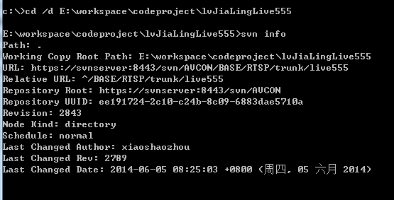

# svn

## statsvn
statsvn 统计svn代码行数
java -jar statsvn.jar D:\devtools\statsvn-0.7.1\Code\cuser-dubbo-service\logfile.log D:\devtools\statsvn-0.7.1\Code\cuser-dubbo-service-xml
12月 16, 2020 10:51:00 上午 net.sf.statsvn.util.JavaUtilTaskLogger info
信息: StatSVN - SVN statistics generation

12月 16, 2020 10:51:01 上午 net.sf.statsvn.util.JavaUtilTaskLogger error
严重: Subversion binary is incorrect version. Found: 1.14.0, required: 1.3.0

乌龟svn 查看某次提交更新了
直接仓库远程 查看更新记录
跟sourcetree一样

svn log --search djshi3 -l 50

svn log --search fjwang2 -l 50 > fjwang2.txt
svn diff -r 57790:57792  --summarize

1.8 版本和以后版本
svn client 1.8 之后提供了一个选项 --search

svn log --search lzz -l 50


1.8以前版本
https://blog.csdn.net/qq_36748278/article/details/82842345
linux 配合sed等其他命令行工具


```shell
svn --version
svn, version 1.7.14 (r1542130)
   compiled Sep 30 2020, 17:44:04

Copyright (C) 2013 The Apache Software Foundation.
This software consists of contributions made by many people; see the NOTICE
file for more information.
Subversion is open source software, see http://subversion.apache.org/

The following repository access (RA) modules are available:

* ra_neon : Module for accessing a repository via WebDAV protocol using Neon.
  - handles 'http' scheme
  - handles 'https' scheme
* ra_svn : Module for accessing a repository using the svn network protocol.
  - with Cyrus SASL authentication
  - handles 'svn' scheme
* ra_local : Module for accessing a repository on local disk.
  - handles 'file' scheme
```

```shell
svn --version
svn, version 1.14.0 (r1876290)
   compiled May 24 2020, 17:07:49 on x86-microsoft-windows

Copyright (C) 2020 The Apache Software Foundation.
This software consists of contributions made by many people;
see the NOTICE file for more information.
Subversion is open source software, see http://subversion.apache.org/

The following repository access (RA) modules are available:

* ra_svn : Module for accessing a repository using the svn network protocol.
  - with Cyrus SASL authentication
  - handles 'svn' scheme
* ra_local : Module for accessing a repository on local disk.
  - handles 'file' scheme
* ra_serf : Module for accessing a repository via WebDAV protocol using serf.
  - using serf 1.3.9 (compiled with 1.3.9)
  - handles 'http' scheme
  - handles 'https' scheme

The following authentication credential caches are available:

* Wincrypt cache in C:\Users\chengwu2\AppData\Roaming\Subversion


svn diff -r 57848:57856  --summarize
M       cuser-service-core\src\main\java\com\xxx\yyy\cuser\core\service\impl\xxxxx.java
M       cuser-service-core\src\main\java\com\xxx\yyy\cuser\core\service\impl\xxxxx.java

```

svn根据提交者筛选

`svn diff -r 57848:57856 > cuser_diff.txt`

svn查看工程版本库的url地址
打开cmd，cd到工程目录，使用svn的命令：

`svn info`





SVN使用log,list,cat,diff命令查看特定文件版本信息
svn diff有三种不同的用法：
检查本地修改
比较工作拷贝与版本库
比较版本库与版本库

https://blog.csdn.net/gb4215287/article/details/52515862


svn 列出某个版本号改动的文件
```shell
svn log -l4
svn log -r 57847:57848 -v
```


branches
tags
trunk

centos 7如何安装svn命令行

yum install -y subversion


svn checkout https://

svn -h
usage: svn <subcommand> [options] [args]
Subversion command-line client.
Type 'svn help <subcommand>' for help on a specific subcommand.
Type 'svn --version' to see the program version and RA modules,
     'svn --version --verbose' to see dependency versions as well,
     'svn --version --quiet' to see just the version number.

Most subcommands take file and/or directory arguments, recursing
on the directories.  If no arguments are supplied to such a
command, it recurses on the current directory (inclusive) by default.

Available subcommands:
   add
   auth
   blame (praise, annotate, ann)
   cat
   changelist (cl)
   checkout (co)
   cleanup
   commit (ci)
   copy (cp)
   delete (del, remove, rm)
   diff (di)
   export
   help (?, h)
   import
   info
   list (ls)
   lock
   log
   merge
   mergeinfo
   mkdir
   move (mv, rename, ren)
   patch
   propdel (pdel, pd)
   propedit (pedit, pe)
   propget (pget, pg)
   proplist (plist, pl)
   propset (pset, ps)
   relocate
   resolve
   resolved
   revert
   status (stat, st)
   switch (sw)
   unlock
   update (up)
   upgrade

Subversion is a tool for version control.
For additional information, see http://subversion.apache.org/


```shell
svn add -h
add: Put new files and directories under version control.
usage: add PATH...

  Schedule unversioned PATHs for addition, so they will become versioned and
  be added to the repository in the next commit. Recurse into directories by
  default (see the --depth option).

  The 'svn add' command is only necessary for files and directories that are
  not yet under version control. Unversioned files and directories can be
  identified with 'svn status' (see 'svn help status').

  The effects of 'svn add' can be undone with 'svn revert' before the addition
  has been committed. Once committed, a path can be removed from version
  control with 'svn delete', and in some circumstances by running a reverse-
  merge (see 'svn help merge' for details).

  With --force, add all the unversioned paths found in PATHs and ignore the
  rest; otherwise, error out if any specified paths are already versioned.

  The selection of items to add may be influenced by the 'ignores' feature.
  Properties may be attached to the items as configured by the 'auto-props'
  feature.

Valid options:
  --targets ARG            : pass contents of file ARG as additional args
  -N [--non-recursive]     : obsolete; same as --depth=empty
  --depth ARG              : limit operation by depth ARG ('empty', 'files',
                             'immediates', or 'infinity')
  -q [--quiet]             : print nothing, or only summary information
  --force                  : ignore already versioned paths
  --no-ignore              : disregard default and svn:ignore and
                             svn:global-ignores property ignores
  --auto-props             : enable automatic properties
  --no-auto-props          : disable automatic properties
  --parents                : add intermediate parents

(Use '-v' to show global and experimental options.)
```


svn add
svn st
svn up
svn commit/ci

https://www.cnblogs.com/wangcp-2014/p/6386211.html


svn忽略文件或者文件夹
svn propedit svn:ignore .
svn pg svn:ignore
svn ps svn:ignore 'test' ./

svn propedit svn:ignore ./branches


不用输入双引号，也不用输入单引号，只需要输入文件名或者文件夹名称
https://blog.csdn.net/weixin_34077371/article/details/86003354


svn查看远程仓库地址 命令行

```shell
svn info
Path: .
Working Copy Root Path: E:\testsvn
URL: https://svn.coding.net/edidada/springsvn/testsvn
Relative URL: ^/
Repository Root: https://svn.coding.net/edidada/springsvn/testsvn
Repository UUID: d07ec820-d73c-4600-96ec-235a81c2276b
Revision: 4
Node Kind: directory
Schedule: normal
Last Changed Author: 1664884095@qq.com
Last Changed Rev: 4
Last Changed Date: 2021-02-05 15:49:28 +0800 (周五, 05 2月 2021)
```

加入忽略列表
svn propget svn:ignore PATH > tempfile
{编辑新的忽略内容到tempfile文件中}
svn propset svn:ignore -F tempfile PATH
因为svn:ignore属性通常是多行的，这里是通过文件显示所修改的内容，而不是直接使用命令行操作。

这样一来就跟git差不多了
https://tortoisesvn.net/docs/nightly/TortoiseSVN_zh_CN/help-onepage.html#tsvn-cli-addignore

```shell
svn propget svn:ignore . > .svnignore
svn propset svn:ignore -F .svnignore .
```

上述命令执行结果
property 'svn:ignore' set on '.'


文件，加单引号
文件夹 不加引号

'd.txt'
ddd
dfasdfasd