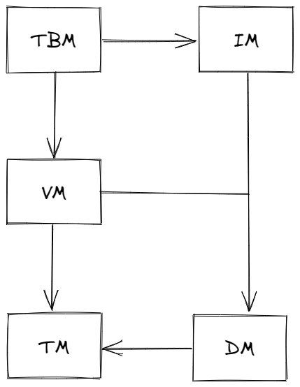

# MYDB

死锁检测是数据库管理系统（DBMS）中的一个重要任务，用于确保多个并发事务在执行过程中不会陷入相互等待的状态，即死锁。死锁会导致系统资源无法被释放，事务无法继续执行，从而影响整个系统的性能。
依赖等待图（Dependency Wait-for Graph）是一种用于检测死锁的有效工具。它表示了系统中事务之间的等待关系。在依赖等待图中，每个节点代表一个事务，节点之间的边表示事务之间的等待关系。如果事务T1正在等待事务T2释放某个资源，那么在图中就会有一条从T1指向T2的边。
通过分析依赖等待图，可以判断系统是否发生了死锁。以下是一个基于依赖等待图的死锁检测算法的基本步骤：
构建依赖等待图：首先，根据系统中的事务和它们之间的等待关系，构建出依赖等待图。这通常需要监控事务的执行过程，并记录它们之间的等待关系。
查找循环：在依赖等待图中查找是否存在循环。循环表示一组事务相互等待，形成了一个闭环，这是死锁的一个必要条件。可以使用深度优先搜索（DFS）或广度优先搜索（BFS）等图遍历算法来查找循环。
判断死锁：如果找到了循环，那么系统就可能发生了死锁。但还需要进一步确认循环中的事务是否都在等待资源。如果循环中的事务都在等待其他事务释放资源，并且没有其他路径可以打破这个循环，那么就可以确认发生了死锁。
解决死锁：一旦检测到死锁，DBMS需要采取适当的措施来解决它。常见的解决方法包括回滚一个或多个事务，以便释放被占用的资源，从而打破死锁循环。还可以采用更复杂的策略，如超时机制、死锁预防或避免算法等。
需要注意的是，依赖等待图只能用于检测死锁，而不能预防或避免死锁的发生。为了有效地管理并发事务并减少死锁的可能性，DBMS还需要采用其他技术和策略，如事务隔离级别、锁机制、资源分配算法等。

死锁预防或避免算法是数据库管理系统（DBMS）中用于确保并发事务不会陷入相互等待状态的重要策略。以下是两种常见的死锁预防或避免算法的例子：

1. 死锁预防算法
资源分级法：

将系统中的所有资源类型进行分级编号，每个事务在申请资源时必须严格按照资源的编号顺序进行。
这样，当两个或多个事务需要相同资源时，它们会按照相同的顺序进行申请，从而避免了循环等待的情况。
资源一次性分配法：

事务在执行前一次性申请所需的全部资源，如果资源足够则一次性分配给事务；否则，事务等待直到所有资源都可用。
这种方法确保了事务在开始执行前不会因等待其他资源而被阻塞，从而避免了死锁。
2. 死锁避免算法
银行家算法：

该算法模拟银行家发放贷款的过程，用于避免死锁。
在事务请求资源时，算法会检查分配资源后系统是否处于安全状态。如果处于安全状态，则分配资源；否则，事务需要等待。
安全状态是指系统能够按照某种顺序为每个事务分配所需资源，并且每个事务都能顺利完成。
时间戳排序：

每个事务在开始时都被赋予一个唯一的时间戳。
当事务请求资源时，系统检查是否有其他事务持有该资源并且具有更小的时间戳。如果有，则当前事务需要等待；否则，可以分配资源。
这种方法通过确保按照时间戳顺序访问资源来避免循环等待。
这些算法在设计和实现时需要考虑多种因素，包括系统的复杂性、性能影响以及并发控制的开销。在实际应用中，DBMS通常会根据具体需求和场景选择合适的死锁预防或避免策略。

https://zhuanlan.zhihu.com/p/447101942
https://cloud.tencent.com/developer/article/2163215

https://www.csbio.unc.edu/mcmillan/Comp521F16/Lecture33.pdf

https://github.com/Petikoch/jtwfg

借鉴项目
https://github.com/qw4990/NYADB2

字节 后端工程师 2022年毕业

https://shinya.click/categories/mydb/

https://www.nowcoder.com/users/6796629

一些人太注重语言了，目前主要的就是java整个技术栈除了语言、框架，mysql redis以及自己选取的技术栈也有学习，cpp是语言之下自己选择一个方向学习。有的学cpp的太多重点放在语言上了，换啥都没用。数据库、中间件、思想啥都是通用的

Transaction Manager（TM）
Data Manager（DM）
Version Manager（VM）
Index Manager（IM）
Table Manager（TBM）

事务管理
依赖
日志管理

性能
Mvcc

版本管理

会话管理 连接数管理
sql解析

断点恢复 容灾，备份

函数功能实现
聚合函数 窗口函数
日期管理
字符串管理

查询的
索引管理

create table 之后，表结构文件存在哪儿？

2024/04/12  19:04    <DIR>          .
2024/04/12  19:04    <DIR>          ..
2024/04/12  19:04                 8 mydb.bt
2024/04/12  19:24            16,384 mydb.db
2024/04/12  19:04               217 mydb.log
2024/04/12  19:30                10 mydb.xid

## 源代码分析

### top.guoziyang.mydb.backend

#### top.guoziyang.mydb.backend.common

#### top.guoziyang.mydb.backend.dm

##### top.guoziyang.mydb.backend.dm.dataItem

##### top.guoziyang.mydb.backend.dm.logger

##### top.guoziyang.mydb.backend.dm.page

##### top.guoziyang.mydb.backend.dm.pageCache

##### top.guoziyang.mydb.backend.dm.pageIndex

#### top.guoziyang.mydb.backend.im
索引管理
https://shinya.click/posts/mydb8/

IM，即 Index Manager，索引管理器，为 MYDB 提供了基于 B+ 树的聚簇索引。目前 MYDB 只支持基于索引查找数据，不支持全表扫描。感兴趣的同学可以自行实现。
在依赖关系图中可以看到，IM 直接基于 DM，而没有基于 VM。索引的数据被直接插入数据库文件中，而不需要经过版本管理。

#### top.guoziyang.mydb.backend.server

top.guoziyang.mydb.backend.server.Executor

            byte[] res = null;
            if(Show.class.isInstance(stat)) {
                res = tbm.show(xid);
            } else if(Create.class.isInstance(stat)) {
                res = tbm.create(xid, (Create)stat);
            } else if(Select.class.isInstance(stat)) {
                res = tbm.read(xid, (Select)stat);
            } else if(Insert.class.isInstance(stat)) {
                res = tbm.insert(xid, (Insert)stat);
            } else if(Delete.class.isInstance(stat)) {
                res = tbm.delete(xid, (Delete)stat);
            } else if(Update.class.isInstance(stat)) {
                res = tbm.update(xid, (Update)stat);
            }
            return res;

#### top.guoziyang.mydb.backend.parser

#### top.guoziyang.mydb.backend.parser.statement

#### top.guoziyang.mydb.backend.tbm

#### top.guoziyang.mydb.backend.tm

#### top.guoziyang.mydb.backend.utils

#### top.guoziyang.mydb.backend.vm

### top.guoziyang.mydb.client

### top.guoziyang.mydb.common

### top.guoziyang.mydb.transpor

