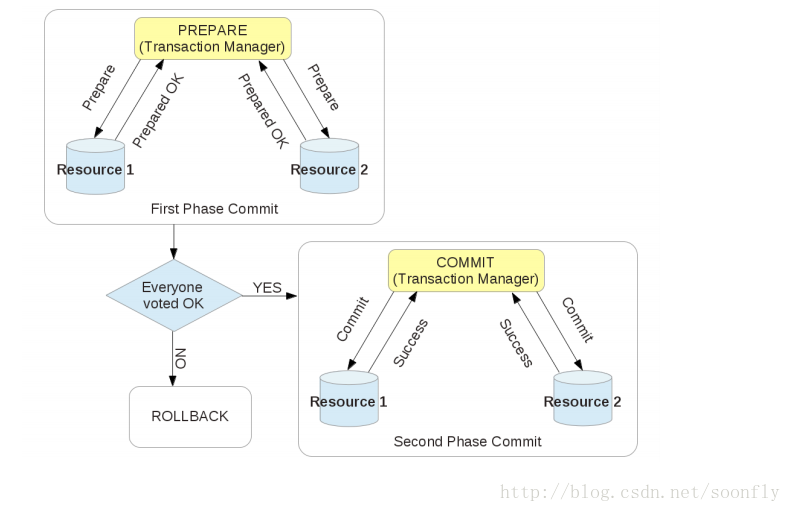

# 阿里面试题 分布式面试题

分布式事务

https://zhuanlan.zhihu.com/p/85772085

理论       -- > 协议

两提交 - > XA

XA状态图

2 两阶段提交理论的一个广泛工业应用是 XA 协议。目前几乎所有收费的商业数据库都支持 XA 协议。XA 协议已在业界成熟运行数十年，但目前它在互联网海量流量的应用场景中，吞吐量这个瓶颈变得十分致命，因此很少被用到
TCC 是由支付宝架构师提供的一种柔性解决分布式事务解决方案,主要包括三个步骤： Try：预留业务资源/数据效验 Confirm：确认执行业务操作；Cancel：取消执行业务操作
TCC 方案在电商、金融领域落地较多。TCC 方案其实是两阶段提交的一种改进。其将整个业务逻辑的每个分支显式的分成了 Try、Confirm、Cancel 三个操作。Try 部分完成业务的准备工作，confirm 部分完成业务的提交，cancel 部分完成事务的回滚。基本原理如下图所示。
TCC 优点：

让应用自己定义数据库操作的粒度，使得降低锁冲突、提高吞吐量成为可能。

TCC 不足之处：
对应用的侵入性强。业务逻辑的每个分支都需要实现try、confirm、cancel 三个操作，应用侵入性较强，改造成本高。实现难度较大。需要按照网络状态、系统故障等不同的失败原因实现不同的回滚策略。为了满足一致性的要求，confirm和cancel接口必须实现幂等。

为了满足一致性的要求，confirm和cancel接口必须实现幂等

[tcc-transaction是TCC型事务java实现](https://github.com/changmingxie/tcc-transaction)

[分布式事务的4种模式](https://zhuanlan.zhihu.com/p/78599954)

解决分布式事务，也有相应的规范和协议。分布式事务相关的协议有2PC、3PC

3pc实现太复杂，排除

2pc不是为了tcc而设计的

2pc抓包

[龙果学院 tcc博文和实践](https://blog.roncoo.com/article/124243)

Seata中有两种分布式事务实现方案，AT和TCC。

AT模式是基于XA事务演进而来，核心是对业务无侵入，是一种改进后的两阶段提交，需要数据库支持。

https://blog.csdn.net/squirrelanimal0922/article/details/97370212

https://zhuanlan.zhihu.com/p/98590126

https://zhuanlan.zhihu.com/p/95852045

### base ebay

基本可用 软状态 最终一致性

**二、基本可用（Basically Available）**

基本可用是指分布式系统在出现故障的时候，允许损失部分可用性，即保证核心可用。

电商大促时，为了应对访问量激增，部分用户可能会被引导到降级页面，服务层也可能只提供降级服务。这就是损失部分可用性的体现。

**三、软状态（ Soft State）**

软状态是指允许系统存在中间状态，而该中间状态不会影响系统整体可用性。分布式存储中一般一份数据至少会有三个副本，允许不同节点间副本同步的延时就是软状态的体现。mysql replication的异步复制也是一种体现。

**四、最终一致性（ Eventual Consistency）**

最终一致性是指系统中的所有数据副本经过一定时间后，最终能够达到一致的状态。弱一致性和强一致性相反，最终一致性是弱一致性的一种特殊情况。

一个最常见的场景，如果产生了一笔交易，需要在交易表增加记录，同时还要修改用户表的金额。这两个表属于不同的库及远程服务，所以就涉及到分布式事务一致性的问题。

核心思想是用两个事务来保证一致性（CAP中的C），同时用异步保证了可用性（CAP中的A）：一个事务处理主要操作”增加交易表记录”与异步消息构建，另外一个事务用来处理构建的异步消息；第一个事务即处理主要业务又记录次要业务，同时还能快速返回，保证了高可用性，第二个事务则用来保证数据的一致性。(即将buyer和seller表更新的处理转为”线下”处理，消息日志可以存储到本地文本、数据库或消息队列，再通过业务规则自动或人工发起重试。人工重试更多的是应用于支付场景，通过对账系统对事后问题的处理，类似与淘宝双11重复支付后续退款)

一个经典的解决方法，将主要修改操作以及更新用户表的”异步消息”放在一个本地事务来完成。同时为了达到多次重试的幂等性，避免重复消费用户表消息带来的问题，增加一个更新记录表 updates_applied 来记录已经处理过的消息。

在第一事务中，通过本地的数据库的事务保障，保证”增加交易表记录”、”增加两条异步消息队列记录(一条处理buyer表、一条处理seller表)”，同时成功或同时失败。

在第二事务中，分别读出消息队列（但不删除），通过判断更新记录表 updates_applied 来检测相关消息是否被执行，如没执行，则执行相关业务逻辑(保证幂等性，保证即使执行过程中异常，重复执行没有任何问题)，执行完所有消息后然后增加一条操作记录到updates_applied，事务到此结束。用事务保证两个异步消息执行及updates_applied的一致性操作(又称为分布式事务框架)。最后删除队列。

https://yq.aliyun.com/articles/181155

Saga是分布式事务领域最有名气的解决方案之一，最初出现在1987年Hector Garcaa-Molrna & Kenneth Salem发表的论文

Saga的实现有很多种方式，其中最流行的两种方式是：

- 基于事件的方式。这种方式没有协调中心，整个模式的工作方式就像舞蹈一样，各个舞蹈演员按照预先编排的动作和走位各自表演，最终形成一只舞蹈。处于当前Saga下的各个服务，会产生某类事件，或者监听其它服务产生的事件并决定是否需要针对监听到的事件做出响应。

- 基于命令的方式。这种方式的工作形式就像一只乐队，由一个指挥家（协调中心）来协调大家的工作。协调中心来告诉Saga的参与方应该执行哪一个本地事务。

  

1，基于事件的方式

2，基于命令的方式

https://www.cs.cornell.edu/andru/cs711/2002fa/reading/sagas.pdf

分布式事务  xa 2pc 3pc tcc 

[Mysql数据库分布式事务XA详解](https://blog.csdn.net/luckyjiuyi/article/details/46955337)

Mysql数据库分布式事务XA

[分布式面试题](https://juejin.im/post/5ab898b9518825188038eca3)

[2018年一线互联网公司Java高级面试题总结](https://segmentfault.com/a/1190000013974980)

分布式id
雪花算法

分布式Session
jwt

阿里面试题

题目1：最小函数min()栈

1. 设计含最小函数min()、取出元素函数pop()、放入元素函数push()的栈AntMinStack，实现其中指定的方法

2. AntMinStack中数据存储使用Java原生的Stack，存储数据元素为int。请实现下面对应的方法，完善功能。

public class AntMinStack {

    /**
     * push 放入元素
     * @param data
     */
    public void push(int data) {
      // todo
    }
    
    /**
     * pop 推出元素
     * @return
     * @throws Exception
     */
    public int pop() throws Exception {
        // todo
    }
    
    /**
     * min 最小函数，调用该函数，可直接返回当前AntMinStack的栈的最小值
     *
     * @return
     * @throws Exception
     */
    public int min() throws Exception {
        // todo
    }
}

题目2：算数表达式

设计数据结构与算法，计算算数表达式，需要支持

基本计算，加减乘除，满足计算优先级 例如输入 3*0+3+8+9*1，输出20

括号，支持括号，例如输入 3+（3-0）*2 输出9

假设所有的数字均为整数，无需考虑精度问题

要求：

1. 输入的表达式是字符串类型String。

2. 对于操作数要求不止一位，这里对字符串里面解析出操作数有要求。需要有从表达式里面解析出完整操作数的能力。

3. 代码结构要求具备一定的面向对象原则，能够定义出表达式，操作数，运算符等对象。

4. 提供基本的测试。

题目3：提供一个懒汉模式的单实例类实现，并满足如下要求：

    1.考虑线程安全。
    
    2.基于junit提供测试代码，模拟并发，测试线程安全性，给出对应的断言。

at

分布式事务框架FESCAR执行过程-AT

https://www.jianshu.com/p/77a95a0cf850

http://seata.io/en-us/docs/dev/mode/at-mode.html

https://juejin.im/post/5ddfed67e51d4574c3375cf2