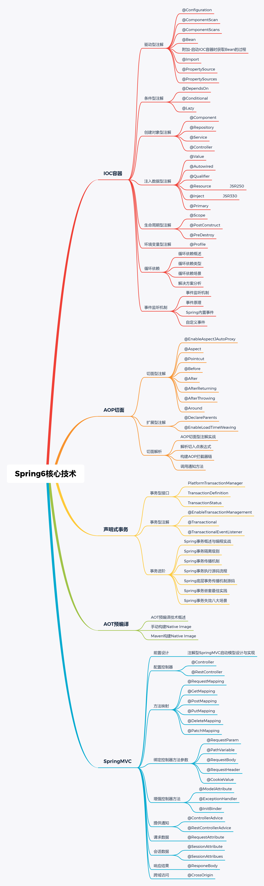

# 冰河技术

想问一下大家，混合型缓存那一章的本地缓存的版本号是前端传递过来的，那前端是根据什么传递的呢
这个问题我之前也疑惑过，其实版本号就是时间戳，前端第一次请求传null，服务端经过一系列处理之后返回数据时带上这个版本号，后续前端正常请求时都会带上这个版本号，服务端再对版本号进行校验处理。如果用户有执行强制刷新之类的操作，前端携带的版本号就不能是上一次服务端返回的版本号了，需要重新生成一个版本号即时间戳(服务端提供生成接口)，然后前端对这个时间戳需要定时累加，保证获取到的数据都是最新的。

https://binghe.gitcode.host/

20230918
秒杀系统基本完结了，目前正在筹划下一个实战项目专栏，大家可以从下面的项目中进行投票，也可以添加自己想学的项目，票数
最高的项目会成为下一个专栏重点打磨的项目。

1.手写分布式网关项目
2.手写分布式IM系统
3.手写分布式调度系统
4.手写分库分表中间件项目
5.手写Redis
6.手写JVM
7.大家想学的其他项目

## Spring核心技术 

专栏介绍
第00章：开篇：我要带你一步步调试Spring6.0源码啦！
第一篇：IOC容器
第01章：深度解析@Configuration注解
第02章：深度解析@ComponentScan注解
第03章：深度解析@Bean注解
第04章：深度解析从IOC容器中获取Bean的过程
第05章：深度解析@Import注解
第06章：深度解析@PropertySource注解
第07章：深度解析@DependsOn注解
第08章：深度解析@Conditional注解
第09章：深度解析@Lazy注解
【付费】 第10章：深度解析@Component注解（含@Repository、@Service和@Controller）
【付费】 第11章：深度解析@Value注解
【付费】 第12章：深度解析@Autowired注解
【付费】 第13章：深度解析@Qualifier注解
【付费】 第14章：深度解析@Resource注解
【付费】 第15章：深度解析@Inject注解
【付费】 第16章：深度解析@Primary注解
【付费】 第17章：深度解析@Scope注解
【付费】 第18章：深度解析@PostConstruct注解与@PreDestroy注解
【付费】 第19章：深度解析@Profile注解
【付费】第20章：深度解析循环依赖(史上最全)
【付费】第21章：深度解析事件监听机制
第二篇：AOP切面
【付费】第22章：AOP切面型注解实战
【付费】第23章：深度解析@EnableAspectJAutoProxy注解
【付费】第24章：深度解析切入点表达式
【付费】第25章：深度解析构建AOP拦截器链的流程
【付费】第26章：深度解析调用通知方法的流程
【付费】第27章：深度解析@DeclareParents注解
【付费】第28章：@EnableLoadTimeWeaving注解
第三篇：声明式事务
【付费】第29章：Spring事务概述与编程实战
【付费】第30章：深度解析Spring事务三大接口
【付费】第31章：深度解析Spring事务隔离级别与传播机制
【付费】第32章：深度解析@EnableTransactionManagement注解
【付费】第33章：深度解析@Transactional注解
【付费】第34章：深度解析Spring事务的执行流程
【付费】第35章：深度解析Spring底层事务传播机制源码
【付费】第36章：深度解析@TransactionEventListener注解
【付费】第37章：七大场景深度分析Spring事务嵌套最佳实践
【付费】第38章：深度解析Spring事务失效的八大场景
第四篇：AOT预编译
第39章：AOT预编译技术概述
【付费】第40章：手动构建Native Image
【付费】第41章：Maven构建Native Image
第五篇：SpringMVC
【付费】第42章：注解型SpringMVC通用SpringBoot启动模型设计与实现
【付费】第43章：深度解析@Controller注解
【付费】第44章：深度解析@RestController注解
【付费】第45章：深度解析@RequestMapping注解
【付费】第46章：深度解析@RequestParam注解
【付费】第47章：深度解析@PathVariable注解
【付费】第48章：深度解析@RequestBody注解
【付费】第49章：深度解析@RequestHeader注解
【付费】第50章：深度解析@CookieValue注解
【付费】第51章：深度解析@ModelAttribute注解
【付费】第52章：深度解析@ExceptionHandler注解
【付费】第53章：深度解析@InitBinder注解
【付费】第54章：深度解析@ControllerAdvice注解
【付费】第55章：深度解析@RequestAttribute注解
【付费】第56章：深度解析@SessionAttribute注解
【付费】第57章：深度解析@SessionAttributes注解
【付费】第58章：深度解析@ResponseBody注解
【付费】第59章：深度解析@CrossOrigin注解
作业篇
作业：专栏整体作业

第1章作业
Spring为何在创建IOC容器时先注册ConfigurationClassPostProcessor类后置处理器的Bean定义信息，随后才是注册标注了@Configuration注解的ConfigurationAnnotationConfig配置类的Bean定义信息？
Spring为何先将类的Bean定义信息注册到IOC容器？为何不是直接注册实例化后的对象？
Spring为何是在刷新IOC容器时，实例化标注了@Configuration注解的配置类的代理对象？为何不是在创建IOC容器时就进行实例化？
Spring IOC容器的这种设计能给你带来哪些启示？
第2章作业
Spring扫描指定包的逻辑看起来挺复杂的，Spring为何会这样设计？
如果使用Spring的注解开发应用程序，配置类上不标注@ComponentScans注解与@ComponentScan注解，能扫描到哪些包下的类？能将标注了@Component注解的类注入的IOC容器吗？
@ComponentScan注解中的basePackages属性或者value属性可以设置任意包名吗（前提是包存在）？
第3章作业
@Bean注解为何也是先将Bean定义信息注册到IOC容器中呢？这样做的好处是什么呢？
@Bean注解标注的方法被Spring解析后将Bean定义信息注册到IOC容器中后，何时会对注册的信息进行实例化呢？实例化的流程是怎样的呢？
Spring是如何调用@Bean注解中使用initMethod和destroyMethod属性指定的方法的？调用的流程是怎样的呢？
第4章作业
Spring为何会有循环依赖的问题？
Spring如何解决循环依赖问题？
Spring为何使用三级缓存解决循环依赖问题？使用二级缓存不行吗？为什么？
Spring中为何把创建Bean对象设计的如此复杂？你觉得是出于哪方面的考虑呢？
从Spring的设计中，你学到了什么？
第5章作业
在ConfigurationClassParser类的processImports()中，如果@Import注解引入的是普通类或者引入的是实现了ImportSelector接口，并且没有实现DeferredImportSelector接口的类，最终还是会执行processImports()方法的else逻辑。那么，如果@Import注解引入的是实现了ImportSelector接口，并且没有实现DeferredImportSelector接口的类，最终是如何执行else逻辑的？
@Import注解的三种案例在Spring底层的源码执行流程分别是什么？
使用@Import注解向IOC容器中注入Bean与使用@Bean注解有什么区别？
在你自己负责的项目中，会在哪些场景下使用@Import注解向IOC容器中注入Bean？
你从Spring的@Import注解的设计中得到了哪些启发？
第6章作业
@PropertySource注解的执行流程？
@PropertySource注解是如何将配置文件加载到环境变量的？
@PropertySource注解有哪些使用场景？
Spring中为何会设计一个@PropertySource注解来加载配置文件？
从@PropertySource注解的设计中，你得到了哪些启发？
第7章作业
@DependsOn注解的作用是什么？
@DependsOn注解是如何指定Bean的依赖顺序的？
你了解过Bean的循环依赖吗？这和@DependsOn注解有关系吗？
你在平时工作中，会在哪些场景下使用@DependsOn注解？
你从@DependsOn注解的设计中得到了哪些启发？
第8章作业
@Conditional注解的作用是什么？
@Conditional注解有哪些使用场景？
@Conditional注解与@Profile注解有什么区别？
@Conditional注解在Spring内层的执行流程？
你在平时工作中，会在哪些场景下使用@Conditional注解？
你从@Conditional注解的设计中得到了哪些启发？
第9章作业
@Lazy注解的作用是什么？
@Lazy注解有哪些使用场景？
@Lazy注解延迟创建Bean是如何实现的？
@Lazy注解在Spring内部的执行流程？
你在平时工作中，会在哪些场景下使用@Lazy注解？
你从@Lazy注解的设计中得到了哪些启发？
第10章作业
@Component注解的作用是什么？
@Component注解有哪些使用场景？
@Component注解是如何将Bean注入到IOC容器的？
@Component注解在Spring内部的执行流程？
你在平时工作中，会在哪些场景下使用@Component注解？
你从@Component注解的设计中得到了哪些启发？
第11章作业
@Value注解的作用是什么？
@Value注解有哪些使用场景？
@Value向Bean的字段和方法注入值是如何实现的？
@Value注解在Spring内部的执行流程？
@Value注解在Spring源码中的执行流程与@Autowired注解有何区别？
你在平时工作中，会在哪些场景下使用@Value注解？
你从@Value注解的设计中得到了哪些启发？
第12章作业
@Autowired注解的作用是什么？
@Autowired注解有哪些使用场景？
@Autowired向Bean的字段和方法注入值是如何实现的？
@Autowired注解在Spring内部的执行流程？
@Autowired注解在Spring源码中的执行流程与@Autowired注解有何区别？
你在平时工作中，会在哪些场景下使用@Autowired注解？
你从@Autowired注解的设计中得到了哪些启发？
第13章作业
@Qualifier注解的作用是什么？
@Qualifier注解有哪些使用场景？
@Qualifier向Bean的字段和方法注入指定的值是如何实现的？
@Qualifier注解在Spring内部的执行流程？
你在平时工作中，会在哪些场景下使用@Qualifier注解？
你从@Qualifier注解的设计中得到了哪些启发？
第14章作业
@Resource注解的作用是什么？
@Resource注解有哪些使用场景？
@Resource向Bean的字段和方法注入值是如何实现的？
@Resource与@Autowired的区别是什么？
@Resource注解在Spring内部的执行流程？
@Resource注解在Spring源码中的执行流程与@Autowired注解有何区别？
你在平时工作中，会在哪些场景下使用@Resource注解？
你从@Resource注解的设计中得到了哪些启发？
第15章作业
@Inject注解的作用是什么？
@Inject注解有哪些使用场景？
@Inject向Bean的字段和方法注入值是如何实现的？
@Inject注解在Spring内部的执行流程？
@Inject注解在Spring源码中的执行流程与@Autowired和@Resource注解有何区别？
你在平时工作中，会在哪些场景下使用@Inject注解？
你从@Inject注解的设计中得到了哪些启发？
第16章作业
@Primary注解的作用是什么？
@Primary注解有哪些使用场景？
@Primary是如何实现Bean的优先级的？
@Primary注解在Spring内部的执行流程？
@Primary注解与@Qualifier注解有何区别？
你在平时工作中，会在哪些场景下使用@Primary注解？
你从@Primary注解的设计中得到了哪些启发？
第17章作业
@Scope注解的作用是什么？
@Scope注解有哪些使用场景？
@Scope是如何指定Bean的作用范围的？
@Scope注解在Spring内部的执行流程？
@Scope是如何创建代理类的？流程是什么？
你在平时工作中，会在哪些场景下使用@Scope注解？
你从@Scope注解的设计中得到了哪些启发？
第18章作业
@PostConstruct注解和@PreDestroy注解的作用是什么？
@PostConstruct注解和@PreDestroy注解有哪些使用场景？
@PostConstruct注解和@PreDestroy注解是如何体现Bean的生命周期的？
@PostConstruct注解和@PreDestroy注解在Spring内部的执行流程？
你在平时工作中，会在哪些场景下使用@PostConstruct注解和@PreDestroy注解？
你从@PostConstruct注解和@PreDestroy注解的设计中得到了哪些启发？
第19章作业
@Profile注解的作用是什么？
@Profile注解有哪些使用场景？
@Profile注解是如何做到隔离不同环境的配置的？
@Profile注解在Spring内部的执行流程？
你在平时工作中，会在哪些场景下使用@Profile注解？
你从Profile注解的设计中得到了哪些启发？
第20章作业
什么是循环依赖问题？
循环依赖有哪些类型？
在Spring中支持哪种循环依赖？
列举几种Spring不支持的循环依赖的场景，为什么不支持？
Spring解决循环依赖的流程是什么？
Spring解决缓存依赖时，二级缓存的作用是什么？
Spring只用二级缓存能否解决循环依赖？为什么一定要用三级缓存来解决循环依赖呢？
你从Spring解决循环依赖的设计中得到了哪些启发？
第21章作业
什么是Spring的事件监听机制？
事件监听机制有哪些使用场景？
Spring的事件监听机制的流程是什么？
Spring基于接口实现监听机制和基于注解实现监听机制有什么区别吗？
你在平时工作中，会在哪些场景下使用Spring的事件监听机制？
你从Spring的事件监听机制的设计中得到了哪些启发？
第22章作业
AOP切面中注解提供了哪些注解，各自的作用是什么？
AOP切面中环绕通知的注解是如何实现的？
AOP切面型注解的执行顺序是什么？
@After、@AfterReturning、@AfterThrowing的区别是什么？
你在平时工作中，会在哪些场景下使用AOP切面型注解？
你从AOP切面型注解的设计中得到了哪些启发？
第23章作业
@EnableAspectJAutoProxy注解在Spring底层的执行流程？
@EnableAspectJAutoProxy注解都做了哪些工作？
@EnableAspectJAutoProxy注解是如何开启AOP代理的？
你在平时工作中，会在哪些场景下使用@EnableAspectJAutoProxy注解开启AOP功能？
你从@EnableAspectJAutoProxy注解的设计中得到了哪些启发？
第24章作业
切入点表达式是如何使用的？
你在实际工作中会使用哪些切入点表达式？
Spring解析切入点表达式的流程是什么？
Spring解析出切入点表达式后又是如何处理的？
你从Spring解析切入点表达式的设计中得到了哪些启发？
第25章作业
什么是AOP的拦截器链？
Spring是如何解析AOP拦截器链的？
Spring为何要构建AOP调用的拦截器链？
AOP拦截器链的调用顺序是怎样的？
你从Spring构建AOP拦截器链的流程设计中得到了哪些启发？
第26章作业
Spring中通知的顺序？
如何有效证明Spring中通知的顺序？
Spring底层调用通知方法时，为何会使用递归操作？
Spring是如何保证程序正常时，不会调用@AfterThrowing注解标注的方法？
Spring是如何保证程序抛异常时，不会调用@AfterReturning注解标注的方法？
你从Spring调用通知方法的流程设计中得到了哪些启发？
第27章作业
你使用过@DeclareParents注解吗？在哪里使用的？
@DeclareParents注解的作用是什么？
@DeclareParents注解为何能够为类添加新的功能，是如何实现的？
简单说说@DeclareParents注解在Spring中的执行流程？
你从@DeclareParents注解的设计中得到了哪些启发？
第28章作业
@EnableLoadTimeWeaving注解的使用场景？
@EnableLoadTimeWeaving注解是如何开启LTW的？
你从@EnableLoadTimeWeaving注解的设计中得到了哪些启发？
第29章作业
为何使用Spring事务就能够减少项目开发过程中维护事务的工作量？
Spring中事务有哪些分类？
Spring是如何回滚事务的？
Spring为何能够控制事务的提交和回滚？
你从Spring事务的设计中得到了哪些启发？
第30章作业
Spring提供了哪些接口支持事务？
Spring中的事务接口各自提供了哪些功能？
Spring控制事务的提交和回滚是哪个接口的功能？
你从Spring事务三大接口的设计中得到了哪些启发？
第31章作业
Spring提供了哪些事务隔离级别？
Spring提供了哪些事务传播机制？
简单说说Spring中每种事务隔离的特性？
Spring中的事务传播机制各自都有哪些特点？
你从Spring事务的隔离级别和传播机制的设计中得到了哪些启发？
第32章作业
@EnableTransactionManagement注解是如何开启事务的？
@EnableTransactionManagement注解与@EnableAspectJAutoProxy注解在Spring底层的执行流程有啥区别？
为什么说Spring中的事务是基于AOP实现的？
@EnableTransactionManagement注解底层向IOC容器中注册了哪些Bean?
你从Spring的@EnableTransactionManagement注解的设计中得到了哪些启发？
第33章作业
@Transactional注解在Spring底层都做了哪些事情？
为什么@Transactional注解能够开启、提交和回滚事务？
@Transactional注解的事务提交了一部分，此时事务超时了会怎么处理？
@Transactional注解与Spring AOP中的通知注解有什么区别?
你从Spring的@Transactional注解的设计中得到了哪些启发？
第34章作业
简单描述下Spring在处理事务操作时的流程？
为何有些场景下目标方法异常了，但是Spring会提交事务，而不是回滚事务呢？
Spring事务的执行流程与AOP调用拦截器链的流程有何联系和区别？
Spring在提交事务的过程中，哪些场景会触发回滚事务的操作？
Spring为何会把事务信息绑定到线程上？
Spring事务通常在哪些场景下会失效？为什么？
你从Spring事务执行流程的设计中得到了哪些启发？
第35章作业
Spring提供了哪些事务传播机制？
简单说说Spring中事务传播机制的源码流程？
Spring中的事务传播机制各自都有哪些特点？
你从Spring事务传播机制的设计中得到了哪些启发？
第36章作业
@TransactionEventListener注解的作用是什么？
@TransactionEventListener注解有哪些使用场景？
@TransactionEventListener是如何指定监听方法的？
@TransactionEventListener注解在Spring内部的执行流程？
你在平时工作中，会在哪些场景下使用@TransactionEventListener注解？
你从@TransactionEventListener注解的设计中得到了哪些启发？
第37章作业
什么是嵌套事务？
Spring在哪些场景下会产生嵌套事务？
在嵌套事务中，哪些事务会成功，哪些事务会失败？
简单说说Spring嵌套事务有哪些场景？各自执行的结果又是什么？
你在平时工作中，会如何使用Spring的嵌套事务？
你从Spring嵌套事务处理方式的设计中得到了哪些启发？
第38章作业
在哪些场景下会导致Spring事务失效？
能具体聊聊Spring在某些场景下为何会失效吗？
你觉得Spring事务失效最根本的问题是什么？
你在平时工作中，会采取哪些措施防止Spring的事务失效？
第42章作业
SpringBoot与SpringMVC有什么关系？
为什么说SpringBoot只是在Spring和SpringMVC的基础上进行了简单的封装？
SpringMVC经过怎么样的设计可以实现SpringBoot的启动方式？
自行扩展本章启动模型，实现启动时自动配置。
目前大环境下，SpringBoot使用的比较多，但是，你在平时工作中，会在哪些场景下使用SpringMVC？
你从本章启动模型的设计中得到了哪些启发？
第43章作业
@Controller注解的作用是什么？
@Controller注解有哪些使用场景？
@Controller注解是如何将Bean注入到IOC容器的？
@Controller注解在Spring内部的执行流程？
Tomcat启动时，会经历怎样的流程将@Controller注解注入到IOC容器中？
你在平时工作中，会在哪些场景下使用@Controller注解？
你从@Controller注解的设计中得到了哪些启发？
第44章作业
@RestController注解的作用是什么？
@RestController注解有哪些使用场景？
@RestController注解与@Controller注解有何区别？
@RestController注解是如何将Bean注入到IOC容器的？
@RestController注解在Spring内部的执行流程？
Tomcat启动时，会经历怎样的流程将@RestController注解标注的类注入到IOC容器中？
你在平时工作中，会在哪些场景下使用@RestController注解？
你从@RestController注解的设计中得到了哪些启发？
第45章作业
@RequestMapping注解的作用是什么？
@RequestMapping注解有哪些使用场景？
@RequestMapping注解是如何实现建立请求与处理方法的映射关系的？
@RequestMapping注解是如何实现定位处理方法的？
@RequestMapping注解是如何实现访问处理方法的？
@RequestMapping实现定位方法时，实现了哪些容错机制？
Tomcat启动时，@RequestMapping注解实现的映射关系是如何注册的？
你在平时工作中，会在哪些场景下使用@RequestMapping注解？
你从@RequestMapping注解的设计中得到了哪些启发？
第46章作业
@RequestParams注解的作用是什么？
@RequestParams注解有哪些使用场景？
@RequestParams注解解析参数的？
@RequestParams注解传到单个参数和传递Map集合的执行流程有何不同？
你在平时工作中，会在哪些场景下使用@RequestParams注解？
你从@RequestParams注解的设计中得到了哪些启发？
第47章作业
@PathVariable注解的作用是什么？
@PathVariable注解有哪些使用场景？
@PathVariable注解是如何解析参数的？
@PathVariable注解的参数是如何绑定的URL上的？
你在平时工作中，会在哪些场景下使用@PathVariable注解？
你从@PathVariable注解的设计中得到了哪些启发？
第48章作业
@RequestBody注解的作用是什么？
@RequestBody注解有哪些使用场景？
@RequestBody注解是如何解析参数的？
@RequestBody注解在Spring中的执行流程是怎样的？
你在平时工作中，会在哪些场景下使用@RequestBody注解？
你从@RequestBody注解的设计中得到了哪些启发？
第49章作业
@RequestHeader注解的作用是什么？
@RequestHeader注解有哪些使用场景？
@RequestHeader注解是如何解析参数的？
@RequestHeader注解的参数是如何绑定到方法中的参数上的？
你在平时工作中，会在哪些场景下使用@RequestHeader注解？
你从@RequestHeader注解的设计中得到了哪些启发？
第50章作业
@CookieValue注解的作用是什么？
@CookieValue注解有哪些使用场景？
@CookieValue注解是如何解析参数的？
@CookieValue注解的参数是如何绑定到方法中的参数上的？
你在平时工作中，会在哪些场景下使用@CookieValue注解？
你从@CookieValue注解的设计中得到了哪些启发？
第51章作业
@ModelAttribute注解的作用是什么？
@ModelAttribute注解有哪些使用场景？
@ModelAttribute注解是如何解析参数的？
@ModelAttribute注解的参数是如何绑定到方法中的参数上的？
你在平时工作中，会在哪些场景下使用@ModelAttribute注解？
你从@ModelAttribute注解的设计中得到了哪些启发？
第52章作业
@ExceptionHandler注解的作用是什么？
@ExceptionHandler注解有哪些使用场景？
@ExceptionHandler注解是如何捕获异常的？
@ExceptionHandler注解是如何解析参数的？
@ExceptionHandler注解的参数是如何绑定到方法中的参数上的？
你在平时工作中，会在哪些场景下使用@ExceptionHandler注解？
你从@ExceptionHandler注解的设计中得到了哪些启发？
第53章作业
@InitBinder注解的作用是什么？
@InitBinder注解有哪些使用场景？
@InitBinder注解是如何解析和转换参数的？
@InitBinder注解的参数是如何绑定到方法中的参数上的？
你在平时工作中，会在哪些场景下使用@InitBinder注解？
你从@InitBinder注解的设计中得到了哪些启发？
第54章作业
@ControllerAdvice注解的作用是什么？
@ControllerAdvice注解有哪些使用场景？
@ControllerAdvice注解是如何增强类的？
你在平时工作中，会在哪些场景下使用@ControllerAdvice注解？
你从@ControllerAdvice注解的设计中得到了哪些启发？
第55章作业
@RequestAttribute注解的作用是什么？
@RequestAttribute注解有哪些使用场景？
@RequestAttribute注解是如何解析参数的？
@RequestAttribute注解在转发请求时能够获取到数据，那么，在重定向时，可以获取到数据吗？为什么？
你在平时工作中，会在哪些场景下使用@RequestAttribute注解？
你从@RequestAttribute注解的设计中得到了哪些启发？
第56章作业
@SessionAttribute注解的作用是什么？
@SessionAttribute注解有哪些使用场景？
@SessionAttribute注解是如何解析参数的？
@SessionAttribute是如何从Session作用域获取数据的？
你在平时工作中，会在哪些场景下使用@SessionAttribute注解？
你从@SessionAttribute注解的设计中得到了哪些启发？
第57章作业
@SessionAttributes注解的作用是什么？
@SessionAttributes注解有哪些使用场景？
@SessionAttributes是如何将数据存入Session的？
你在平时工作中，会在哪些场景下使用@SessionAttributes注解？
你从@SessionAttributes注解的设计中得到了哪些启发？
第58章作业
@ResponseBody注解的作用是什么？
@ResponseBody注解有哪些使用场景？
@ResponseBody是如何响应数据的？
你在平时工作中，会在哪些场景下使用@ResponseBody注解？
你从@ResponseBody注解的设计中得到了哪些启发？
第59章作业
@CrossOrigin注解的作用是什么？
@CrossOrigin注解有哪些使用场景？
@CrossOrigin是如何解决跨域请求的？
你在平时工作中，会在哪些场景下使用@CrossOrigin注解？
你从@CrossOrigin注解的设计中得到了哪些启发？

IOC容器、AOP切面、声明式事务和SpringMVC四个大的篇章

https://gitee.com/edidada/spring-annotation-book

自习写rpc RPC手撸专栏
已经复制到bitbucket gitee

## RPC手撸专栏
1、结尾 知识点多，多总结，多动手，多思考
共122 章节

第一篇：整体设计
《RPC手撸专栏》第1章：开篇，从零开始手撸一个能在实际场景使用的高性能RPC框架(opens new window)
《RPC手撸专栏》第2章：高性能分布式RPC框架整体架构设计(opens new window)
《RPC手撸专栏》第3章：RPC服务核心注解的设计与实现

《RPC手撸专栏》第4章：实现RPC服务核心注解的扫描与解析

第二篇：服务提供者

《RPC手撸专栏》第5章：服务提供者收发消息基础功能实现.mhtml
《RPC手撸专栏》第6章：自定义网络传输协议的实现.mhtml
《RPC手撸专栏》第7章：自定义网络编解码的实现.mhtml
《RPC手撸专栏》第8章：模拟服务消费者与服务提供者之间的数据交互.mhtml
《RPC手撸专栏》第9章：服务提供者调用真实方法的实现.mhtml
《RPC手撸专栏》第10章：测试服务提供者调用真实方法.mhtml
《RPC手撸专栏》第11章：服务提供者扩展支持CGLib调用真实方法.mhtml

第三篇：服务消费者

《RPC手撸专栏》第12章：实现服务消费者与服务提供者直接通信.mhtml
《RPC手撸专栏》第13章：服务消费者异步转同步直接获取返回结果.mhtml
《RPC手撸专栏》第14章：服务消费者异步转同步的自定义Future与AQS实现.mhtml      
《RPC手撸专栏》第15章：服务消费者同步、异步、单向调用的实现.mhtml
《RPC手撸专栏》第16章：服务消费者回调方法的实现.mhtml
《RPC手撸专栏》第17章：服务消费者实现动态代理功能屏蔽构建请求协议对象的细节.mhtml
《RPC手撸专栏》第18章：服务消费者整合动态代理实现直接调用接口返回结果数据.mhtml
《RPC手撸专栏》第19章：服务消费者动态代理实现异步调用.mhtml
《RPC手撸专栏》第20章：服务消费者动态代理扩展优化.mhtml

第四篇：注册中心

《RPC手撸专栏》第21章：注册中心基础服务功能的实现.mhtml
《RPC手撸专栏》第22章：服务提供者整合注册中心实现服务注册.mhtml
《RPC手撸专栏》第23章：服务消费者整合注册中心实现服务发现.mhtml

第五篇：负载均衡

《RPC手撸专栏》第24章：服务消费者实现基于随机算法的负载均衡策略.mhtml

第六篇：SPI扩展序列化机制

《RPC手撸专栏》第25章：对标Dubbo实现SPI扩展机制的基础功能.mhtml
《RPC手撸专栏》第26章：基于SPI扩展JDK序列化与反序列化机制.mhtml
《RPC手撸专栏》第27章：基于SPI扩展Json序列化与反序列化机制.mhtml
《RPC手撸专栏》第28章：基于SPI扩展Hessian2序列化与反序列化机制.mhtml
《RPC手撸专栏》第29章：基于SPI扩展FST序列化与反序列化机制.mhtml
《RPC手撸专栏》第2章：高性能分布式RPC框架整体架构设计.mhtml
《RPC手撸专栏》第30章：基于SPI扩展Kryo序列化与反序列化机制.mhtml
《RPC手撸专栏》第31章：基于SPI扩展Protostuff序列化与反序列化机制.mhtml        

第七篇：SPI扩展动态代理机制

《RPC手撸专栏》第32章：基于SPI扩展JDK动态代理机制.mhtml
《RPC手撸专栏》第33章：基于SPI扩展CGLib动态代理机制.mhtml
《RPC手撸专栏》第34章：基于SPI扩展Javassist动态代理机制.mhtml
《RPC手撸专栏》第35章：基于SPI扩展ByteBuddy动态代理机制.mhtml
《RPC手撸专栏》第36章：基于SPI扩展ASM动态代理机制.mhtml

第八篇：SPI扩展反射机制

《RPC手撸专栏》第37章：基于SPI扩展JDK反射机制调用真实方法.mhtml
《RPC手撸专栏》第38章：基于SPI扩展CGLib反射机制调用真实方法.mhtml
《RPC手撸专栏》第39章：基于SPI扩展Javassist反射机制调用真实方法.mhtml
《RPC手撸专栏》第3章：RPC服务核心注解的设计与实现.mhtml
《RPC手撸专栏》第40章：基于SPI扩展ByteBuddy反射机制调用真实方法.mhtml
《RPC手撸专栏》第41章：基于SPI扩展ASM反射机制调用真实方法.mhtml

第九篇：SPI扩展负载均衡策略

《RPC手撸专栏》第42章：基于SPI扩展随机算法负载均衡策略.mhtml
《RPC手撸专栏》第43章：基于SPI扩展加权随机算法负载均衡策略.mhtml
《RPC手撸专栏》第44章：基于SPI扩展轮询算法负载均衡策略.mhtml
《RPC手撸专栏》第45章：基于SPI扩展加权轮询算法负载均衡策略.mhtml
《RPC手撸专栏》第46章：基于SPI扩展Hash算法负载均衡策略.mhtml
《RPC手撸专栏》第47章：基于SPI扩展加权Hash算法负载均衡策略.mhtml
《RPC手撸专栏》第48章：基于SPI扩展源IP地址Hash算法负载均衡策略.mhtml
《RPC手撸专栏》第49章：基于SPI扩展源IP地址加权Hash算法负载均衡策略.mhtml      
《RPC手撸专栏》第4章：实现RPC服务核心注解的扫描与解析.mhtml
《RPC手撸专栏》第50章：基于SPI扩展Zookeeper的一致性Hash算法负载均衡策略.mhtml

第十篇：SPI扩展增强型负载均衡策略

《RPC手撸专栏》第51章：基于SPI扩展增强型加权随机算法负载均衡策略.mhtml
《RPC手撸专栏》第52章：基于SPI扩展增强型加权轮询算法负载均衡策略.mhtml        
《RPC手撸专栏》第53章：基于SPI扩展增强型加权Hash算法负载均衡策略.mhtml        
《RPC手撸专栏》第54章：基于SPI扩展增强型加权源IP地址Hash算法负载均衡策略.mhtml
《RPC手撸专栏》第55章：基于SPI扩展增强型Zookeeper一致性Hash算法负载均衡策略.mhtml
《RPC手撸专栏》第56章：基于SPI扩展最少连接数负载均衡策略.mhtml
第十一篇：SPI扩展实现注册中心
《RPC手撸专栏》第57章：基于SPI扩展实现Zookeeper注册中心.mhtml
《RPC手撸专栏》第57-X章：阶段性作业(opens new window)

第十二篇：心跳机制
《RPC手撸专栏》第58章：心跳机制交互数据模型设计.mhtml
《RPC手撸专栏》第59章：心跳机制增强数据模型与协议解析设计.mhtml
《RPC手撸专栏》第60章：服务消费者向服务提供者发送心跳信息并接收心跳响应.mhtml 
《RPC手撸专栏》第61章：服务消费者心跳间隔时间配置化.mhtml
《RPC手撸专栏》第62章：服务提供者向服务消费者发送心跳消息并接收心跳响应.mhtml 
《RPC手撸专栏》第63章：服务提供者心跳间隔时间配置化.mhtml

第十三篇：增强型心跳机制

《RPC手撸专栏》第64章：服务提供者增强型心跳检测机制的实现.mhtml
《RPC手撸专栏》第65章：服务消费者增强型心跳检测机制的实现.mhtml

第十四篇：重试机制

《RPC手撸专栏》第66章：服务消费者实现服务订阅的重试机制.mhtml
《RPC手撸专栏》第67章：服务消费者连接服务提供者的重试机制.mhtml

第十五篇：整合Spring

《RPC手撸专栏》第68章：服务提供者整合Spring.mhtml
《RPC手撸专栏》第69章：基于Spring XML接入服务提供者.mhtml
《RPC手撸专栏》第70章：基于Spring注解接入服务提供者.mhtml
《RPC手撸专栏》第71章：服务消费者整合Spring.mhtml
《RPC手撸专栏》第72章：基于Spring XML接入服务消费者.mhtml
《RPC手撸专栏》第73章：基于Spring注解接入服务消费者.mhtml
《RPC手撸专栏》第74章：服务提供者整合SpringBoot.mhtml

第十六篇：整合SpringBoot

《RPC手撸专栏》第75章：基于SpringBoot接入服务提供者.mhtml
《RPC手撸专栏》第76章：服务消费者整合SpringBoot.mhtml
《RPC手撸专栏》第77章：基于SpringBoot接入服务消费者.mhtml

第十七篇：整合Docker

《RPC手撸专栏》第78章：基于Docker接入服务提供者.mhtml
《RPC手撸专栏》第79章：基于Docker接入服务消费者.mhtml

第十九篇：结果缓存

《RPC手撸专栏》第81章：结果缓存通用模型设计.mhtml
《RPC手撸专栏》第82章：服务提供者支持结果缓存.mhtml
《RPC手撸专栏》第83章：服务消费者支持结果缓存.mhtml

第二十篇：路由控制

《RPC手撸专栏》第84章：服务消费者直连某个服务提供者.mhtml
《RPC手撸专栏》第85章：服务消费者直连多个服务提供者.mhtml
《RPC手撸专栏》第86章：服务消费者支持延迟连接服务提供者.mhtml
《RPC手撸专栏》第87章：服务消费者支持非延迟连接服务提供者.mhtml
《RPC手撸专栏》第88章：并发控制基础模型设计.mhtml
《RPC手撸专栏》第89章：服务提供者支持并发控制.mhtml
《RPC手撸专栏》第90章：服务消费者支持并发控制.mhtml
《RPC手撸专栏》第91章：流控分析后置处理器模型设计.mhtml
《RPC手撸专栏》第92章：服务提供者整合流控分析.mhtml
《RPC手撸专栏》第94章：连接控制基础模型设计.mhtml
《RPC手撸专栏》第95章：服务提供者整合连接控制.mhtml
《RPC手撸专栏》第96章：基于SPI扩展最早连接淘汰策略.mhtml
《RPC手撸专栏》第97章：基于SPI扩展最晚连接淘汰策略.mhtml
《RPC手撸专栏》第98章：基于SPI扩展先进先出连接淘汰策略.mhtml
《RPC手撸专栏》第99章：基于SPI扩展使用次数最少连接淘汰策略.mhtml
《RPC手撸专栏》第100章：基于SPI扩展最近未被使用连接淘汰策略.mhtml
《RPC手撸专栏》第101章：基于SPI扩展随机连接淘汰策略.mhtml
《RPC手撸专栏》第102章：基于SPI扩展拒绝连接淘汰策略.mhtml
《RPC手撸专栏》第103章：数据缓冲基础模型设计.mhtml
《RPC手撸专栏》第104章：服务提供者整合数据缓冲.mhtml
《RPC手撸专栏》第105章：服务消费者整合数据缓冲.mhtml
《RPC手撸专栏》第106章：服务容错设计与研发.mhtml
《RPC手撸专栏》第107章：服务容错效果测试.mhtml
《RPC手撸专栏》第108章：服务容错失效问题修复.mhtml
《RPC手撸专栏》第109章：服务限流基础模型设计.mhtml

《RPC手撸专栏》第110章：服务提供者整合服务限流.mhtml
《RPC手撸专栏》第111章：服务消费者整合服务限流.mhtml
《RPC手撸专栏》第112章：基于SPI扩展Semaphore限流策略.mhtml
《RPC手撸专栏》第113章：基于SPI扩展Guava限流策略.mhtml
《RPC手撸专栏》第114章：服务提供者超出限流上限触发的规则.mhtml
《RPC手撸专栏》第115章：服务消费者超出限流上限触发的规则.mhtml
《RPC手撸专栏》第116章：服务熔断基础模型设计.mhtml
《RPC手撸专栏》第117章：服务提供者整合服务熔断.mhtml
《RPC手撸专栏》第118章：服务消费者整合服务熔断.mhtml
《RPC手撸专栏》第119章：基于SPI扩展错误率熔断策略.mhtml
《RPC手撸专栏》第120章：异常监控后置处理器基础模型设计.mhtml
《RPC手撸专栏》第121章：服务提供者整合异常监控.mhtml
《RPC手撸专栏》第122章：服务消费者整合异常监控.mhtml
 第102章-X：SPI扩展连接拒绝策略阶段作业 _ 冰河技术.mhtml
 第105章-X：数据缓冲阶段作业 _ 冰河技术.mhtml
 第108章-X：服务容错阶段作业 _ 冰河技术.mhtml
 第111章-X：服务限流阶段作业 _ 冰河技术.mhtml
 第113章-X：基于SPI扩展限流策略阶段作业 _ 冰河技术.mhtml
 第115章-X：超出限流规则阶段作业 _ 冰河技术.mhtml
 第119章-X：基于SPI扩展熔断策略阶段作业 _ 冰河技术.mhtml
 第122章-X：异常监控阶段作业 _ 冰河技术.mhtml
 第63-X章：心跳机制阶段性作业 _ 冰河技术.mhtml
 第73章-X：整合Spring阶段作业 _ 冰河技术.mhtml
 第77章-X：整合SpringBoot阶段作业 _ 冰河技术.mhtml
 第79章-X：整合Docker阶段作业 _ 冰河技术.mhtml
 第80章-X：整合SpringCloud Alibaba阶段作业 _ 冰河技术.mhtml
 第80章：整合SpringCloud Alibaba实际项目 _ 冰河技术.mhtml
 第83章-X：结果缓存阶段作业 _ 冰河技术.mhtml
 第85章-X：路由控制阶段作业 _ 冰河技术.mhtml
 第87章-X：延迟连接阶段作业 _ 冰河技术.mhtml
 第90章-X：并发控制阶段作业 _ 冰河技术.mhtml
 第93章-X：流控分析阶段作业 _ 冰河技术.mhtml
 第95章-X：连接控制阶段作业 _ 冰河技术.mhtml
 第fix-01章：修复服务消费者读取配置优先级的问题 _ 冰河技术.mhtml
 第fix-02章：修复Zookeeper一致性Hash负载均衡泛型类型不匹配的问题 _ 冰河技术.mhtml
 第fix-03章：修复自定义扫描器递归扫描文件标识不起作用的问题 _ 冰河技术.mhtml   
 第fix-04章：修复基于SpringBoot启动服务消费者Netty Group多次连接的问题 _ 冰河技术.mhtml
 第fix-05章：修复基于计数器的限流策略不起作用的问题 _ 冰河技术.mhtml
 第fix-06章：修复基于SpringBoot启动服务消费者无法同时连接多个服务提供者的问题  冰河技术.mhtml
 第fix-07章：更新基于Semaphore的限流策略 _ 冰河技术.mhtml

尼恩java
冰河技术
马士兵
Mick

https://github.com/binghe001/BingheGuide

数据传输项目
https://gitcode.net/binghe001/mykit-data