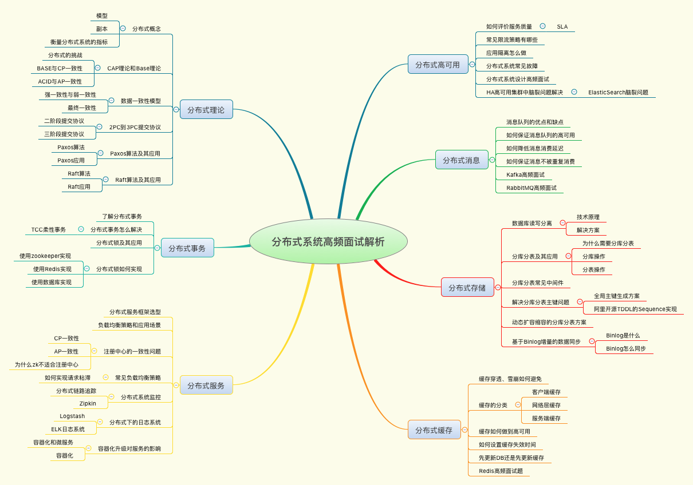

# 分布式技术原理与实战45讲

邴越

提到分布式架构就一定绕不开“一致性”问题，而“一致性”其实又包含了**数据一致性**和**事务一致性**两种情况，本文主要讨论**数据一致性**（事务一致性指ACID）

强一致性 弱一致性

单调读一致性 、单调*写一致性*

https://zhuanlan.zhihu.com/p/67949045

因果一致性 session回话一致性

https://kaiwu.lagou.com/course/courseInfo.htm?courseId=69#/content

### 第一讲

单点故障（single point failure）

系统达到了sla 三个9 四个9

###  第二讲

的

