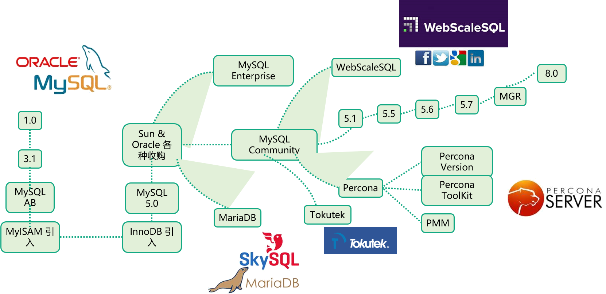

# 高性能MySQL实战

拉钩教育

周彦伟

自我介绍下，我从事数据库开发和运维工作近 15 年，先后曾担任人人网数据库主管和去哪儿网数据库总监，在数据库的架构设计、性能调优、大规模数据库集群运维等方面积累了丰富的实战经验。

我目前创立了一家数据库公司——极数云舟，致力于企业级云原生数据库 ArkDB 的产品研发和相关企业级数据库解决方案的架构和实施。同时，我个人是 Oracle ACE Director，还担任中国计算机行业协会开源数据库专业委员会会长。曾出版过原创 MySQL 技术书籍《MySQL运维内参》，这本书是 MySQL 运维实战与源码分析的完美结合，被业界称为 MySQL 面试宝典，还有一本《MySQL 8 Cookbook》中文版，这是第一本 MySQL8 的中文书籍。

分为五大部分。

第一部分主要介绍 MySQL 的体系架构与存储引擎，也会介绍一些事务与锁的机制。从整体到细节地帮助你比较深入地去了解 MySQL 的内部机制和原理，这也是在面试过程中面试官比较喜欢问的。

在第二部分里，我们会用两个课时来介绍 MySQL 库表设计和索引设计的一些思路。

第三部分，我们会介绍 MySQL 的架构设计和查询优化，这也是在工作中最常碰到的。

在第四部分，我们会来介绍 MySQL 的高可用架构方案和一些要点，同时，也会讲解一下 MySQL 自动化运维体系构建的一些思路和知识点。

最后一部分，我们会通过一个亿级数据库的项目，用实战的方式来讲解怎么去规划或设计一个可扩展的 MySQL 架构。

MySQL 常见的坑 .png

MySQL 知识点全景图.png

MySQL推荐书籍.png

在运维数据库的过程中，你如果不小心把库删掉了，进行什么操作才能实现最大的弥补，不至于做出跑路这种无奈之举，当然，跑路只是开玩笑而已。还有在碰到断电或者是主键冲突的时候，你该怎么办？数据库延迟了，你该怎么办？忘记了数据库密码，你该怎么办？还有MySQL大小写敏感得用什么样的策略，另外，表空间有碎片，你该怎么解决，或者说怎么去巡检，怎么查看表空间和表数据的碎片？等等，还有很多，这里就不详细展开了。

最重要的，就是 MySQL 的数据库属性，它支持事务、MVCC、4 种隔离级别等，同时易扩展、集群、高可用等也可以满足一般需求。

### 第02讲：深入理解事务与锁机制（上）

mysql隔离级别

产生的问题

ru rc rr s

READ UNCOMMITTED

READ COMMITTED

REPEATABLE READ

SERIALIZABLE

[你真的明白事务的隔离性吗 姜承尧](https://mp.weixin.qq.com/s?__biz=MjM5MjIxNDA4NA==&mid=400262409&idx=1&sn=827bdcde075ef2f96c82a3f11fa422d4&scene=0&key=b410d3164f5f798ea52ee30c99dcb9c7e079c79659c2ffd9927976ab0093eb3003db7a80ff517fb25e7d1f4d95c602ad&ascene=0&uin=Mjk1ODMyNTYyMg%3D%3D&devicetype=iMac+MacBookPro11%2C4+OSX+OSX+10.11.1+build(15B42)&version=11020201&pass_ticket=R6pckpGE0E2s4Glv9xfkwcXltT2IyLOoSgjYv8LFO%2Bbf7dCsH7csTqs%2BqUqWZJaF)

脏读

不可重复读

幻读

MVCC实现原理

前文多次提到了MVCC这个概念，这里我们来讲解MVCC的实现原理。MySQL InnoDB存储引擎，实现的是基于多版本的并发控制协议——MVCC，而不是基于锁的并发控制。

 

MVCC最大的好处是读不加锁，读写不冲突。在读多写少的OLTP（On-Line Transaction Processing）应用中，读写不冲突是非常重要的，极大的提高了系统的并发性能，这也是为什么现阶段几乎所有的RDBMS（Relational Database Management System），都支持MVCC的原因。 

第03讲：高性能数据库表该如何设计？

范式与反范式

本节课主要讲解一些高性能表设计的规则和案例。
以高性能为目标，库表设计以范式为主，根据特殊业务场景使用反范式，允许必要的空间换时间。
规范数据库的使用原则，统一规范命名，减少性能隐患，减少隐式转换。

高性能表设计的原则：合适的字段、合适的长度、NOT NULL。

从不同角度思考 IP、timestamp 的转换，拓宽设计思路。

规范的命名可提高可读性，反范式设计可提高查询性能。

本课时到这里就结束了，主要讲了范式和反范式、基础规范、命名规范、表设计规范、高性能数据库表实践，下一课时将分享“高性能索引如何设计”。

### 4

我们学习了索引设计和工作原理、索引类型、 索引使用技巧、如何创建高性能索引和索引创建规范 ，需要重点掌握的是索引使用技巧和如何创建高性能索引，当然索引创建规范也很重要。

### 第07讲：如何做到MySQL的高可用

企业初期使用较多的高可用架构，一类是基于 Keepalived + VIP + MySQL 主从/双主，一类是封装好的 MMM 集群，两者本质是一样的，MMM 相比前者多了一套工具集来帮助运维。

MMM也就是Master-Master replication Manager for MySQL，MySQL主主复制管理器。关于MySQL主主复制配置的监控，故障转移和管理的一套可伸缩的脚本套件，可以用这个套件在一组居于复制的服务器启动虚拟IP，除此以外，还有对从服务器的延迟监控，主从数据备份，节点之间重新同步功能。通过MMM方案可以实现MySQL服务器的故障转移，从而实现MySQL的高可用。但这个工具没有读负载均衡，这样会很难对主服务器进行读负载的分担，而且在进行主从切换时容易造成数据丢失。

mmm安装

https://www.cnblogs.com/iplus/archive/2012/03/13/4490285.html

mmm官网

https://mysql-mmm.org/

**By now there are a some good alternatives to MySQL-MMM. Maybe you want to check out Galera Cluster which is part of MariaDB Galera Cluster.**

Galera Cluster consists of two parts: the Galera Replication Library (galera-3) and a version of MySQL extended with the Write Set Replication (WSREP) API (mysql-wsrep).

MHA

[MHA](https://code.google.com/p/mysql-master-ha/) (Master High Availability Manager and tools for MySQL) 

mha4mysql-node-0.57.tar.gz

https://github.com/yoshinorim/mha4mysql-manager

mha4mysql-manager - Master High Availability Manager and tools for MySQL (MHA) for automating master failover and fast master switch. This package contains manager scripts.

去哪儿网 QMHA

PXC/MGR

### 第08讲：搭建稳固的MySQL运维体系

Arkcontrol 的备份恢复中心就是一个 MySQL 自动化备份恢复系统

# 9

在数据库的架构设计中主要有三种方法论，分别是：Shared Everything、Shared Nothing和 Shared Disk。

Shared Everything：一般是针对单个系统，完全透明共享 CPU/MEMORY/IO，并行处理能力是最差的，典型的代表 SQL Server。

Shared Nothing：系统中的各个处理单元都有私有的 CPU/MEMORY/IO 等，不存在共享资源，类似于 MPP（大规模并行处理）模式，各处理单元之间相互独立，各自处理自己的数据，它们之间通过协议通信，处理后的结果或向上层汇总或在节点间流转。这种方式的并行处理和扩展能力更好。典型的代表 DB2 DPF、Hadoop、GreenPlum 等。

Shared Disk：系统中的各个处理单元使用私有 CPU 和 MEMORY，共享磁盘系统。典型的代表 Oracle Rac、AWS Aurora 和极数云舟自主研发的 ArkDB 等，它们都是数据共享，可通过增加节点来提高并行处理的能力，做到了计算与存储分离，扩展能力较好。

10

数据库架构又可以分为三大类：主从架构、集群架构和分布式架构。在主从架构类别中，又可以分 7 小类，分别是。

传统主从复制，有时候也称为：异步复制（希望大家再复习下 MySQL 中的各种存储引擎，要注意它们的特性）。

基于 GTID 的主从复制，从 MySQL 5.6 版本后，推荐使用这种方式的复制，原因前面的课程中已经有讲解。

主主复制，这个还有不少传统企业仍在使用。

级连复制，面试的时候特别容易问到关于复制的各种变换，用的就是级连复制，注意技巧，工作中也经常用。

多源复制，MySQL 5.7 版本的一个特性，在某些特殊场景中会用到。

延迟复制，备份中会用到，尤其是当数据量特别大的情况。

半同步复制，对数据一致性要求比较高的业务场景，可以考虑用。

在集群架构类别中，又可以分为 6 小类，分别是：

MySQL Group Replication；

Percona XtraDB Cluster；

MySQL Galera Cluster；

MySQL NDB Cluster，有时候也称为 MySQL Cluster；

MySQL + 共享存储方案；

MySQL + DRBD 方案。

在分布式架构类别中，又可以分为 2 小类，分别是：

基于分布式事务的数据库，如 Google Cloud Spanner 和 TiDB。

基于分布式存储的数据库，如极数云舟的 ArkDB、Aurora、PolarDB。

数据库高可用
在前面第 7 课时中，我们详细介绍了几种常用的 MySQL 数据库高可用解决方案，这里再给大家罗列出来了，如果这里列的在前面的课程中没有介绍到，大家可以自行去学习。主要有下面 6 种：

Keepalive、Heartbeat、Haproxy；

MMM；

MHA；

Orchestrator、Raft；

极数云舟的 Arksentinel；

Zookeeper、Consul、Etcd。