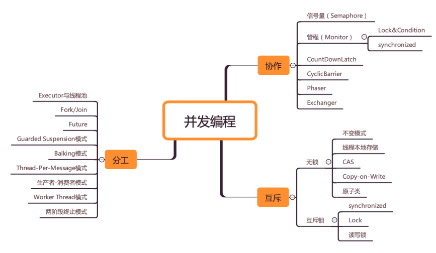

# Java并发编程实战

https://time.geekbang.org/column/intro/159?tab=catalog
王宝令

Windows电脑上有pdf

多线程问题

1、线程缓存
2、

并发编程可以总结为三个核心问题：分工、同步、互斥。
第一部分：并发理论基础 (13讲)
Java SDK并发包里的 Executor、Fork/Join、Future 本质上都是分工方法
Java SDK里提供的 CountDownLatch、CyclicBarrier、Phaser、Exchanger

Java并发编程实战王宝令极客时间

Chap. 2

多线程问题

- 多线程协作
- 多线程并发

协作一般是和分工相关的。Java SDK 并发包里的 Executor、Fork/Join、Future 本质上 都是分工方法，但同时也能解决线程协作的问题。
Java SDK 里提供的 CountDownLatch、CyclicBarrier、Phaser、 Exchanger 也都是用来解决线程协作问题的。

future.get()
主线程等待

在 Java 并发编程领域，解决协作问题的核心技术是管程

第二部分：并发工具类 (14讲)

第三部分：并发设计模式 (10讲)

第四部分：案例分析 (4讲)

第五部分：其他并发模型 (4讲)

