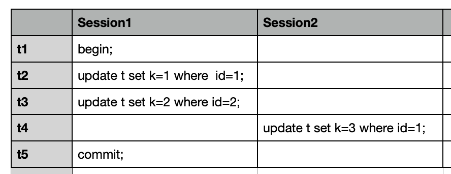
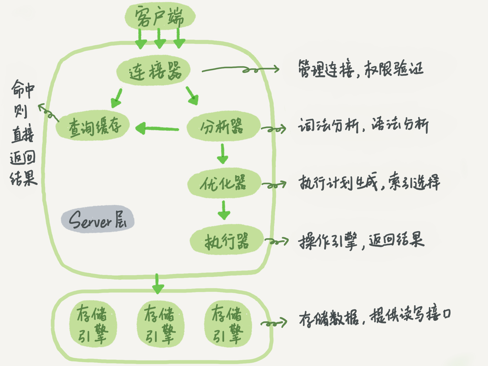

# MySQL实战45讲

林晓斌 网名丁奇，腾讯云数据库负责人

林晓斌，网名“丁奇”，腾讯云数据库负责人，前阿里 P9 技术专家，曾负责阿里云 RDS 内核开发团队和运维团队，并推动了 AliSQL 分支开源。作为活跃的 MySQL 社区贡献者，丁奇专注于数据存储系统、MySQL 源码研究和改进、MySQL 性能优化和功能改进，热衷于

https://time.geekbang.org/column/intro/100020801
https://time.geekbang.org/column/intro/139


Widnows Mac电脑上

一共45讲

202403评价：
没有“数据库管理系统-清华大学李国良”深入

#### 核心概念/专有名词

- 两阶段锁协议 1pl 3pl
- 覆盖索引 coving index 索引下推
- WAL
- redo log
- bin log
- 脏读（dirty read）
- 不可重复读（non-repeatable read）
- 幻读（phantom read）
- 索引下推
- mdl 锁 表锁 行锁 锁的粒度 MDL(Metadata Locking)

two-phase locking protocol 2PL协议，两段封锁协议
Two-phase transaction and two-phase locking protocol

两阶段锁协议（Two-Phase Locking Protocol）是一种并发控制协议，用于确保事务的隔离性和一致性。它将事务的执行分为两个阶段：增长阶段（Growing Phase）和收缩阶段（Shrinking Phase）。
以下是两阶段锁协议的基本原则：
1. 增长阶段（Growing Phase）：
   - 锁请求：事务在需要访问共享资源之前，必须先申请读锁（共享锁）或写锁（排他锁）。
   - 锁释放：事务在完成对共享资源的访问后，释放所持有的锁。
2. 收缩阶段（Shrinking Phase）：
   - 锁释放：事务在释放一个锁之后，不能再请求新的锁。
   - 锁释放顺序：事务在释放锁的过程中，必须按照获取锁的逆序释放，即后获取的锁先释放，以保证不会发生死锁。
两阶段锁协议的关键是保证事务在释放锁之前，已经获取了所有需要的锁。这样可以避免数据不一致和并发冲突的问题。如果一个事务在增长阶段请求锁时发现有冲突，它必须等待直到锁可用，或者选择回滚（撤销）操作，释放已经获取的锁并重新开始事务。

两阶段锁协议提供了一种可靠的并发控制机制，确保事务的隔离性和一致性。然而，它并不能解决所有的并发问题，如死锁和饥饿问题，因此在实际应用中，还需要综合考虑其他的并发控制机制和调度算法。

分布式事务里面的
https://zh.wikipedia.org/wiki/%E4%BA%8C%E9%98%B6%E6%AE%B5%E6%8F%90%E4%BA%A4


MySQL行锁、两阶段锁协议、死锁以及死锁检测
https://blog.csdn.net/weixin_38118016/article/details/90271468

[两阶段锁协议](https://blog.csdn.net/weixin_30764771/article/details/96820963)

MySQL的行级锁是由各个引擎自己实现的，innodb支持行级锁但MyISAM却不支持，这也是innodb更受青睐的原因之一。
想要高效使用innodb的行级锁，必须要熟悉两阶段锁协议和死锁预防。

#### 两阶段锁协议

- 定义
事务执行时，在运行到需要加锁的语句时加锁，但不是对应语句执行完了就释放锁，而是等到commit时才会释放锁。



- 如图1所示，session1在t1时刻对id=1的行加锁了。在t4时刻session2想要更新id=1的行，这是会被阻塞，因为id=1的行锁需要等到t5时刻session1 commit后才会被释放。
   对程序的影响
   在编写程序时，程序员应当尽量将需要请求行锁的代码放到离commit更近的地方。

#### 死锁预防措施

- 我们知道死锁发生的条件
  1. 多个资源互斥访问
  2. 资源被获取后不可抢占
  3. 多个线程循环等待
- 在数据库行级锁场景下，这些条件都会被满足，因此对于行级锁的请求肯定会造成死锁。那我们应当如何解决死锁呢，有如下两种办法：
1. 死锁检测
      著名的死锁检测方法就是银行家算法，不知道的小伙伴可以查一下。但这有个非常大的缺点，每次死锁检测的时间复杂度为O(N)，因此如果有1000个线程要执行加锁操作时就会带来100万级别的时间复杂度开销。
2. 控制并发度
      很好理解，线程数越少死锁发生的概率越小。可以通过控制统一时刻访问同一行的请求数量来控制并发度以减少死锁发生的概率。另一种方式就是将数据分散，比如数据库中原来有一行数据记录用户在银行的存款数额，现在将其拆分成10行，10行数额的相加就是这个用户的存款数，当一个请求要修改该用户的存款数额的时候，就随机从10行中选一行进行操作，这样就将并发度减少为了1/10。

在整个专栏里面，我们的例子中如果没有特别说明，都是默认autocommit=1。

#### 01 基础架构



连接器

查询缓存  8.0开始彻底没有这个功能了

分析器
优化器
执行器

执行引擎

select * from T where k=1 报错k列不存在 分析器报错的

#### 02 日志系统

重要的日志模块：redo log
重要的日志模块：binlog

两阶段提交


#### 03讲 事务隔离

当数据库上有多个事务同时执行的时候，就可能出现脏读（dirty read）、不可重复读（non-repeatable read）、幻读（phantom read）的问题，为了解决这些问题，就有了“隔离级别”的概念。
读未提交（read uncommitted）、读提交（read committed）、可重复读（repeatable read）和串行化（serializable ）

事务隔离的实现

事务的启动方式

#### 04讲 深入浅出索引（上）

InnoDB索引的数据结构模型
索引的常见模型
三种常见、也比较简单的数据结构，它们分别是哈希表、有序数组和搜索树
有序数组索引只适用于静态存储引擎
InnoDB 的索引模型
B+树能够很好地配合磁盘的读写特性，减少单次查询的磁盘访问次数。

```sql
create table T ( ID int primary key, k int NOT NULL DEFAULT 0,  s varchar(16) NOT NULL DEFAULT '', index k(k)) engine=InnoDB;
insert into T values(100,1, 'aa'),(200,2,'bb'),(300,3,'cc'),(500,5,'ee'),(600,6,'ff'),(700,7,'gg');
select * from T where k between 3 and 5;
```
覆盖索引

如果执行的语句是select ID from T where k between 3 and 5，这时只需要查ID的值，而ID的值已经在k索引树上了，因此可以直接提供查询结果，不需要回表。也就是说，在这个查询里面，索引k已经“覆盖了”我们的查询需求，我们称为覆盖索引。

由于覆盖索引可以减少树的搜索次数，显著提升查询性能，所以使用覆盖索引是一个常用的性能优化手段。

`CREATE TABLE `tuser` (  `id` int(11) NOT NULL,  `id_card` varchar(32) DEFAULT NULL,  `name` varchar(32) DEFAULT NULL,  `age` int(11) DEFAULT NULL,  `ismale` tinyint(1) DEFAULT NULL,  PRIMARY KEY (`id`),  KEY `id_card` (`id_card`),  KEY `name_age` (`name`,`age`) ) ENGINE=InnoDB;`

问：再建立一个（身份证号、姓名）的联合索引，是不是浪费空间？

如果现在有一个高频请求，要根据市民的身份证号查询他的姓名，这个联合索引就有意义了。它可以在这个高频请求上用到覆盖索引，不再需要回表查整行记录，减少语句的执行时间。
#### 05讲 索引下推

索引下推（Index Pushdown）是一种优化技术，用于在数据库查询过程中将过滤条件下推到存储引擎层级，以减少数据的读取和处理量，提高查询性能。
传统的查询优化过程中，查询语句首先会根据索引定位到符合条件的数据块，然后将数据块读入内存，在内存中进行过滤操作。这种方式可能导致大量的数据读取和传输操作，增加了查询的开销。
索引下推的思想是，将过滤条件应用到索引读取过程中，以便在存储引擎层级尽早地过滤掉不符合条件的数据，减少数据的读取量。具体来说，当查询语句中包含了过滤条件时，存储引擎可以利用索引的特性，将过滤条件下推到存储引擎中的索引层级进行处理，只读取满足条件的索引项，而不是读取整个数据块。
通过索引下推，可以减少磁盘 I/O 操作和数据传输量，提高查询性能。尤其在大数据量和复杂查询条件的情况下，索引下推可以带来显著的性能优势。
需要注意的是，索引下推的可行性和效果取决于数据库管理系统和存储引擎的实现。不同的数据库系统可能对索引下推的支持程度有所差异，且并非所有类型的查询和索引都适用于索引下推的优化。因此，在实际应用中，需要综合考虑数据库系统的特性和查询的特点，以确定是否使用索引下推以及如何优化查询性能。


最左前缀原则

name字段是比age字段大的 ，那我就建议你创建一个（name,age)的联合索引和一个(age)的单字段索引。

索引下推

#### 06讲 全局锁和表锁：给表加个字段怎么有这么多阻碍
根据加锁的范围，MySQL里面的锁大致可以分成全局锁、表级锁和行锁三类。
全局锁的典型使用场景是，做全库逻辑备份。也就是把整库每个表都select出来存成文本。

##### 表级锁

MySQL里面表级别的锁有两种：一种是表锁，一种是元数据锁（meta data lock，MDL)。
表锁的语法是 lock tables … read/write。
另一类表级的锁是MDL（meta data lock)。

#### 07讲 行锁功过：怎么减少行锁对性能的影响
从两阶段锁说起
在InnoDB事务中，行锁是在需要的时候才加上的，但并不是不需要了就立刻释放，而是要等到事务结束时才释放。这个就是两阶段锁协议。


死锁和死锁检测
一种头痛医头的方法，就是如果你能确保这个业务一定不会出现死锁，可以临时把死锁检测关掉。
另一个思路是控制并发度

#### 08讲 事务到底是隔离的还是不隔离的

在整个专栏里面，我们的例子中如果没有特别说明，都是默认autocommit=1。


#### 09讲 普通索引和唯一索引，应该怎么选择

change buffer 和 redo log
https://www.cnblogs.com/jamaler/p/12371205.html


#### 10讲 MySQL为什么有时候会选错索引

explain

显示结果的含义

mysql自动选择索引

#### 11讲 怎么给字符串字段加索引

邮箱字段加索引

使用前缀索引，定义好长度，就可以做到既节省空间，又不用额外增加太多的查询成本。

覆盖索引

覆盖索引是select的数据列只用从索引中就能够取得，不必读取数据行，换句话说查询列要被所建的索引覆盖。

理解方式一：索引是高效找到行的一个方法，但是一般数据库也能使用索引找到一个列的数据，因此它不必读取整个行。毕竟索引叶子节点存储了它们索引的数据；当能通过读取索引就可以得到想要的数据，那就不需要读取行了。一个索引包含了（或覆盖了）满足查询结果的数据就叫做覆盖索引。
理解方式二：是非聚集复合索引的一种形式，它包括在查询里的Select、Join和Where子句用到的所有列（即建索引的字段正好是覆盖查询条件中所涉及的字段，也即，索引包含了查询正在查找的数据）
那我们如何知道，SQL有没有使用到覆盖索引呢，在MySql中，我们可以使用explain查询SQL的执行计划，如果使用了覆盖索引，在Extra字段会输出Using index，这就表示当前sql使用了覆盖索引 ‘ 如何实现索引覆盖？
最常见的方法就是：将被查询的字段，建立到联合索引（如果只有一个字段，普通索引也可以）里去。

前缀索引对覆盖索引的影响

show engines;查看mysql支持的存储引擎

show variables like '%storage_engine%';

查看默认的存储引擎

InnoDB的行锁是针对索引加的锁，不是针对记录加的锁。并且该索引不能失效，否则都会从行锁升级为表锁。索引失效的原因

#### 12 | 为什么我的MySQL会“抖”一下？
#### 13 | 为什么表数据删掉一半，表文件大小不变？
#### 14 | count(*)这么慢，我该怎么办？
#### 15 | 答疑文章（一）：日志和索引相关问题
#### 16 | “order by”是怎么工作的？
#### 17 | 如何正确地显示随机消息？
#### 18 | 为什么这些SQL语句逻辑相同，性能却差异巨大？
#### 19 | 为什么我只查一行的语句，也执行这么慢？
#### 20 | 幻读是什么，幻读有什么问题？

#### 21 | 为什么我只改一行的语句，锁这么多？

#### 22 | MySQL有哪些“饮鸩止渴”提高性能的方法？
#### 23 | MySQL是怎么保证数据不丢的？
#### 24 | MySQL是怎么保证主备一致的？
#### 25 | MySQL是怎么保证高可用的？
#### 26 | 备库为什么会延迟好几个小时？
#### 27 | 主库出问题了，从库怎么办？
#### 28 | 读写分离有哪些坑？
#### 29 | 如何判断一个数据库是不是出问题了？
#### 30 | 答疑文章（二）：用动态的观点看加锁
#### 31 | 误删数据后除了跑路，还能怎么办？
#### 32 | 为什么还有kill不掉的语句？

#### 33 | 我查这么多数据，会不会把数据库内存打爆？
#### 34 | 到底可不可以使用join？
#### 35 | join语句怎么优化？
#### 36 | 为什么临时表可以重名？
#### 37 | 什么时候会使用内部临时表？
#### 38 | 都说InnoDB好，那还要不要使用Memory引擎？
#### 39 | 自增主键为什么不是连续的？
#### 40 | insert语句的锁为什么这么多？
#### 41 | 怎么最快地复制一张表？
#### 42 | grant之后要跟着flush privileges吗？

#### 43 | 要不要使用分区表？
#### 44 | 答疑文章（三）：说一说这些好问题
#### 45 | 自增id用完怎么办？
