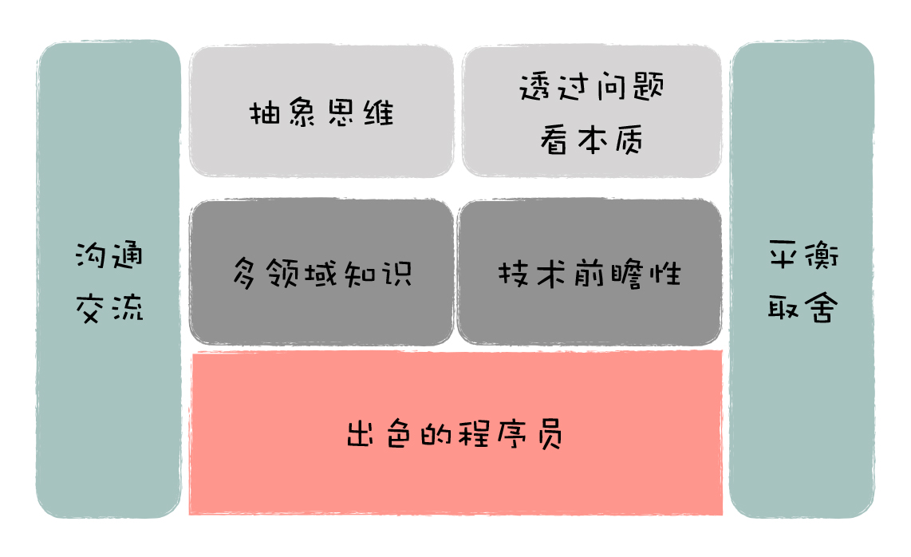

# 架构实战案例解析

架构实战案例解析

王庆友

https://time.geekbang.org/column/intro/100046301?code=mWCwfbKEV14yGm-dVLIMCrmH8xIIMXyiCu1-xZXmiAo%3D

先后就职于Sybase、eBay、腾讯、1号店等大型互联网公司，曾担任1号店首席架构师和创业公司CTO

系统设计 架构师

如何学习架构

首先，你需要跳出当前的小模块，站在系统整体的角度来考虑问题。

其次，你不仅要从技术的角度考虑问题，也要学会从业务的角度来考虑问题，深入理解系统的挑战在哪里，不要在错误的地方发力。

最后，你需要做好各方面的平衡，能在现有的各项资源约束下，寻求一个最优解。

架构设计的实践性很强

业务架构篇：重点针对系统的扩展性和复用性两大目标展开。

技术架构篇：重点针对系统高可用和高性能 / 可伸缩的目标展开

架构 业务架构 技术架构

业务架构

技术架构

可扩展性

可复用行

技术架构
ha
hp/可伸缩性
GoF 设计模式和 J2EE 设计模式我对 GoF 的 23 个设计模式和 J2EE 设计模式都作过深入了解，GoF 设计模式的粒度比较小，针对的是类级别的关系定义；J2EE 设计模式的粒度比较大，针对的是企业级系统设计。

GOF的23种设计模式https://www.jianshu.com/p/da3ffb955a93

### 2

架构的本质就是：通过合理的内部编排，保证系统高度有序，能够不断扩展，满足业务和技术的变化。

系统的落地过程。系统首先由人来开发，然后由机器来运行，人和机器共同参与一个系统的落地。

开发的痛点主要由业务架构和应用架构来解决，机器的痛点主要由技术架构来解决。

业务架构就是讲清楚核心业务的处理过程，定义各个业务模块的相互关系，它从概念层面帮助我们理解系统面临哪些问题以及如何处理；

应用架构就是讲清楚系统内部是怎么组织的，有哪些应用，相互间是怎么调用的，它从逻辑层面帮助我们理解系统内部是如何分工与协作的。

技术架构就是讲清楚系统由哪些硬件、操作系统和中间件组成，它们是如何和我们开发的应用一起配合，应对各种异常情况，保持系统的稳定可用。所以，技术架构从物理层面帮助我们理解系统是如何构造的，以及如何解决稳定性的问题。

业务架构定义了这个电影的故事情节和场景安排；应用架构进一步定义有哪些角色，每个角色有哪些职责，并且在每个场景中，这些角色是如何互动的；技术架构最后确定这些角色由谁来表演，物理场景上是怎么布置的，以此保证整个拍摄能够顺利完成。

所以做架构设计时，一般是先考虑业务架构，再应用架构，最后是技术架构。

一个好的架构必须满足两方面挑战：业务复杂性和技术复杂性。

1、业务复杂性

系统的功能变化不能影响现有业务，不要一修改，就牵一发动全身，到处出问题。因此，在架构设计上，要做到系统的柔性可扩展，能够根据业务变化做灵活的调整。

2. 技术复杂性

   一个复杂系统是由很多部分组成的，如应用程序、服务器、数据库、网络、中间件等，都可能会出问题。那怎么在出问题时，能够快速恢复系统或者让备用系统顶上去呢

出色的程序员，写的一手好代码

架构师要有技术的广度（多领域知识）和深度（技术前瞻）

思维的高度，具备抽象思维能力

思维的深度，能够透过问题看本质

良好的沟通能力（感性）

良好的平衡取舍能力（理性）

### 02 | 业务架构：作为开发，你真的了解业务吗？

从架构角度看，业务架构是源头，然后才是技术架构

因此，一个好的架构设计既要满足业务的可扩展、可复用；也要满足系统的高可用、高性能和可伸缩，并尽量采用低成本的方式落地。所以，对架构设计来说，技术和业务两手都要抓，两手都要硬。

安全架构不是技术架构
部署架构属于技术架构

课后习题

安全架构

部署架构属于技术架构

https://time.geekbang.org/column/article/200822

微信小程序领券线下买单

websocker轮训 1min一次

订阅通知

MQ 异步削锋

王庆友

前1号店首席架构师

王庆友，浙江大学计算机硕士，有近二十年的软件开发经验。他先后就职于Sybase、eBay、腾讯、1号店等大型互联网公司，曾担任1号店首席架构师和创业公司CTO。作为一名架构老兵，王庆友熟悉互联网电商和新零售场景，在大规模分布式系统、微服务、中台建设等领域，他都有着非常丰富的理论和实践经验。

#### 01 | 架构的本质：如何打造一个有序的系统

架构的分类

业务架构、应用架构和技术架构

业务架构

可扩展架构

可复用架构

所以做架构设计时，一般是先考虑业务架构，再应用架构，最后是技术架构

接入系统

应用系统

基础平台

核心组件

支撑系统

