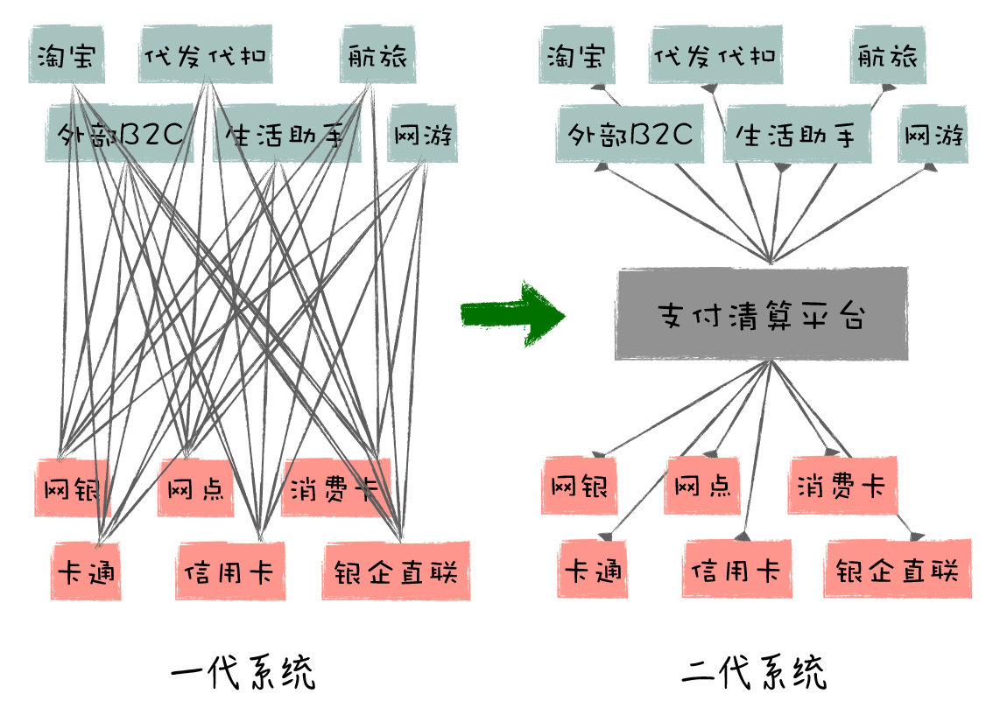
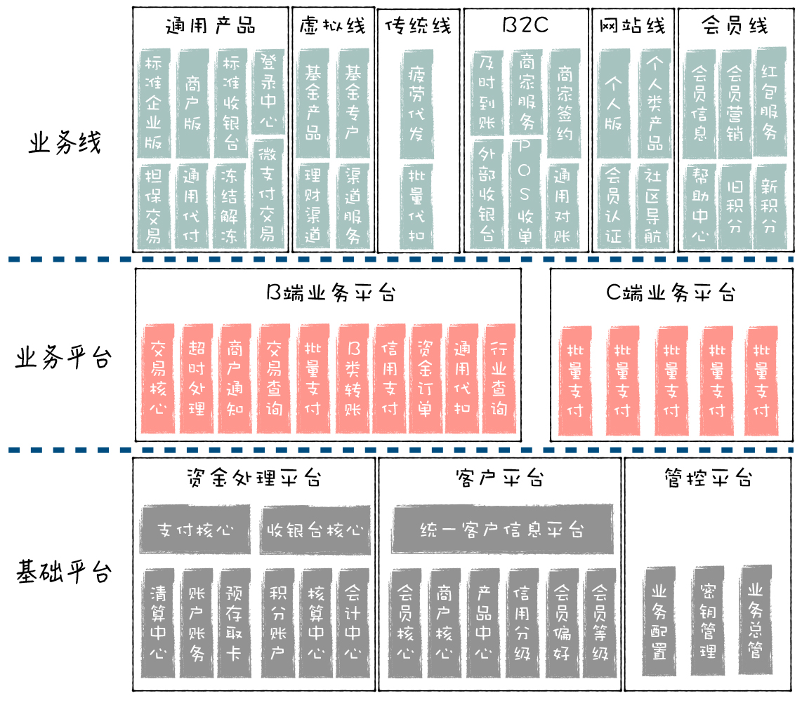
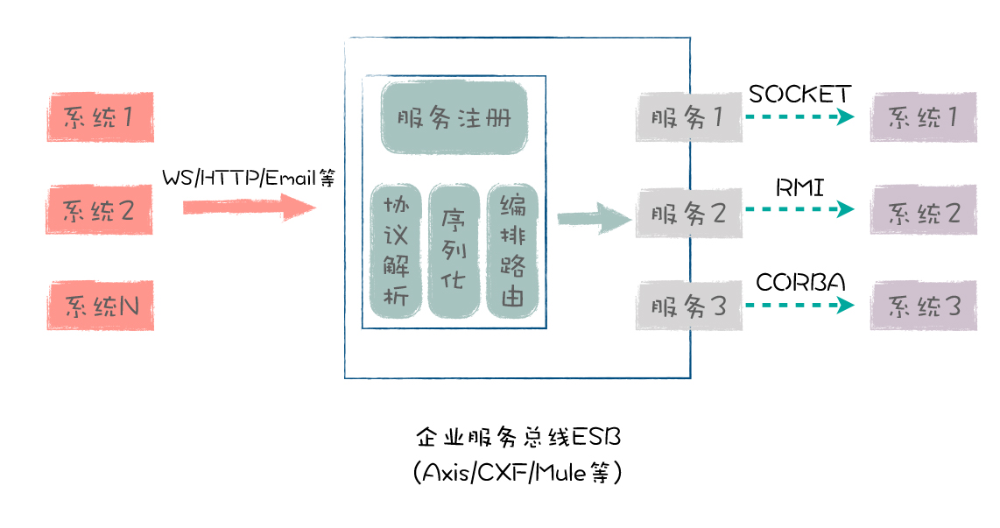
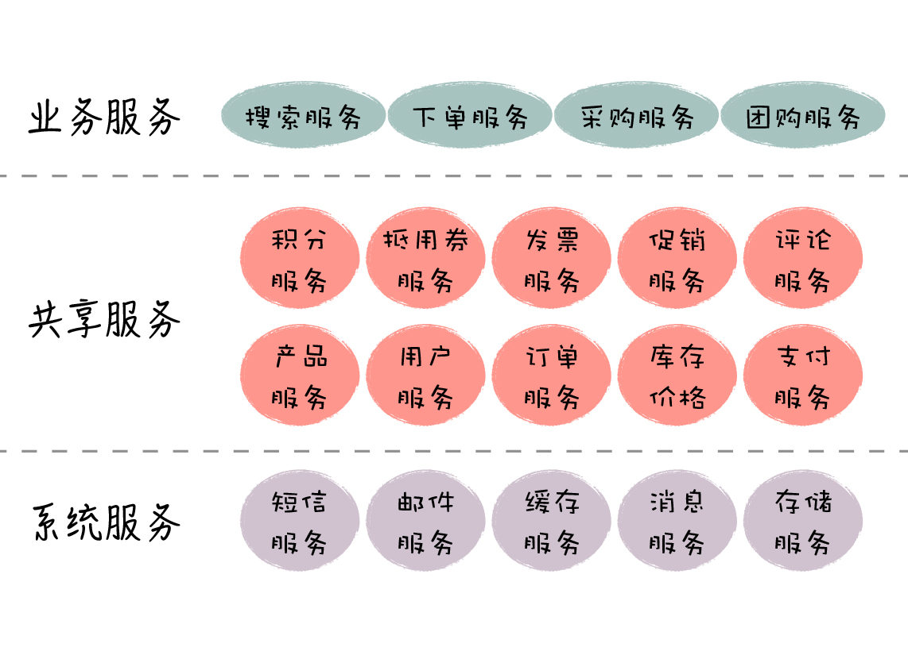

# 架构实战案例解析

架构实战案例解析

期第2天

架构实战案例解析 王庆友 极客时间 

架构

技术架构师
业务架构师
安全架构 部署架构

系统=模块+

模块之间调用关系

支付宝一代架构和二代架构的变迁

中台

上线评审

概述篇 (2讲)

开篇词 | 想吃透架构？你得看看真实、接地气的架构案例
01 | 架构的本质：如何打造一个有序的系统？
业务架构篇 (9讲)
02 | 业务架构：作为开发，你真的了解业务吗？
03 | 可扩展架构：如何打造一个善变的柔性系统？
04 | 可扩展架构案例（一）：电商平台架构是如何演变的？
05 | 可扩展架构案例（二）：App服务端架构是如何升级的？
06 | 可扩展架构案例（三）：你真的需要一个中台吗？
07 | 可复用架构：如何实现高层次的复用？
08 | 可复用架构案例（一）：如何设计一个基础服务？
09 | 可复用架构案例（二）：如何对现有系统做微服务改造？
10 | 可复用架构案例（三）：中台是如何炼成的？
11 | 技术架构：作为开发，你真的了解系统吗？
12 | 高可用架构：如何让你的系统不掉链子？
13 | 高可用架构案例（一）：如何实现O2O平台日订单500万？
14 | 高可用架构案例（二）：如何第一时间知道系统哪里有问题？
15 | 高可用架构案例（三）：如何打造一体化的监控系统？
16 | 高性能和可伸缩架构：业务增长，能不能加台机器就搞定？
17 | 高性能架构案例：如何设计一个秒杀系统？
18 | 可伸缩架构案例：数据太多，如何无限扩展你的数据库？
19 | 综合案例：电商平台技术架构是如何演变的？
20 | 从务实的角度，给你架构设计的重点知识和学习路径
结束语 | 和你聊聊我的架构心路历程
结课测试 | “架构实战案例解析”100分试卷等你来挑战！

https://time.geekbang.org/column/intro/100046301?code=mWCwfbKEV14yGm-dVLIMCrmH8xIIMXyiCu1-xZXmiAo%3D

先后就职于Sybase、eBay、腾讯、1号店等大型互联网公司，曾担任1号店首席架构师和创业公司CTO

系统设计 架构师
如何学习架构
首先，你需要跳出当前的小模块，站在系统整体的角度来考虑问题。
其次，你不仅要从技术的角度考虑问题，也要学会从业务的角度来考虑问题，深入理解系统的挑战在哪里，不要在错误的地方发力。
最后，你需要做好各方面的平衡，能在现有的各项资源约束下，寻求一个最优解。
架构设计的实践性很强

业务架构篇：重点针对系统的扩展性和复用性两大目标展开。
技术架构篇：重点针对系统高可用和高性能 / 可伸缩的目标展开

架构 业务架构 技术架构

业务架构
技术架构

可扩展性
可复用行

技术架构
ha
hp/可伸缩性
GoF 设计模式和 J2EE 设计模式我对 GoF 的 23 个设计模式和 J2EE 设计模式都作过深入了解，GoF 设计模式的粒度比较小，针对的是类级别的关系定义；J2EE 设计模式的粒度比较大，针对的是企业级系统设计。

GOF的23种设计模式https://www.jianshu.com/p/da3ffb955a93

王庆友
前1号店首席架构师
王庆友，浙江大学计算机硕士，有近二十年的软件开发经验。他先后就职于Sybase、eBay、腾讯、1号店等大型互联网公司，曾担任1号店首席架构师和创业公司CTO。作为一名架构老兵，王庆友熟悉互联网电商和新零售场景，在大规模分布式系统、微服务、中台建设等领域，他都有着非常丰富的理论和实践经验。

#### 01 | 架构的本质：如何打造一个有序的系统
架构的分类
业务架构、应用架构和技术架构
业务架构
可扩展架构
可复用架构

所以做架构设计时，一般是先考虑业务架构，再应用架构，最后是技术架构

接入系统
应用系统
基础平台
核心组件
支撑系统

#### 2 业务架构：作为开发，你真的了解业务吗？

架构的本质就是：通过合理的内部编排，保证系统高度有序，能够不断扩展，满足业务和技术的变化。

系统的落地过程。系统首先由人来开发，然后由机器来运行，人和机器共同参与一个系统的落地。

开发的痛点主要由业务架构和应用架构来解决，机器的痛点主要由技术架构来解决。

业务架构就是讲清楚核心业务的处理过程，定义各个业务模块的相互关系，它从概念层面帮助我们理解系统面临哪些问题以及如何处理；

应用架构就是讲清楚系统内部是怎么组织的，有哪些应用，相互间是怎么调用的，它从逻辑层面帮助我们理解系统内部是如何分工与协作的。

技术架构就是讲清楚系统由哪些硬件、操作系统和中间件组成，它们是如何和我们开发的应用一起配合，应对各种异常情况，保持系统的稳定可用。所以，技术架构从物理层面帮助我们理解系统是如何构造的，以及如何解决稳定性的问题。

业务架构定义了这个电影的故事情节和场景安排；应用架构进一步定义有哪些角色，每个角色有哪些职责，并且在每个场景中，这些角色是如何互动的；技术架构最后确定这些角色由谁来表演，物理场景上是怎么布置的，以此保证整个拍摄能够顺利完成。

所以做架构设计时，一般是先考虑业务架构，再应用架构，最后是技术架构。

一个好的架构必须满足两方面挑战：业务复杂性和技术复杂性。

1、业务复杂性
系统的功能变化不能影响现有业务，不要一修改，就牵一发动全身，到处出问题。因此，在架构设计上，要做到系统的柔性可扩展，能够根据业务变化做灵活的调整。
2. 技术复杂性
 一个复杂系统是由很多部分组成的，如应用程序、服务器、数据库、网络、中间件等，都可能会出问题。那怎么在出问题时，能够快速恢复系统或者让备用系统顶上去呢

出色的程序员，写的一手好代码
架构师要有技术的广度（多领域知识）和深度（技术前瞻）
思维的高度，具备抽象思维能力
思维的深度，能够透过问题看本质
良好的沟通能力（感性）
良好的平衡取舍能力（理性）

### 02 | 业务架构：作为开发，你真的了解业务吗？
从架构角度看，业务架构是源头，然后才是技术架构
因此，一个好的架构设计既要满足业务的可扩展、可复用；也要满足系统的高可用、高性能和可伸缩，并尽量采用低成本的方式落地。所以，对架构设计来说，技术和业务两手都要抓，两手都要硬。
购物流程 = 商品模块. 商品搜索 + 购物车模块. 添加商品 + 订单模块. 创建订单 + 支付模块. 支付
对业务架构师来说，TA 的工作，就是把业务流程和节点打散，按照业务域的维度来划分系统模块，并定义这些模块之间的关系，最终形成一个高度结构化的模块体系。
产品经理和业务架构师的工作既有区别又有联系，简单地说，产品经理定义了系统的外观，满足了用户；业务架构师在此基础上，进一步定义了系统的内部模块结构，满足了开发人员。
架构目标之一：业务的可扩展
架构目标之二：业务的可复用
那么，我们如何才能实现业务的快速变化和系统的相对稳定呢？
业务的主题是变化和创新，系统的主题是稳定和可靠。
支付宝的业务架构变化过程

架构目标之二：业务的可复用
对于类似的业务需求，如果原来做的工作可以大量复用的话，这是非常理想的结果，无论对于开发效率和开发质量的提升都很有帮助。
那么，业务架构设计如何实现业务的可复用呢？
首先，模块的职责定位要非常清晰。
其次，模块的数据模型和接口设计要保证通用。
最后，实现模块的高复用，还需要做好业务的层次划分。

三方支付平台的业务架构图

最后，给你留一道思考题：产品经理和业务架构师都是分析业务，产品经理为什么不能兼业务架构师的角色？他们的能力模型有什么区别？
展示业务架构和应用架构，混在一起
混在一起问题也不大，很多时候业务架构和应用架构长的差不多。一般来说三个图：
1. 模块的静态结构图，描述各个模块的层次关系
2. 模块的动态关系图，比如业务流，数据流，调用关系
3. 针对核心的场景，补充交互序列图，从具体过程理解交互关系
或者你静态关系图偏业务架构，动态关系偏应用架构。
最后根据需要，可能还需要状态机，核心库表模型等等。主要是说明问题，大家理解清晰就可以。
总结：
1. 进行微服务拆分时，需要根据业务领域来确定服务边界（DDD）
2. 当业务越来越复杂，前台业务场景越来越多，为了保证系统的服务的扩展性和可复用 ，在微服务的基础上，可以通过服务分层，进一步落地中台架构
业务架构会影响微服务边界的划分和系统分层，这些最终都要在技术上落地，所以需要架构师来做这些事情。产品经理更多的是对用户需求的挖掘，业务流程的梳理，原型设计等工作
你这个理解得很好，就微服务来说，确定需要划分为几个服务，各个服务边界是什么，有了这么多的应用和服务后，系统怎么分层比较好，这个是业务架构要做的，产品经理是搞不定这些的。
至于选用什么微服务框架，是dubbo还是spring cloud，这是技术架构层面的事。
结合业务，划分服务边界，确定应用和服务之间的调用序列图，这些都是业务架构师做的事情。
https://www.processon.com/view/link/5e51378ce4b0c037b5f9d1e3

### 03 | 可扩展架构:如何打造一个善变的柔性系统?

03篇到06篇讲的都是业务可扩展，大致关系如下：

1. 03篇是总纲，从系统=模块+关系出发，怎么去定义模块和关系。
2. 04篇介绍互联网架构，从单体到微服务，这些都是实际的架构，通过这些架构中，介绍模块和关系是怎么演变支持扩展的。
3. 05篇通过具体的网关案例，从单体到服务化，介绍模块和关系在一个实际项目中怎么变化的。
4. 06篇介绍中台，是04篇的继续。

系统的构成：模块 + 关系

模块

从扩展性的角度出发，首先，我们对模块的要求是：定位明确，概念完整。
自成体系，粒度适中。
尽量围绕自身内部数据进行处理

依赖关系
MVC 架构，系统模块按照定位，分为表示层、应用层、聚合服务层、基础服务层。表示层，对应前端的模块，如 App、小程序、公众号等，属于 View 层。应用层，对应和前端表示层直接关联的服务端，属于 Control 层。聚合服务层，如果系统业务比较复杂，经常需要单独的聚合服务层负责业务流程的编排组合，这个属于 Model 层的加强。基础服务层，代表最基础的业务模块管理，如订单、商品、用户等，属于实际的 Model 层。
业务架构扩展性的本质是：通过构建合理的模块体系，有效地控制系统复杂度，最小化业务变化引起的系统调整。
通过拆分，实现模块划分；通过整合，优化模块依赖关系。
打造可扩展的模块体系：模块拆分我们先对系统进行模块化拆分，拆分有两种方式：水平拆分和垂直拆分。
一般做业务架构时，我们先考虑垂直拆分，从大方向上，把不同业务给区分清楚，然后再针对具体业务，按照业务处理流程进行水平拆分。

垂直方向拆分
一般做业务架构时，我们先考虑垂直拆分，从大方向上，把不同业务给区分清楚，然后再针对具体业务，按照业务处理流程进行水平拆分。
打造可扩展的模块体系：模块整合

通用化整合

通过模块通用化，模块的数量减少了，模块的定位更清晰，概念更完整，职责更聚焦。在实践中，当不同业务线对某个功能需求比较类似时，我们经常会使用这个手段。

平台化整合

打造可扩展的模块体系：模块整合

通用化整合

通过模块通用化，模块的数量减少了，模块的定位更清晰，概念更完整，职责更聚焦。在实践中，当不同业务线对某个功能需求比较类似时，我们经常会使用这个手段。

平台化整合

业务平台化是模块依赖关系层次化的一个特例，只是它偏向于基础能力，在实践中，当业务线很多，业务规则很复杂时，我们经常把底层业务能力抽取出来，进行平台化处理。

问：关于系统重构，业务梳理并划分清楚后，在技术角度需要考量的因素还有那些。
回复：系统重构时，除了设计到位，保证系统能够平滑过渡也很重要。技术角度多考虑数据如何迁移，如何实现系统的灰度改造，分阶段上线，减少风险。出问题时，要有B计划兜底。

一个信息对接平台，简化后的主要内容就是这样。
1.信息分为几大类，用户可以发布几种不同的信息，信息发布流程大不分逻辑是一样的，有一小部分差别，和你举例中的打车有点类似。
2.用户查看别人发布的信息需要消耗积分，查看几种分类的信息消耗的积分是不一样的。
3.用户可以置顶自己发布的信息，需要消耗积分，置顶不同分类信息的积分也是不同的。
4.积分是通过用户 拉新、充值等方式获得的。
5.用户的积分是储存在用户表的一个字段中。
6.用户查看信息、或者发布信息 之前会先判断用户的状态，如果用户被我们做了一些标记，就会先让用户做一些其他操作才能查看信息，比如先填手机号填个验证码.

7. 一条信息只扣一次积分，也就是说，在扣分之前会先查询是否已经扣分，扣过分就不再扣分了。
大致的场景就这样，我把系统划分为下面几个模块、和功能。

用户模块： 登录、注册、鉴权...
信息模块： 发布信息、修改信息...
积分模块： 设置各种信息的扣分单价（比如 A类信息需要1分查看，B类信息需要2分查看）。设置 充值单价(10元20积分，20元50积分等)。 记录 积分来源记、积分消耗等积分记录

问题1： 我这样划分模块合不合适？

问题2： 用户查看信息消耗积分这个动作应该放在哪个模块，是放到用户模块、还是积分模块，还是再新增一个模块。
如果放到用户模块： 先去信息模块获取信息，获取用户信息(需要判断用户状态是否健康) 再扣掉用户积分，然后调用积分模块增加一条积分消耗的记录
如果放到积分模块： 先去信息模块获取信息，调用用户模块(需要判断用户状态是否健康) 再次调用用户模块扣掉积分，再增加一条积分消耗记录。

### 04 | 可扩展架构案例（一）：电商平台架构是如何演变的

单体架构

在单体架构中，模块结构是否合理，很大程度上依赖于开发者的个人水平。

分布式架构

分布式架构适用于业务相关性低、耦合少的业务系统。

SOA 架构

那有没有更轻量级的架构，使得系统各个部分更容易构建和相互协作呢？

微服务架构

而微服务围绕更小的业务单元构建独立的应用。

但两者不同的地方在于，微服务是去中心化的，不需要 SOA 架构中 ESB 的集中管理方式。

微服务强调所谓的哑管道

微服务强调智能终端

微服务 = 小应用 + 小服务。

在实践中，我们往往弱化微服务的小应用定位，然后扩大化微服务小服务的定位，我们不再强调端到端的业务封装，而是可以有各种类型的微服务。

值得注意的是，我们需要对服务依赖关系进行有效的管理，打造一个有序的微服务体系。

### 05 | 可扩展架构案例（二）：App服务端架构是如何升级的？

1 号店 App 服务端架构改造

V1.0 架构

它的优点是简单方便

第一个问题：移动服务端对 Jar 包的紧密依赖
第二个问题：移动团队的职责过分复杂
第三个问题：团队并行开发困难

V2.0 架构

分布式的系统架构
通过 V2.0 架构的升级，业务线团队的生产力就被完全释放了，App 的功能也就快速丰富起来了。
首先是移动端和 PC 端互相干扰的问题。
其次是重复开发的问题。
最后是稳定性的问题。
V3.0 架构
首先，我们对每个业务线的服务端进行拆分，让 App 接口和 PC 端接口各自在物理上独立，但它们共享核心的业务逻辑。

除此之外，架构改造还考虑了移动端自身的特点。
最后，我们结合服务端的应用拆分，以及对移动接口本身的改造，落地了服务端 V3.0 架构。

移动网关的内部实现
通用层
接口路由层
服务适配层
架构的实际效果

首先，App端和PC端彻底独立了。
其次，通过架构改造，实现了核心业务的复用。
还有，这个架构强化了系统级功能。
最后，团队分工也更明确了。
总的改造结果就是，解放了业务线，提升了系统的稳定性，使得移动端可以做大做强。

总结
过度设计和设计不足，同样都是有害的。
最后，给你留一道思考题：你都做过哪些系统改造，改造前是什么架构，改造后又是什么架构，过程中有哪些挑战呢？

### 06 | 可扩展架构案例（三）：你真的需要一个中台吗？
前台 面向 C 端的应用
前台不仅仅是指前端，它还包含和前端配套的服务端。
后台指的是企业内部系统
前台对外,后台对内
所以，如何实现前后台的平滑对接，这是一个巨大的挑战，中台架构因此而生。
中台的定位
这些C端应用，与内部后台系统要如何打通呢？
这个中间层就是中台。
企业处于什么样的发展阶段，需要落地中台呢？
中台的适用性
第一种是独立地建设新业务线，这样，各个业务线并列，系统整体上是一个“川”字型的结构。

第二种做法是，把各业务线中相同的核心逻辑抽取出来，通过抽象设计，实现通用化，共同服务于所有业务线的需求，系统结构整体上是一个“山”字型。
这样，我们就能一处建设，多处复用，一处修改，多处变化，从而实现最大程度的复用。
我们什么时候，需要从“川”字型转为“山”字形呢？

数量
相似度
变化速度
数量
业务角度
系统角度
数据角度

中台通过实现基础业务的平台化，实现了企业级业务能力的快速复用。
如何落地一个中台架构？
中台是微服务的升级。
松散的微服务 -> 共享服务体系 -> 中台
通用聚合服务层、通用基础业务平台和通用中间件平台

互联网企业
传统企业

你可以看到，整个中台架构从上到下分为四个层次：
渠道&应用

对外部分
应用平台
母体
网关
业务中台
核心
后台
适配插件
企业内部系统
中台代表了企业核心的业务能力，它自成体系，能够为 C 端的互联网场景提供通用的能力，并通过各种插件和后台打通。
总结
对于互联网企业来说，有大量微服务做基础，往中台转是改良，目的是更好地衔接前台和后台，实现业务的快速创新；
对于传统企业来说，内部有大量的遗留系统，落地中台是革命，目的是盘活老系统，全面实现企业的数字化转型。
Q&A
王健老师一语中的，中台是企业级能力复用平台

### 07 | 可复用架构：如何实现高层次的复用
复用，它可以让我们站在巨人的肩膀上，基于现有的成果，快速落地一个新系统。
复用的分类
技术复用包括代码复用和技术组件复用；业务复用包括业务实体复用、业务流程复用和产品复用。

技术复用
代码级复用
技术组件复用
值得注意的是，代码级复用和技术组件复用都属于工具层面，它们的好处是在很多地方都可以用，但和业务场景隔得有点远，不直接对应业务功能，因此复用的价值相对比较低。
业务复用
业务实体复用针对细分的业务领域
业务流程的复用针对的是业务场景
最高层次的复用是对整个系统的复用
从技术复用到业务复用，越往上，复用程度越高，复用产生的价值也越大，但实现起来也越复杂，它能复用的场景就越有限。
但如果我们能进一步打造业务中间件，并在这个基础上，形成业务平台，这样，我们就能实现更高的业务级复用，可以更高效地支持系统的快速落地。

基础服务边界划分
首先，是服务的完整性原则
所以，当你在划分服务边界时，要保证服务数据完整、功能全面，这样才能支撑一个完整的业务领域。
其次，是服务的一致性原则
最后一个，是正交原则
总结
业务上的复用比纯粹的技术复用有更高的价值，我们要尽量往这个方向上靠。
最后，给你留一道思考题：我们在落地服务时，有时会冗余存储其它服务的数据，你对这个有什么看法呢？

### 08 | 可复用架构案例（一）：如何设计一个基础服务？

对于落地一个共享服务来说，服务边界的划分和功能的抽象设计是核心。
实际的订单服务例子
订单业务架构

订单服务是和 4 个应用直接打交道的：
小程序服务端调用订单服务落地自有线上订单；
外卖同步程序接收三方外卖平台的订单，然后调用订单服务落地订单；
POS同步程序通过订单服务拉取订单，并推送给商户内部的收银系统；
最后还有一个订单管理后台，通过订单服务查询和修改订单
订单服务边界划分
基本信息管理
订单优惠管理
订单生命周期管理
订单服务的状态要做到通用
为了更好地定义边界，在实践中，你还需要澄清哪些功能不属于服务
第一，作为基础服务，订单服务不主动调用其他服务。
第二，订单服务不负责和第三方系统的集成。
第三，订单服务不提供优惠计算或成本分摊逻辑。
最后，该服务不提供履单详情，不负责详细物流信息的存储。
订单服务内部设计

订单服务要做什么之后，接下来，我们要解决的就是服务内部怎么做的问题了。
订单状态通用化

但不同的行业甚至不同的企业，他们对于订单状态管理都是不一样的，订单服务作为一个共享服务，它必须要满足不同项目的订单状态管理。
一个是开放订单状态定义。
另外一个是应用和服务共同管理状态。
这些订单的基本状态，我们称之为“主状态”，它们由订单服务负责定义

订单除了“主状态”，还有“子状态”。
子状态有哪些具体的取值，不同的项目是不一样的，这个就开放给各个应用来定义。
订单服务数据模型里有两个字段
第一种方案，我们不对订单状态进行管理
第二种方案，应用和服务共同管理订单的状态
订单服务接口定义
两种方式
首先是同步的服务接口调用。
那么，我们怎么设计查询接口，来满足各种场景需求呢
第一个是粗粒度接口
第二个是中粒度接口
第三个是细粒度接口
其次是异步的消息通知。
按照消息详细程度的不同，订单消息可以分为“胖消息”和“瘦消息”。
胖消息包含了尽可能多的字段，但传输效率低；瘦消息只包含最基本的字段，传输效率高。

总结
要想打造一个可高度复用的共享服务，你需要掌握最核心的两点：清晰的边界划分、内部的抽象设计。
最后，给你留一道思考题：在落地共享服务的时候，你碰到过哪些挑战，都是怎么解决的？

### 09 | 可复用架构案例（二）：如何对现有系统做微服务改造？
如何对现有系统做微服务化改造。

改造背景和目标

从应用方面
从数据库方面
微服务改造过程
库存微服务

准备阶段：这个阶段为微服务改造做好前期的准备工作，具体步骤包括了圈表、收集 SQL 和 SQL 拆分。实施阶段：这个阶段实际落地微服务，具体步骤包括微服务开发、服务接入和数据库独立。

准备阶段
准备阶段的第一步，就是圈表。

对现有系统的改造，服务的边界划分主要是从圈表入手的，而不是从一个服务应该有哪些功能入手的，这一点和新服务设计是有所不同的。

第二步是收集 SQL。
第三步是拆分 SQL。
实施阶段
第四步是构建库存微服务。
第五步是接入库存微服务。
最后一步是数据库独立。

微服务改造小结
除了做好库存服务本身的设计开发工作，相关团队之间的配合也是非常重要的。
团队之间沟通和确认
从项目推进的角度来看，这种核心服务的改造，很多时候都是技术一把手工程。
一个历史包袱很重的系统，它是如何经过服务化改造，最终变成一个能够高度复用和扩展的平台的。

### 10 | 可复用架构案例（三）：中台是如何炼成的？
业务上有什么重大变化，导致当前系统的弊端已经很明显，不能适应业务发展了呢？
架构改造时，如何在业务、系统、资源三者之间做好平衡，对系统进行分步式的改造呢？
聚合外卖订单架构

外卖同步接口
POS接口
从数据模型上看，系统的订单模型也是完全按照外卖订单的需求设计的，订单状态管理也相对比较简单，因为这些订单都是用户在第三方外卖平台已经完成支付的。所以，我们的外卖系统，主要是负责管理门店履单过程中带来的订单状态变化。
从系统架构上看，外卖系统从外卖平台接单，然后把订单推送给后面的收银系统，只需要一个应用、一个数据库、两套接口就可以支持，使用单体架构就能很好地满足外卖的接单需求。
小程序下单架构
不同于三方外卖订单，小程序下单平台是一个完整的业务

消息系统
实际上是一种妥协
那有没有更好的办法，能够把这两个系统有机地结合起来呢？
统一订单服务架构

经过升级，新的架构具备了明显的层次结构，自上而下分为三层
这里就不仅仅是一个外卖订单和小程序订单的处理平台，而是升级成了一个完整的全渠道交易平台。
中台架构
通过构建这样一系列的共享服务，我们就实现了各个渠道业务规则和业务数据的统一管理，最终我们落地了一个强大的业务中台，可以很方便地扩展各个业务，实现企业整体业务能力的复用。

总结今天，我从一个企业的订单业务变化出发，为你介绍了为什么要落地一个统一的订单服务，以及如何落地，并通过打造一系列类似的共享服务，逐步升级系统到中台架构。相信通过这个实际案例，你进一步理解了如何通过共享服务和中台，实现业务能力的复用，并能根据公司的业务发展阶段，选择合适的时机、合适的架构，以接地气的方式对系统进行逐步改造。最后，给你留一道思考题：目前你的公司有没有落地共享服务，它是怎么逐步演变过来的呢？

### 11 | 技术架构：作为开发，你真的了解系统吗？

安全架构不是技术架构
部署架构属于技术架构

课后习题

https://time.geekbang.org/column/article/200822

微信小程序领券线下买单
websocker轮训，1min一次

订阅通知
MQ异步削锋

