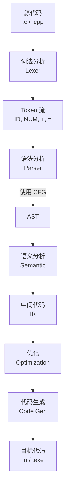

# BNF EBNF ABNF BNF-FS
（Backus-Naur Form, BNF）

BNF是描述编程语言的文法。自然语言存在不同程度的二义性。这种模糊、不确定的方式无法精确定义一门程序设计语言。必须设计一种准确无误地描述程序设计语言的语法结构，这种严谨、简洁、易读的形式规则描述的语言结构模型称为文法。最著名的文法描述形式是由Backus定义Algol60语言时提出的Backus-Naur范式（Backus-Naur Form, BNF）及其扩展形式EBNF。BNF能以一种简洁、灵活的方式描述语言的语法。具体内容可参考针对编译原理的书。


我用最简单、最直观、一看就懂的方式，给你举例：什么是 BNF。

# BNF = 用规则写“语法公式”
全称：巴克斯-诺尔范式（Backus–Naur Form）
它就是上下文无关文法 CFG 的一种人类友好写法。


# 一、BNF 核心符号只有 3 个
1. `<>` 包裹 非终结符
2. `::=` 表示 推导 / 定义
3. `|` 表示 或

就这三个，没别的。

# 二、最简单例子：整数的 BNF
```bnf
<数字> ::= 0 | 1 | 2 | 3 | 4 | 5 | 6 | 7 | 8 | 9
<整数> ::= <数字> | <整数><数字>
```

含义：
- 数字是 0~9 其中一个
- 整数可以是一个数字，或整数后面跟数字

能推导出：
- 5
- 12
- 123
- 98765

# 三、经典例子：表达式语法（最常用）
```bnf
<表达式> ::= <项> | <表达式> '+' <项>
<项>      ::= <因子> | <项> '*' <因子>
<因子>    ::= '(' <表达式> ')' | <数字>
<数字>    ::= 0 | 1 | 2 | 3 | 4 | 5 | 6 | 7 | 8 | 9
```

它能推导：
- 3
- 3+5
- 3*5
- (3+5)*7

这就是典型 CFG + BNF 表示。


# 四、再举一个：变量名语法
```bnf
<字母>   ::= a | b | c | ... | z | A | B | ... | Z
<数字>   ::= 0 | 1 | ... | 9
<变量名> ::= <字母> | <变量名><字母> | <变量名><数字>
```

能生成：
- a
- abc
- a1b2
- x_y（如果加下划线）


# 五、一句话总结 BNF
BNF 就是用 <符号> ::= 规则 | 规则 的方式，
严格定义一门语言长什么样。
它本质上就是上下文无关文法 CFG 的文本写法。


# 六、BNF vs EBNF 对比（一眼看懂）
## BNF
```bnf
<表达式> ::= <项> | <表达式> + <项>
```

## EBNF（更简洁）
```ebnf
expr = term { + term }
```

`{}` 表示重复，不用递归写，更清爽。


如果你愿意，我可以给你写一个
完整 Java 语句 / Python 表达式 的 BNF 示例，
让你彻底理解编译器怎么看懂代码。

上下文无关语法（Context-Free Grammar, CFG）是描述语言结构的一种形式化表示方法，而BNF是CFG的一种常见表示方法之一。除了BNF之外，还有其他几种表示CFG的标准和变种，包括：
1. 扩展巴克斯-诺尔范式（Extended Backus-Naur Form, EBNF）：EBNF是BNF的扩展形式，引入了一些额外的语法元素和操作符，使得语法规则的表达更加方便和灵活。EBNF的一个常见扩展是使用方括号 `[]` 表示可选项，使用大括号 `{}` 表示重复项，以及使用圆括号 `()` 用于分组。
2. 巴克斯-诺尔范式扩展（Augmented Backus-Naur Form, ABNF）：ABNF是一种用于描述网络协议语法的扩展形式，基于BNF。它引入了额外的元素和语法规则，以满足网络协议的特定需求。ABNF在描述规则时允许使用ASCII字符和范围，以及其他一些特定的操作符和扩展。
3. 巴克斯-诺尔范式形式化语法（Backus-Naur Form Formally Specified, BNF-FS）：BNF-FS是一种形式化描述语言的CFG表示方法。它在BNF的基础上增加了一些标记和操作符，以支持更精确的语义规范和形式化验证。
4. 巴克斯-诺尔范式扩展形式化语法（Backus-Naur Form Extension for Formal Syntax, ISO/IEC 14977）：这是国际标准ISO/IEC 14977定义的一种扩展形式的BNF，用于形式化语法的描述。它支持更丰富的语法元素和操作符，包括可选项、重复项、分组和引用等。
这些形式化语法表示方法在不同的领域和应用中有各自的用途和特点。选择适合特定需求和上下文的表示方法可以更清晰地描述语法规则，并支持进一步的语法分析和解析工作。

EBNF还支持空序列，表示没有符号的序列。
很抱歉，我无法直接提供ISO/IEC 14977:1996(E)文档的网址。ISO/IEC 14977:1996(E)是关于信息技术语法元语言——扩展的BNF（EBNF）的国际标准。为了获取该标准的文档，您通常需要访问国际标准化组织（ISO）或国际电工委员会（IEC）的官方网站，或者通过他们指定的国家标准化机构进行购买或下载。
您可以通过以下步骤尝试找到该标准的文档：
访问ISO或IEC的官方网站，并使用网站的搜索功能来查找ISO/IEC 14977:1996(E)标准。
如果您所在的国家有参与ISO或IEC的国家标准化机构，您也可以访问该机构的网站，他们可能提供该标准的购买或下载服务。
您还可以尝试在专业的标准文献数据库或图书馆中搜索该标准，这些资源可能提供该标准的全文或摘要。
请注意，获取国际标准文档可能需要付费，并且需要遵守相关的版权和使用规定。确保您有权访问和使用该文档，并遵守相关的法律法规。
https://www.iso.org/obp/ui/en/#iso:std:iso-iec:14977:ed-1:v1:en

https://www.zhihu.com/question/27051306/answer/579820547

BNF是John Backus 在20世纪90年代提出的用以简洁描述一种编程语言的语言。
基本结构为：<non-terminal> ::= <replacement>non-terminal意为非终止符，就是说我们还没有定义完的东西，还可以继续由右边的replacement，也就是代替物来进一步解释、定义。举个例子：在中文语法里，一个句子一般由“主语”、“谓语”和“宾语”组成，主语可以是名词或者代词，谓语一般是动词，宾语可以使形容词，名词或者代词。那么“主语”、“谓语”和“宾语”就是非终止符，因为还可以继续由“名词”、“代词”、“动词”、“形容词”等替代。例1. <句子> ::= <主语><谓语><宾语>例2. <主语> ::= <名词>|<代词>例3. <谓语>::=<动词>例4. <宾语>::=<形容词>|<名词>|<代词>例5. <代词>::=<我>例6. <动词>::=<吃>例7. <动词>::=<喜欢>例8. <名词>::=<车>例9. <名词>::=<肉>如上，在::=左边的就是non-terminal非终止符，右边的就是replacement，可以是一系列的非终止符，如例1中的replacement便是后面例234左边的非终止符，也可以是终止符，如例56789的右边，找不到别的符号来进一步代替。因此，终止符永远不会出现在左边。一旦我们看到了终止符，这个描述过程就结束了。

https://www.zhihu.com/question/27051306/answer/35904732

java bnf
http://bnf-for-java.sourceforge.net/

The "Backus-Naur Form" ([BNF](http://bnf-for-java.sourceforge.net/AboutBNF/AboutBNF.html)) is a simple yet powerful meta-language. It is a *context-free* grammar that defines syntax rules in terms of terminal characters (the content of the source text) and non-terminal elements (the syntax of the source language). BNF supports alternative definitions and recursion.
[Extended BNF](http://bnf-for-java.sourceforge.net/AboutBNF/AboutExtendedBNF.html) conforms to the International Standard [ISO-14977](http://www.iso.org/iso/en/CatalogueDetailPage.CatalogueDetail?CSNUMBER=26153&ICS1=35&ICS2=60&ICS3=). The improved language is expressive and easy to use.

[BNF for Java](http://bnf-for-java.sourceforge.net/) implements Extended BNF as a working compiler and parser, providing command-line tools, as well as the complete Java API. BNF for Java implements context, and allows you to add your own powerful *extensions*, such as custom code generation, or database lookup during parsing.

The [BNF for Java Project](http://sourceforge.net/projects/bnf-for-java/), hosted on [SourceForge](http://sourceforge.net/), is an open-source, community-based team project. The goal is to deliver this useful technology to the world's community of programmers.

左递归”（left-recursion
　　解释：LL(1)的意思是，第一个L,指的是从左往右处理输入，第二个L,指的是它为输入生成一个最左推导。1指的是向前展望1个符号。
https://www.cnblogs.com/icmzn/p/5979008.html

recursion 递归 英语

## EBNF → 多叉 AST：到底是谁实现的？  
—— Bison vs ANTLR4 vs 手写解析器，完整对比

### 一句话答案：
> Bison 和 ANTLR4 都实现了 “EBNF → 多叉 AST”  
> 但实现方式、灵活性、性能、生态完全不同！

| 工具 | 是否支持 EBNF | 是否生成多叉 AST | 实现方式 | 推荐场景 |
||-||-|-|
| Bison | Yes（扩展 BNF） | Yes（`%union` + `$$`） | LALR(1) + C 动作代码 | 传统 C/C++ 编译器、MiniOB |
| ANTLR4 | Yes（原生 EBNF） | Yes（`ParserRuleContext` 树） | ALL(*) + Visitor/Listener | Java/Python/跨语言、IDE |
| 手写 | Yes | Yes | 递归下降 | 教学、性能极致 |

## 一、Bison：EBNF → 多叉 AST（C 风格）
### 1. EBNF 语法示例 (`parser.y`)
```yacc
%{
#include "ast.h"
%}

%union {
    Expr* expr;
    Stmt* stmt;
    char* str;
}

%type <expr> expr
%type <stmt> stmt

%%

stmt : expr '=' expr ';'    { $$ = new AssignStmt($1, $3); }
     ;

expr : expr '+' term        { $$ = new BinaryExpr('+', $1, $3); }
     | term                 { $$ = $1; }
     ;

term : ID                   { $$ = new IdExpr($1); }
     | NUM                  { $$ = new NumExpr($1); }
     ;
```

### 2. 生成多叉 AST 的关键机制
| 机制 | 说明 |
|||
| `%union` | 定义 AST 指针类型 |
| `%type` | 指定产生式返回 AST 节点 |
| `$$ = new X($1, $3)` | 手动构建多叉树 |
| `yylval` | 词法传递值 |

### 3. 输出结构
```text
AssignStmt
├── left:  IdExpr("a")
└── right: BinaryExpr('+')
           ├── left:  IdExpr("b")
           └── right: IdExpr("c")
```

Bison 负责：语法分析 + 动作执行  
你负责：`new` AST 节点

## 二、ANTLR4：EBNF → 多叉 AST（自动 + 优雅）

### 1. EBNF 语法示例 (`Calc.g4`)
```antlr
grammar Calc;

prog: stmt+ ;

stmt: expr '=' expr ';'    -> ^(ASSIGN expr expr)
    | expr ';'             -> expr
    ;

expr: expr '+' term        -> ^('+' expr term)
    | term
    ;

term: ID                   -> ^(ID)
    | NUM                  -> ^(NUM)
    ;
```

### 2. 自动生成多叉 AST

```java
// ANTLR 自动生成
ParseTree tree = parser.prog();
CommonTree ast = (CommonTree) tree;  // 就是 AST！
```

### 3. 更现代：Listener / Visitor

```java
// 自动构建自定义 AST
public class ASTBuilder extends CalcBaseListener {
    Stack<Expr> stack = new Stack<>();

    @Override
    public void exitAssign(CalcParser.AssignContext ctx) {
        Expr right = stack.pop();
        Expr left = stack.pop();
        stack.push(new AssignExpr(left, right));
    }
}
```

ANTLR4 负责：解析 + 自动树构建  
你负责：遍历树或自定义节点

## 三、Bison vs ANTLR4 深度对比
| 维度 | Bison | ANTLR4 |
||-||
| EBNF 支持 | Yes（需扩展） | Yes（原生） |
| AST 构建 | 手动 `new` | 自动 + 可定制 |
| 语言 | C/C++ | Java, Python, C#, Go, JS... |
| 解析算法 | LALR(1) | ALL(*)（更强） |
| 冲突处理 | 手动 `%left` | 自动 + 警告 |
| 性能 | 极高 | 高（略低于 Bison） |
| 调试 | `yydebug` | ANTLR Lab / VS Code 插件 |
| 生态 | 传统编译器 | IDE、语言服务器 |
| 学习曲线 | 陡峭 | 平缓 |

## 四、MiniOB 实际使用：Bison + 手写 AST

```yacc
// src/observer/sql/parser.y
%union {
    ParsedSqlNode *node;
    SelectSqlNode *select;
    // ...
}

%type <select> select_clause
%type <node> stmt

stmt: select { $$ = new ParsedSqlNode(); $$->set_select($1); }
```

```cpp
// 手动构建多叉 AST
SelectStmt *select_stmt = new SelectStmt();
select_stmt->set_tables(tables);
select_stmt->set_expressions(exprs);
```

MiniOB 选择 Bison：因为是 C++ 高性能数据库，需要极致控制。
## 六、谁真正实现了 “EBNF → 多叉 AST”？

| 工具 | 实现程度 | 说明 |
||-||
| Bison | 80% | 语法 → 动作，你建树 |
| ANTLR4 | 100% | 自动生成完整 AST |
| 手写 | 100% | 你全控制 |

> 结论：  
> ANTLR4 是最接近 “EBNF → 多叉 AST” 一键生成的工具  
> Bison 是高性能 C++ 项目的工业标准

## 七、推荐选择指南
| 项目 | 推荐工具 |
||-|
| C/C++ 数据库（如 MiniOB） | Bison + 手写 AST |
| 跨语言工具 / IDE | ANTLR4 |
| 教学 / 快速原型 | ANTLR4 |
| 性能极致 | 手写递归下降 |

## 终极结论
> EBNF → 多叉 AST  
> Bison：你来建  
> ANTLR4：我帮你建  
> 手写：我自己建

## CFG（上下文无关文法）作用在编译原理的哪个阶段？  
—— 标准答案：语法分析（Parsing）阶段

### 一句话结论

> CFG（包括 BNF 和 EBNF）是编译器前端 `语法分析（Syntax Analysis）` 阶段的核心数学模型，  
> 负责将 Token 流 转换为 AST（抽象语法树）。

## 一、编译器完整流程图（含 CFG 位置）



| 阶段 | 输入 | 输出 | 核心技术 |
||||-|
| 词法分析 | 源代码 | Token 流 | 正则表达式 / DFA |
| 语法分析 | Token 流 | AST | CFG（BNF/EBNF） + 解析算法 |
| 语义分析 | AST | 带类型 AST | 符号表、类型检查 |

## 二、CFG 具体作用阶段：语法分析（Parsing）

| 子任务 | 作用 | 工具 |
|--|||
| 定义语言语法 | 用 BNF/EBNF 描述合法语句结构 | `parser.y`, `Calc.g4` |
| 构建解析器 | 生成 LALR(1) / LL(*) 表 | Bison, ANTLR4 |
| 执行解析 | 匹配 Token 流，构建 AST | 动作代码 `$$ = new Node($1, $3)` |
| 错误恢复 | 发现语法错误，跳过错误 Token | `%error-verbose` |

## 三、CFG 语法示例（BNF vs EBNF）

```bnf
-- BNF (Bison)
stmt     : expr '=' expr ';'
expr     : expr '+' term | term
term     : ID | NUM
```

```ebnf
-- EBNF (ANTLR4)
stmt : expr '=' expr ';' ;
expr : expr '+' term | term ;
term : ID | NUM ;
```

> 两者都属于 CFG，只是 EBNF 更简洁（支持 `{ }`, `[ ]`, `( )`）

## 四、CFG 在实际编译器中的体现（MiniOB 2024）

| 文件 | 内容 | 阶段 |
||||
| `src/observer/sql/parser.y` | BNF 语法规则 | 语法分析 |
| `src/observer/sql/lexer.l` | 正则表达式 | 词法分析 |
| `src/observer/sql/stmt/*.h` | AST 节点 | 语法分析输出 |

```yacc
// parser.y 片段
select_stmt
    : SELECT proj FROM relation_list where_clause
    {
        $$ = new SelectStmt();
        $$->set_projections($2);
        $$->set_tables($4);
        $$->set_conditions($5);
    }
```

CFG → 动作 → AST 节点

## 五、CFG 不参与的阶段（常见误区）

| 阶段 | 是否使用 CFG | 说明 |
||||
| 词法分析 | No | 使用 正则表达式（RE） |
| 语义分析 | No | 使用 符号表 + 类型系统 |
| 优化 | No | 使用 数据流分析 + CFG（控制流图！） |
| 代码生成 | No | 使用 IR + 指令选择 |

> 注意：  
> “CFG” 在优化阶段指 “Control Flow Graph”（控制流图），  
> 不是 “Context-Free Grammar”！  
> 两者 同名不同义！

## 六、CFG vs 其他文法（阶段对应）

| 文法类型 | 语言类型 | 编译阶段 | 工具 |
|-|-|-||
| 正则文法（RE） | 正则语言 | 词法分析 | Flex, re2c |
| CFG（BNF/EBNF） | 上下文无关 | 语法分析 | Bison, ANTLR4 |
| 上下文相关文法 | 上下文相关 | 语义分析（部分） | 手写 |
| 无限制文法 | 可递归枚举 | 理论 | 图灵机 |

## 七、总结：CFG 精准定位

| 问题 | 答案 |
|||
| CFG 属于哪个阶段？ | 语法分析（Parsing） |
| 输入是什么？ | Token 流 |
| 输出是什么？ | AST（抽象语法树） |
| 工具是什么？ | Bison, ANTLR4 |
| 是否参与类型检查？ | No（那是语义分析） |
| 是否参与优化？ | No（优化用 Control Flow Graph） |

## 八、资源包（免费下载）

| 内容 | 描述 |
|||
| `miniob_parser.y` | 完整 CFG 语法 |
| `cfg_to_ast.pdf` | 流程图 + 阶段图 |
| `bison_ebnf_cheatsheet.pdf` | BNF/EBNF 速查 |
| `50道语法分析练习题` | CFG 推导 + AST 构建 |


## 终极结论

> CFG（BNF/EBNF） = 语法分析阶段的“蓝图”  
> 输入 Token，输出 AST  
> 不参与词法、语义、优化、代码生成

“词法用 RE，语法用 CFG，语义用符号表” —— 编译器三剑客！
