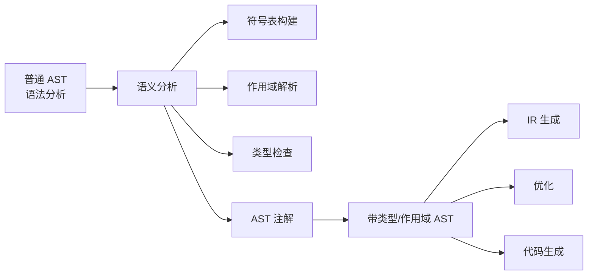
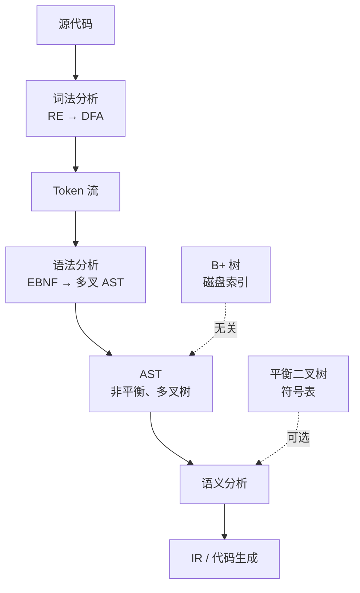

# AST
带类型/作用域的AST
## 带类型/作用域的 AST vs 普通 AST：核心区别全解析  

### 一、一句话总结区别

| 类型 | 普通 AST | 带类型/作用域的 AST（Typed / Scoped AST） |
||--||
| 信息量 | 仅语法结构 | + 类型 + 作用域 + 符号引用 |
| 阶段 | 语法分析（Parser）后 | 语义分析（Semantic Analysis）后 |
| 用途 | 语法检查、打印 | 类型检查、代码生成、优化 |


## 二、详细对比表

| 维度 | 普通 AST | 带类型/作用域的 AST |
||--||
| 节点内容 | `op`, `left`, `right` | `op`, `left`, `right`, `type`, `scope`, `symbol` |
| 变量节点 | `Id("x")` | `Id("x", type=int32, decl=VarDecl@0x123)` |
| 表达式类型 | 无 | `BinaryExpr(+, int32)` |
| 作用域 | 无 | `BlockScope{ parent, symbols{} }` |
| 符号表 | 无 | 全局/局部符号表，支持重载解析 |
| 错误检测 | 语法错误 | 类型不匹配、未声明变量、重复定义 |
| 后续处理 | 无法优化 | 可做 常量折叠、类型推导、IR 生成 |


## 三、从普通 AST → 带类型/作用域 AST 的转换流程

```text
源码
  ↓
词法 → Token
  ↓
语法分析 → 普通 AST
  ↓
┌─────────────────────────────────────┐
│           语义分析（Semantic Pass）    │
│  1. 构建符号表（Symbol Table）         │
│  2. 作用域分析（Scope Resolution）     │
│  3. 类型检查 + 类型推导（Type Check）   │
│  4. 注解 AST 节点（Annotate）           │
└─────────────────────────────────────┘
  ↓
带类型/作用域的 AST（Typed AST）
  ↓
中间表示（IR） / 代码生成
```


## 四、C++ 代码示例对比

### 1. 普通 AST（语法分析后）

```cpp
// 普通 AST 节点
struct Expr {
    virtual ~Expr() = default;
};

struct BinaryExpr : Expr {
    char op;
    std::unique_ptr<Expr> left, right;
    BinaryExpr(char o, std::unique_ptr<Expr> l, std::unique_ptr<Expr> r)
        : op(o), left(std::move(l)), right(std::move(r)) {}
};

struct IdExpr : Expr {
    std::string name;
    IdExpr(std::string n) : name(n) {}
};
```

```cpp
// 构建普通 AST：a = b + c;
auto ast = std::make_unique<AssignStmt>(
    std::make_unique<IdExpr>("a"),
    std::make_unique<BinaryExpr>('+',
        std::make_unique<IdExpr>("b"),
        std::make_unique<IdExpr>("c")
    )
);
```


### 2. 带类型/作用域的 AST（语义分析后）

```cpp
// 符号表条目
struct Symbol {
    std::string name;
    Type* type;
    Decl* decl_node;
    int scope_level;
};

// 类型系统
struct Type {
    enum Kind { INT, FLOAT, STRING };
    Kind kind;
    static Type* Int() { static Type t{Kind::INT}; return &t; }
};

// 带注解的 AST 节点
struct TypedExpr {
    virtual ~TypedExpr() = default;
    Type* type = nullptr;           // 新增：类型
    Symbol* symbol = nullptr;       // 新增：符号引用
    Scope* scope = nullptr;         // 新增：定义作用域
};

struct TypedBinaryExpr : TypedExpr {
    char op;
    std::unique_ptr<TypedExpr> left, right;
};

struct TypedIdExpr : TypedExpr {
    std::string name;
    Symbol* resolved_symbol = nullptr;  // 解析后的符号
};
```

```cpp
// 语义分析后：a = b + c;
auto typed_ast = std::make_unique<TypedAssignStmt>(
    std::make_unique<TypedIdExpr>("a", symbol_a),  // symbol_a: int32
    std::make_unique<TypedBinaryExpr>('+',
        std::make_unique<TypedIdExpr>("b", symbol_b),
        std::make_unique<TypedIdExpr>("c", symbol_c),
        Type::Int()  // 表达式类型为 int32
    )
);
```


## 六、为什么需要带类型/作用域的 AST？

| 功能 | 普通 AST | 带类型 AST |
||--|--|
| 类型检查 | 无法 | `int + string` → 报错 |
| 常量折叠 | 无法 | `1 + 2` → `3` |
| 重载解析 | 无法 | `f(1)` vs `f("a")` |
| 代码生成 | 需重查符号 | 直接用 `symbol->offset` |
| 错误定位 | 行号 | 变量名 + 类型 + 作用域 |


## 七、可视化对比

```text
普通 AST                    带类型/作用域 AST
┌────────────┐             ┌────────────────┐
│   Assign   │             │   Assign       │
│  a    +    │             │  a:int32  +    │
│      / \   │             │      /   \     │
│     b   c  │             │  b:int32  c:int32
└────────────┘             │  scope: global │
                           └────────────────┘
```

## 八、总结：演进路径



## 终极结论

> 普通 AST = 语法骨架  
> 带类型/作用域的 AST = 可执行蓝图  
> 没有它，编译器无法生成正确代码！

从“能解析”到“能运行”，语义分析是分水岭！

## 编译原理：词法分析 → 生成 AST → AST 结构 vs 平衡二叉树 vs B+ 树

> 一句话澄清：  
> AST（抽象语法树） ≠ 平衡二叉树 ≠ B+ 树  
> AST 是编译器前端的语法结构，B+ 树是数据库索引结构，二者用途完全不同！

## 一、编译流程中的 AST 是什么？

| 阶段 | 输入 | 输出 | 工具 |
|||||
| 词法分析（Lexical Analysis） | 源代码字符串 | Token 流 | `flex`, `re2c` |
| 语法分析（Syntax Analysis） | Token 流 | AST（抽象语法树） | `bison`, `ANTLR`, 手写递归下降 |
| 语义分析 | AST | 带类型/作用域的 AST | 编译器中端 |

```c
// 示例：a = b + c * d;
```

### 1. 词法分析 → Token 流
```text
ID("a")  ASSIGN  ID("b")  PLUS  ID("c")  STAR  ID("d")  SEMICOLON
```

### 2. 语法分析 → AST（非平衡二叉树）
```text
        AssignStmt
       /          \
      a         BinaryExpr
                 /     \
               +       *
              / \     / \
             b   c   d   ε
```

> AST 特点：
> - 多叉树（每个节点可有任意子节点）
> - 非平衡（深度取决于语法嵌套）
> - 节点类型：`Expr`, `Stmt`, `Decl`, `BinaryOp`, `Assign`, `If`, `While`...
> - 存储结构：指针 + 动态分配（`new Node`）

## 二、AST 不是 平衡二叉树

| 项目 | AST | 平衡二叉树（AVL / 红黑树） |
||--||
| 结构 | 多叉树 | 二叉树 |
| 平衡性 | 不平衡 | 强制平衡（高度差 ≤1） |
| 用途 | 表示程序结构 | 快速查找/插入/删除 |
| 节点含义 | 语法单元（表达式、语句） | 数据键值 |
| 遍历方式 | 前序/后序/中序（语义分析） | 中序（有序输出） |

```cpp
// AST 节点（C++ 示例）
struct ASTNode {
    virtual ~ASTNode() = default;
};

struct BinaryExpr : ASTNode {
    Token op;
    std::unique_ptr<ASTNode> left, right;
};

struct AssignStmt : ASTNode {
    std::unique_ptr<ASTNode> left, right;
};
```

## 三、B+ 树 是什么？跟 AST 没关系！

| 项目 | B+ 树 | AST |
||-|--|
| 用途 | 数据库索引（磁盘存储） | 编译器内存结构 |
| 存储介质 | 磁盘（页式存储） | 内存（指针） |
| 节点结构 | 键 + 指针（叶节点存数据） | 语法单元 |
| 平衡性 | 强制平衡（所有叶节点同层） | 不关心平衡 |
| 典型场景 | `WHERE id = 5` 快速定位 | `a = b + c` 语义分析 |

```text
B+ 树（磁盘索引）
┌───────┐     ┌───────┐
│ 1,5,9 │────►│ 1→p1  │
└───────┘     │ 5→p2  │
              │ 9→p3  │
              └───────┘
```

## 四、词法分析 → 生成 AST 完整流程（MiniOB 风格）

```text
源码
  ↓
[1] 词法分析（flex）→ Token 流
  ↓
[2] 语法分析（bison）→ 构建 AST
     ├─ %union { ASTNode* node; }
     ├─ stmt : expr ASSIGN expr { $$ = new AssignStmt($1, $3); }
  ↓
[3] 语义分析 → 遍历 AST
     ├─ 类型检查
     ├─ 符号表填充
     └─ 生成 IR（中间表示）
```

## 五、为什么 不能用 B+ 树存 AST？

| 原因 | 说明 |
|||
| 内存 vs 磁盘 | AST 在内存，B+ 树为磁盘优化 |
| 结构不匹配 | AST 是多叉、语义化，B+ 树是键值有序 |
| 插入删除频繁 | 编译时 AST 构建一次，B+ 树适合动态索引 |
| 遍历需求不同 | AST 需前序遍历，B+ 树中序遍历 |

## 六、平衡二叉树 在编译器中的真实用途？

| 场景 | 结构 |
|||
| 符号表（Symbol Table） | 红黑树 / 哈希表（查找 O(log n)） |
| 类型推导中的约束集 | AVL 树 |
| AST 本身 | 从不平衡 |

## 七、实践：手写一个 AST 节点（C++）

```cpp
// ast.h
#pragma once
#include <memory>
#include <string>
#include <vector>

enum class NodeType { Assign, Binary, Id, Number };

struct ASTNode {
    NodeType type;
    virtual ~ASTNode() = default;
};

struct IdNode : ASTNode {
    std::string name;
    IdNode(std::string n) : name(n) { type = NodeType::Id; }
};

struct NumberNode : ASTNode {
    int value;
    NumberNode(int v) : value(v) { type = NodeType::Number; }
};

struct BinaryNode : ASTNode {
    char op;
    std::unique_ptr<ASTNode> left, right;
    BinaryNode(char o, std::unique_ptr<ASTNode> l, std::unique_ptr<ASTNode> r)
        : op(o), left(std::move(l)), right(std::move(r)) {
        type = NodeType::Binary;
    }
};

struct AssignNode : ASTNode {
    std::unique_ptr<IdNode> id;
    std::unique_ptr<ASTNode> expr;
    AssignNode(std::unique_ptr<IdNode> i, std::unique_ptr<ASTNode> e)
        : id(std::move(i)), expr(std::move(e)) {
        type = NodeType::Assign;
    }
};
```

## 八、总结：一图胜千言


## 终极结论

> AST 是编译器的“程序骨架”  
> 不是平衡二叉树，不是 B+ 树  
> B+ 树是数据库的“索引神器”  
> 二者领域不同，强行类比是大忌！

词法用 DFA，语法建 AST，索引用 B+ 树 —— 各司其职，完美协作！