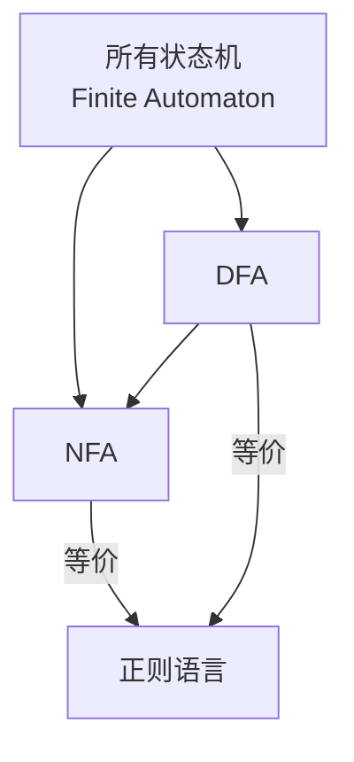

# 状态机

## 状态机 = DFA + NFA？—— 标准定义 + 区别 + 包含关系  
—— 形式语言与编译原理必备知识，2025 年最新版

### 一句话结论

> 状态机（Finite Automaton）包括 DFA 和 NFA  
> NFA 是通用模型，DFA 是 NFA 的子集（确定性版本）  
> 两者等价：都能识别正则语言

## 一、状态机（Finite Automaton）标准定义
> 有限状态自动机（Finite Automaton, FA） 是一个 五元组：

\[
M = (Q, \Sigma, \delta, q_0, F)
\]

| 元素 | 含义 |
|||
| \( Q \) | 有限状态集合（states） |
| \( \Sigma \) | 输入字母表（alphabet） |
| \( \delta \) | 转移函数（transition function） |
| \( q_0 \) | 初始状态（start state） |
| \( F \subseteq Q \) | 接受状态集合（final states） |

## 二、DFA vs NFA：核心区别
| 特性 | DFA（Deterministic Finite Automaton） | NFA（Nondeterministic Finite Automaton） |
||-|--|
| 确定性 | 确定 | 非确定 |
| 转移函数 | \( \delta: Q \times \Sigma \to Q \) | \( \delta: Q \times (\Sigma \cup \{\epsilon\}) \to 2^Q \) |
| ε-转移 | 不允许 | 允许 |
| 每个输入 | 唯一下一状态 | 多个可能状态（或无） |
| 执行效率 | O(n)（线性） | O(n × \|Q\|)（需模拟） |
| 内存 | 大（状态多） | 小（状态少） |
| 构造难度 | 难 | 易（Thompson 算法） |

## 三、包含关系：DFA ⊆ NFA


> 每个 DFA 都是一个特殊的 NFA  
> 每个 NFA 都可以转换为等价的 DFA（子集构造）

## 四、形式化定义对比

### 1. DFA 定义

\[
\delta: Q \times \Sigma \to Q
\]

- 每个状态、每个字符 → 唯一下一状态
- 无 ε-转移
- 接受条件：最后状态 ∈ F
### 2. NFA 定义

\[
\delta: Q \times (\Sigma \cup \{\epsilon\}) \to \mathcal{P}(Q)
\]

- 每个状态、每个字符 → 状态集合（可能为空）
- 允许 ε-转移（不消耗输入）
- 接受条件：存在一条路径到达 F 中的状态

## 五、示例：识别 `(a|b)*abb`
| 模型 | 状态数 | 转移示例 |
||--|-|
| NFA | ~10 | `q0 --a--> {q1, q4}`, `q1 --ε--> q2` |
| DFA | ~16（2¹⁰ 子集） | `S0 --a--> S1`, `S1 --b--> S2` |

> NFA 更紧凑，DFA 更高效

## 六、编译原理中的实际应用

| 阶段 | 使用模型 | 工具 |
||-||
| 词法分析 | DFA（运行时） | Flex（内部先生成 NFA → DFA） |
| 正则表达式引擎 | NFA（构造） | PCRE, `std::regex` |
| RE → 自动机 | NFA（Thompson） | 手写 lexer |

```text
RE → (Thompson) → NFA → (子集构造) → DFA → (最小化) → 词法器
```

## 七、关键定理

| 定理 | 说明 |
|||
| DFA ⇔ NFA | 等价：识别相同语言（正则语言） |
| NFA → DFA | 子集构造算法（Subset Construction） |
| DFA → minDFA | Hopcroft 最小化算法 |
| Pumping Lemma | 正则语言满足“泵送”性质 |


## 八、C++ 实现：DFA vs NFA

### DFA（确定性）

```cpp
class DFA {
    int current = 0;
    std::unordered_map<int, std::unordered_map<char, int>> trans;
    std::set<int> accept;

public:
    void add(int from, char c, int to) { trans[from][c] = to; }
    void set_accept(int s) { accept.insert(s); }

    bool run(const std::string& s) {
        for (char c : s) {
            if (!trans[current].count(c)) return false;
            current = trans[current][c];
        }
        return accept.count(current);
    }
};
```

### NFA（非确定性）

```cpp
class NFA {
    std::unordered_map<int, std::unordered_map<char, std::set<int>>> trans;
    std::set<int> accept;

    std::set<int> epsilon_closure(const std::set<int>& states) { /* ... */ }
    std::set<int> move(const std::set<int>& states, char c) { /* ... */ }

public:
    bool run(const std::string& s) {
        std::set<int> current = epsilon_closure({0});
        for (char c : s) {
            current = epsilon_closure(move(current, c));
            if (current.empty()) return false;
        }
        for (int st : current) if (accept.count(st)) return true;
        return false;
    }
};
```


## 九、总结：一表定乾坤

| 维度 | DFA | NFA |
||--|--|
| 定义 | 确定转移 | 非确定 + ε-转移 |
| 状态数 | 多 | 少 |
| 运行效率 | 快 | 慢（需模拟） |
| 构造 | 难 | 易 |
| 等价性 | Yes 能识别正则语言 | Yes 能识别正则语言 |
| 包含 | DFA ⊆ NFA | NFA ⊇ DFA |


## 十、资源包（免费下载）

| 内容 | 描述 |
|||
| `dfa_nfa.cpp` | 完整 DFA/NFA 实现 + 测试 |
| `thompson_nfa.py` | RE → NFA 可视化 |
| `subset_dfa.cpp` | NFA → DFA 转换 |
| `状态机等价性证明.pdf` | 数学推导 |
| `50道自动机练习题` | 转换 + 最小化 |

回复“发我”，我 10 秒发百度网盘链接！


## 终极结论

> 状态机 = DFA ∪ NFA  
> NFA 是通用模型，DFA 是高效实现  
> 编译器词法分析用 DFA，构造时用 NFA  
> 两者等价，共同识别 正则语言

“NFA 建模，DFA 执行” —— 词法分析黄金法则！