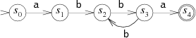

# 编译原理

mac电脑 下载了ppt

前端：词法分析 语法分析 语义分析

后端：中间代码生成 代码优化 目标代码生成

文件读写


Dubbo里面有自定义javac 


##### Lexical Analysis


- 手动实现

- 工具实现

手动实现

工具实现


关键字表算法

在字符中找到关键字


字符是一个集合

关键字是一个集合


字符集合包括关键字集合


## systax analysis

thompson算法

子集构造算法

hopcropt算法

转移图算法

[thompson算法java实现](https://www.codeleading.com/article/70802450278/)

https://study.163.com/course/courseMain.htm?courseId=1002830012


RE DFA NFA

RE

|*

以c语言为例

关键字以a-zA-Z开头 a-zA-Z0-9

if while怎么表示？


DFA

字母表 状态集 初始状态 最终状态 转移函数


状态集 1 2

字母表 a b


转移函数


词义分析

semantic analysis


DSL中用到编译原理的知识


[编译原理 华保健](https://mooc.study.163.com/course/1000002001)


https://www.bilibili.com/video/av18314230/


- [P11.1 编译器概述](https://www.bilibili.com/video/av18314230?p=1)

- [P21.2 编译器结构](https://www.bilibili.com/video/av18314230?p=2)

- [P31.3 编译器实例](https://www.bilibili.com/video/av18314230?p=3)

- [P42.1 词法分析的任务](https://www.bilibili.com/video/av18314230?p=4)

- [P52.2.1 词法分析器的手工构造1](https://www.bilibili.com/video/av18314230?p=5)

- [P62.2.2 词法分析器的手工构造2](https://www.bilibili.com/video/av18314230?p=6)

- [P72.2.3 词法分析器的手工构造3](https://www.bilibili.com/video/av18314230?p=7)

- [P82.3.1 正则表达式1](https://www.bilibili.com/video/av18314230?p=8)

- [P92.3.2 正则表达式2](https://www.bilibili.com/video/av18314230?p=9)

- [P102.3.3 正则表达式3](https://www.bilibili.com/video/av18314230?p=10)

- [P112.3.4 正则表达式4](https://www.bilibili.com/video/av18314230?p=11)

- [P122.4.1 有限状态自动机1](https://www.bilibili.com/video/av18314230?p=12)

- [P132.4.2 有限状态自动机2](https://www.bilibili.com/video/av18314230?p=13)

- [P143.1.1 RE转换成NFA：Thompson算法1](https://www.bilibili.com/video/av18314230?p=14)

- [P153.1.2 RE转换成NFA：Thompson算法2](https://www.bilibili.com/video/av18314230?p=15)

- [P163.1.3 RE转换成NFA：Thompson算法3](https://www.bilibili.com/video/av18314230?p=16)

- [P173.2.1 NFA转换成DFA：子集构造算法1](https://www.bilibili.com/video/av18314230?p=17)

- [P183.2.2 NFA转换成DFA：子集构造算法2](https://www.bilibili.com/video/av18314230?p=18)

- [P193.2.3 NFA转换成DFA：子集构造算法3](https://www.bilibili.com/video/av18314230?p=19)

- [P203.2.4 NFA转换成DFA：子集构造算法4](https://www.bilibili.com/video/av18314230?p=20)

- [P213.3.1 DFA的最小化：Hopcroft算法1](https://www.bilibili.com/video/av18314230?p=21)

- [P223.3.2 DFA的最小化：Hopcroft算法2](https://www.bilibili.com/video/av18314230?p=22)

- [P233.3.3 DFA的最小化：Hopcroft算法3](https://www.bilibili.com/video/av18314230?p=23)

- [P243.4.1 从DFA生成分析算法1](https://www.bilibili.com/video/av18314230?p=24)

- [P253.4.2 从DFA生成分析算法2](https://www.bilibili.com/video/av18314230?p=25)

- [P263.4.3 从DFA生成分析算法3](https://www.bilibili.com/video/av18314230?p=26)

- [P274.1.1 语法分析的任务1](https://www.bilibili.com/video/av18314230?p=27)

- [P284.1.2 语法分析的任务2](https://www.bilibili.com/video/av18314230?p=28)

- [P294.1.3 语法分析的任务3](https://www.bilibili.com/video/av18314230?p=29)

- [P304.2.1 上下文无关文法和推导1](https://www.bilibili.com/video/av18314230?p=30)

- [P314.2.2 上下文无关文法和推导2](https://www.bilibili.com/video/av18314230?p=31)

- [P324.2.3 上下文无关文法和推导3](https://www.bilibili.com/video/av18314230?p=32)

- [P334.2.4 上下文无关文法和推导4](https://www.bilibili.com/video/av18314230?p=33)

- [P344.2.5 上下文无关文法和推导5](https://www.bilibili.com/video/av18314230?p=34)

- [P354.3.1 分析树和二义性文法1](https://www.bilibili.com/video/av18314230?p=35)

- [P364.3.2 分析树和二义性文法2](https://www.bilibili.com/video/av18314230?p=36)

- [P374.3.3 分析树和二义性文法3](https://www.bilibili.com/video/av18314230?p=37)

- [P384.3.4 分析树和二义性文法4](https://www.bilibili.com/video/av18314230?p=38)

- [P394.4.1 自顶向下分析1](https://www.bilibili.com/video/av18314230?p=39)

- [P404.4.2 自顶向下分析2](https://www.bilibili.com/video/av18314230?p=40)

- [P414.4.3 自顶向下分析3](https://www.bilibili.com/video/av18314230?p=41)

- [P424.4.4 自顶向下分析4](https://www.bilibili.com/video/av18314230?p=42)

- [P434.5.1 递归下降分析算法1](https://www.bilibili.com/video/av18314230?p=43)

- [P444.5.2 递归下降分析算法2](https://www.bilibili.com/video/av18314230?p=44)

- [P454.5.3 递归下降分析算法3](https://www.bilibili.com/video/av18314230?p=45)

- [P464.5.4 递归下降分析算法4](https://www.bilibili.com/video/av18314230?p=46)

- [P475.1.1 LL(1)分析算法1](https://www.bilibili.com/video/av18314230?p=47)

- [P485.1.2 LL(1)分析算法2](https://www.bilibili.com/video/av18314230?p=48)

- [P495.1.3 LL(1)分析算法3](https://www.bilibili.com/video/av18314230?p=49)

- [P505.1.4 LL(1)分析算法4](https://www.bilibili.com/video/av18314230?p=50)

- [P515.1.5 LL(1)分析算法5](https://www.bilibili.com/video/av18314230?p=51)

- [P525.1.6 LL(1)分析算法6](https://www.bilibili.com/video/av18314230?p=52)

- [P535.1.7 LL(1)分析算法7](https://www.bilibili.com/video/av18314230?p=53)

- [P545.1.8 LL(1)分析算法8](https://www.bilibili.com/video/av18314230?p=54)

- [P555.2 LL(1)分析的冲突处理](https://www.bilibili.com/video/av18314230?p=55)

- [P565.3.1 LR(0)分析算法1](https://www.bilibili.com/video/av18314230?p=56)

- [P575.3.2 LR(0)分析算法2](https://www.bilibili.com/video/av18314230?p=57)

- [P585.3.3 LR(0)分析算法3](https://www.bilibili.com/video/av18314230?p=58)

- [P595.3.4 LR(0)分析算法4](https://www.bilibili.com/video/av18314230?p=59)

- [P605.4 SLR分析算法](https://www.bilibili.com/video/av18314230?p=60)

- [P615.5 LR(1)分析算法](https://www.bilibili.com/video/av18314230?p=61)

- [P625.6.1 LR(1)分析工具1](https://www.bilibili.com/video/av18314230?p=62)

- [P635.6.2 LR(1)分析工具2](https://www.bilibili.com/video/av18314230?p=63)

- [P645.6.3 LR(1)分析工具3](https://www.bilibili.com/video/av18314230?p=64)

- [P656.1.1 语法制导翻译1](https://www.bilibili.com/video/av18314230?p=65)

- [P666.1.2 语法制导翻译2](https://www.bilibili.com/video/av18314230?p=66)

- [P676.1.3 语法制导翻译3](https://www.bilibili.com/video/av18314230?p=67)

- [P686.2.1 语法制导翻译的实现原理1](https://www.bilibili.com/video/av18314230?p=68)

- [P696.2.2 语法制导翻译的实现原理2](https://www.bilibili.com/video/av18314230?p=69)

- [P706.3.1 抽象语法树1](https://www.bilibili.com/video/av18314230?p=70)

- [P716.3.2 抽象语法树2](https://www.bilibili.com/video/av18314230?p=71)

- [P726.3.3 抽象语法树3](https://www.bilibili.com/video/av18314230?p=72)

- [P736.3.4 抽象语法树4](https://www.bilibili.com/video/av18314230?p=73)

- [P746.4.1 抽象语法树的自动生成1](https://www.bilibili.com/video/av18314230?p=74)

- [P756.4.2 抽象语法树的自动生成2](https://www.bilibili.com/video/av18314230?p=75)

- [P767.1.1 语义分析的任务1](https://www.bilibili.com/video/av18314230?p=76)

- [P777.1.2 语义分析的任务2](https://www.bilibili.com/video/av18314230?p=77)

- [P787.1.3 语义分析的任务3](https://www.bilibili.com/video/av18314230?p=78)

- [P797.2.1 语义规则及实现1](https://www.bilibili.com/video/av18314230?p=79)

- [P807.2.2 语义规则及实现2](https://www.bilibili.com/video/av18314230?p=80)

- [P817.2.3 语义规则及实现3](https://www.bilibili.com/video/av18314230?p=81)

- [P827.2.4 语义规则及实现4](https://www.bilibili.com/video/av18314230?p=82)

- [P837.3.1 符号表1](https://www.bilibili.com/video/av18314230?p=83)

- [P847.3.2 符号表2](https://www.bilibili.com/video/av18314230?p=84)

- [P857.3.3 符号表3](https://www.bilibili.com/video/av18314230?p=85)

- [P867.4 语义分析中的其它问题](https://www.bilibili.com/video/av18314230?p=86)

  

## 第一章：编译概述


编译器 offline

解释器 inline


## 第二章：词法分析


- 手工编码实现法 程序员编码  gcc clang
- 词法分析器的生成器 自动生成

手动构造


手动 几千行代码

生成器 击败行代码


转移图算法

>=
>=
><
><=

相关代码


标识符包括关键字

以c语言为例


关键字表算法

先找出标识符，在hash表中找出关键字

时间复杂度O1


形式语言 re

符号表

nfa

dfa

dfa转移到可以运行的代码


 1、 转移表

 2、 哈希表

3、 跳转表 


 词法分析程序的自动生成器（二）——Thompson算法

https://zhuanlan.zhihu.com/p/54291684

本科编译原理前端
研究生后端

Ai芯片

context-free grammar 上下文无关文法


下图是一个正则表达式ab(bb)+a对应的有限自动机：



正则表达式是用来描述字符串集合的符号。当集合中的一条特定字符串被一条正则表达式所描述，我们就说这条正则表达式匹配了这个字符串。

正则表达式和NFA被证明是等价的：每一条正则表达式都对应等价的NFA（匹配相同的字符串），反之亦成立。（同样，DFA与正则表达式也是等价的，之后会看到。）将正则表达式翻译成NFA有许多种方法，这里给出的方法是Thompson在他的1968 CACM论文中提出的。

有限自动机是另外一种描述字符串集合的方式。有限自动机也被叫做状态机，“automaton”与“machine”两者是可以替换的。

LR分析算法

[LR(0)分析算法](https://blog.csdn.net/shaguabufadai/article/details/72403772)

https://mooc.study.163.com/course/1000002001?tid=1000003000#/info

词法分析


- 程序员自己定义数据结构，优点，能自定义细节，缺点，需要人力财力 gcc llvm是这么做的
- 工具自动实现 RE DFA Tompson算法

正则表达式（RE）
有限状态自动机 FA
CFG（上下文无关文法）

确定状态的有限状态自动机 DFA
非确定状态的有限状态自动机 NFA
自动机的例子

Lex代表Lexical Analyzar。Yacc代表Yet Another Compiler Compiler
lex和yacc是一对配对工具
lex和yacc是Unix的软件，而flex和bison是其在ubantu（linux下）的兼容版本
Flex就是由Vern Paxon实现的一个Lex
Yacc的GNU版叫做Bison

是一种工具，将任何一种编程语言的所有语法翻译成针对此种语言的Yacc语法解析器。它用巴科斯范式(BNF, Backus Naur Form)来书写。


Antlr  扩展巴科斯范式 EBNF

Antlr  扩展巴科斯范式


https://my.oschina.net/igooglezm/blog/776210


按照惯例，Yacc文件有.y后缀。编译行如下调用Yacc编译器：
语法分析 | LL(1) 分析算法

```shell

yacc <options> <filename ending with .y>

```


词法分析主要还是正则表达式和自动机

Lex+YACC or Flex+Bison简介
https://blog.csdn.net/ttwwok/article/details/27377651
语法分析 | LL(1) 分析算法
https://zhuanlan.zhihu.com/p/31301086
编译原理 LR分析（主要是LR（0）分析）
https://blog.csdn.net/Fire_to_cheat_/article/details/78368883
https://www.cnblogs.com/BlackWalnut/p/4472772.html

例子：编译原理 计算器 flex、bison实现
https://blog.csdn.net/qq_35208390/article/details/78249181


yylex()


词法分析
https://zhuanlan.zhihu.com/p/31151971
thompson算法
RE相关的，Unix上实现了，sed等工具中用，快，现在perl中实现的，慢

[Regex Learning](https://github.com/fooozhe/Regex-Learning/blob/master/regexp1.md)

https://en.wikipedia.org/wiki/Thompson%27s_construction

字符流：和被编译的语言密切相关（ASCII（C）， Unicode（Java, Swift）， or ...）
记号流：编译器内部定义的数据结构，编码所识别出的词法单元。

词法分析器 转移图
https://www.cnblogs.com/zzy-2017/articles/7419439.html
https://www.jianshu.com/p/609ea77ebbaf

记号
记号流

字符流：和被编译的语言密切相关（ASCII（C）， Unicode（Java, Swift）， or ...）
记号流：编译器内部定义的数据结构，编码所识别出的词法单元。

关键字表算法
对所有关键字构造哈希表H
先统一按标识符的转移图来识别标识符
识别完成后，进一步查表H是否为关键字
通过合理的构造哈希表H（完美哈希），可以在O(1)时间完成。

https://gaufoo.com/%E6%89%8B%E5%B7%A5%E6%9E%84%E9%80%A0%E8%AF%8D%E6%B3%95%E5%88%86%E6%9E%90%E5%99%A8/
https://blog.csdn.net/Zach_z/article/details/80029826
https://gaufoo.com/ni_to_pre_post/

https://blog.csdn.net/qq_23100787/article/details/50402643

利用子集构造法实现NFA到DFA的转换
https://www.cnblogs.com/kanjian2016/p/6786363.html

词法分析 | DFA 的最小化：Hopcroft 算法
最小化得到状态最少的 DFA 的好处在于，因为 DFA 最后的代码实现是在作为内部的一个数据结构表示，如果状态和边越少，则它占用的计算资源（内存、cache）会更少 ，可以提高算法的运行效率和速度。

DFA的代码表示
概念上将，DFA是一个有向图
实际上，有不同的DFA的代码表示
转移表（类似于邻接矩阵）
哈希表
跳转表
取决于在实际实现中，对时间空间的权衡

语法分析的路线图
数学理论：上下文无关文法（CFG）
描述语言语法规则的数学工具
自顶向下分析
递归下降分析算法（预测分析算法）
LL分析算法  antlr
自底向上分析
LR分析算法 yacc bison

语法分析
也称为类型检查、上下文相关分析
负责检查程序（抽象语法树）的上下文相关的属性

语法分析

一台图灵机是一个七元组，{Q，Σ，Γ，δ，q0,qaccept,qreject}，其中 Q，Σ，Γ 都是有限集合，且满足
1.Q 是状态集合；
2.Σ 是输入字母表，其中不包含特殊的空白符；
3.Γ 是带字母表，其中 □∈Γ且Σ∈Γ ；

4. δ：Q×「→Q×Γ×{L,R}是转移函数，其中L,R 表示读写头是向左移还是向右移；
5.q0∈Q是起始状态；
6. qaccept是接受状态。
7.qreject是拒绝状态，且。qreject≠qaccept
图灵机 M = (Q，Σ，Γ，δ，q0,qaccept,qreject) 将以如下方式运作：
开始的时候将输入符号串 从左到右依此填在纸带的第 号格子上， 其他格子保持空白（即填以空白符）。M 的读写头指向第 0 号格子， M 处于状态 q0。机器开始运行后，按照转移函数 δ 所描述的规则进行计算。例如，若当前机器的状态为 q，读写头所指的格子中的符号为 x， 设 δ（q,x) = (q',x',L）， 则机器进入新状态 q'， 将读写头所指的格子中的符号改为 x'， 然后将读写头向左移动一个格子。若在某一时刻，读写头所指的是第 0 号格子， 但根据转移函数它下一步将继续向左移，这时它停在原地不动。换句话说，读写头始终不移出纸带的左边界。若在某个时刻 M 根据转移函数进入了状态 qaccept， 则它立刻停机并接受输入的字符串； 若在某个时刻 M 根据转移函数进入了状态 qreject， 则它立刻停机并拒绝输入的字符串。


研究生阶段需要学习 optimize

知乎 蓝色

IBM

阿里巴巴


https://www.clear.rice.edu/comp412/

http://community.schemewiki.org/?90min-scheme2c

https://www.youtube.com/watch?v=TxOM9Y5YrCs

https://www.youtube.com/watch?v=HIr9eO1kB8g

https://book.douban.com/subject/5288601/

Engineering a Compiler, Second Edition

LR分析算法

https://blog.csdn.net/zhbssn/article/details/37743713

https://blog.csdn.net/shaguabufadai/article/details/72403772

https://blog.csdn.net/yskyskyer123/article/details/51492707

https://mooc.study.163.com/course/1000002001?tid=1000003000#/info

个人笔记：

IR（中间代码，intermediate Representation）

Lex代表Lexical Analyzar。Yacc代表Yet Another Compiler Compiler

flex bison

https://blog.csdn.net/hguisu/article/details/7490027


数学工具

正则表达式 （二元组

有限状态自动机 （四元组

上下文无关文法（五元组


词法分析的工具是正则表达式，有限状态自动机，匹配源代码串中的每个部分，把源代码串切成一小段一小段，每小段视作一个单元，是个二元组，由单词和语义值组成，这小单元们构成的词串就是词法分析的成果。 enum kind ，struct repent {kind x，string name}

语法分析使用上下文无关文法的产生式，把拿到的词串做成语法树。具体的借助产生式解析语法树的算法有多种，如自顶向下、自底向上，这些算法会产生语法解析树，但这树多余信息太多，进一步做成抽象语法树，以方便后续动作。

语法树有了，但还不知道它是否合语义，就把它交给语义分析，进行例如类型检查、变量声明检查等。检查方法是借助符号表来遍历该树，如果发现了错误，准确详细地报告错误信息，以帮助程序员改正。通过了语义分析，程序在形式上是确保没错了，那就进行中间代码生成，以便下一步方便地生成目标代码，之所以要多这一步，是因为假如有源代码语言甲种，目标代码语言乙种，如果直接生成目标代码，则需要写算法数量为甲乘以乙，而先转为统一的中间代码，则需要写算法数量为甲加乙，节省很多工作。生成中间代码，还是遍历语法树，为语法树的各个节点指定产生规则，以使在遍历到各个节点时生成正确的代码。

中间代码有了，最后一步进行目标代码生成，目标代码语言的指令和寄存器都有限，需要小心地编写算法使语义不被改变。

语义不被改变是编译器的红线，语义如果可能被改变，别的方面再好这编译器也毫无意义。代码优化时也要注意这一点。


https://zhuanlan.zhihu.com/p/24766379


CFG

四元组


编译原理之LL(1) 、LR(0)、SLR、LR(1)、LALR文法的对比

https://blog.csdn.net/zuzhiang/article/details/79047743


B站华保健上有讲解Caculator的例子