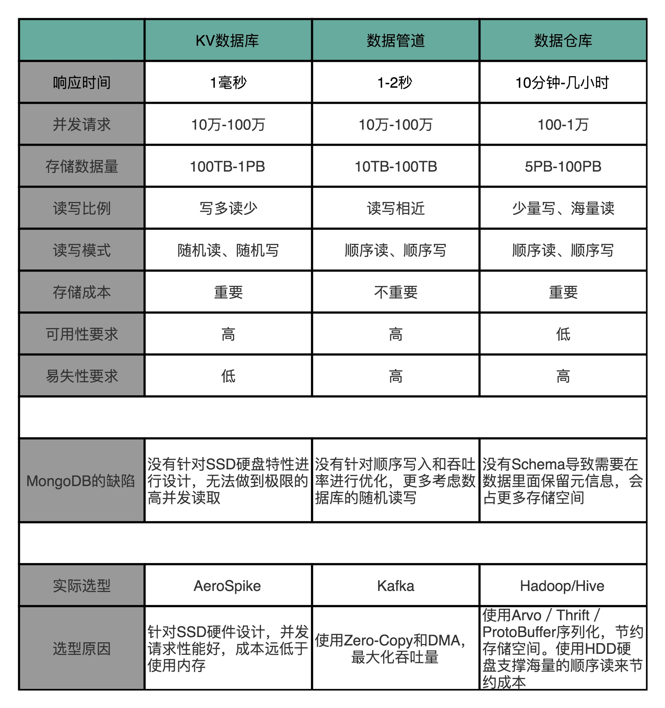

# 计算机组成与设计

https://www.bilibili.com/video/BV1tp4y197Av

https://www.icourse163.org/course/PKU-1205809805

多个cpu共享内存 还是独占部分内存？

计算机组成与设计（原书第4版）

https://book.douban.com/subject/10441748/

Coursera 上北京大学的《计算机组成》开放课程，还是图灵奖作者写的《计算机组成与设计：硬件 / 软件接口》

计算机组成与设计

https://time.geekbang.org/column/article/107422

加法器

乘法器

浮点数 表示

