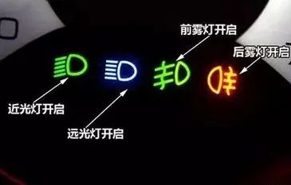

# 科目一

“科目一快速记忆法”

1）安全原则

凡是题中有“安全”两字的判断题正常都对，怎么安全怎么做。

2）让行

能让行的都让行、能避让的都避让、能帮助的都帮助，只要不抢、不急的都对。

路口让行：转弯让直行、右转让左转、后车让前车，机动车让行人。

在没有中间线狭窄山路会车时，不靠山体的一方先行。

3）车速

没有限速标志和标线的情况下，没有道路中心线的城市道路最高车速30公里/小时、公路40公里/小时；

没有限速标志和标线的情况下，只有一条机动车道的城市道路最高车速50公里/小时，公路70公里/小时。

高速公路同方向车道行车速度:

二条车道 左:100~120 右:60~100

三条车道 左:110~120 中:90~110 右:60~80
三条以上/四车道 最左:110~120 中间二条:90~110 最右:60~80
进入高速加速车道,尽快提到(60公里)以上
4）有“扣留该机动车”的答案都是正确答案。
5）警告标志的放置只有两种距离：普通道路50-100米，高速公路150米。
6）所有过激行为都错【如急踩（用力踏）油门或制动，急转方向盘，带有立即、直接、迅速、加速、超越等字眼的全错】。
7）救人：先救人、先止血。

8）罚款：“20-200元”和“200-2000元”基本不会同时存在，若只存在一个，那必是答案。

9）判刑

违反交规发生重大事故致人重伤的，3年以下；

违反交规发生重大事故使公私财产遭受重大损失的，3年以下；

违反交规发生重大事故致人死亡且逃逸的，3年以上7年以下；

违反交规发生重大事故因逃逸导致他人死亡的，7年以上。

10）超车

在中国大陆，任何情况下超车都是从左侧超车；

执行任务的警车、救护车、消防车都不能超；

前车正在超车的、前车正在掉头的，通过路口、人行道、铁路口、交通流量大的路段，都不能超车。

11）灯光

夜间在道路会车，距离对向来车150以外将远光灯改为近光灯；

夜间临时停车，开启危险警报闪烁灯；

选择题中，雾天必选雾灯，其它都是选有近光灯的。

12）不允许停车的情况

公交站、消防站30米内、易发生事故的路段、交叉路口、转弯路、窄路、隧道50米内。

13）吊二撤三醉五逃终生

驾照被吊销后，2年内不得重新申请驾驶证

驾照被依法撤销的，3年内不得重新申请驾驶证

醉酒被吊销驾驶证的，5年内不得重新申请驾驶证

发生交通事故后逃逸的，终身不得重新申请驾驶证

科目一考试技巧口诀

1、转弯让直行，右转让左转，右方道路来车先行，口五站三，即有"口"的选50米，有"站"的选30米；
2、站点30米以内，易发事故路段50米以内；无中线，城3公4；同向一道，城5公7；
3、没限速标志，城市道路30km/h，公路40km/h；一条车道城市道路50km/h，公路70km/h；
4、200米能见度，最高速60，车距100；100米能见度，最高车速40，车距50，能见度50米，车速20，尽快离开高速路；
5、高速公路行车，最高速度120公里，最低速度不低于60公里；
6、同方向两车道，左侧车道最低速度100公里；
7、同方向三车道，左侧车道最低速度110公里，中间最低速度90公里；
8、同方向四车道，左到右最低限速依次为：110、90、90、60；
9、路面限速标志：白高蓝低黄建议（背景颜色）；
10、红圈白底黑字为最高速度，蓝底白字为最低速度；
11、答题中所有题一个原则：安全，因此怎么安全怎么做；
12、判断题中遇到紧急情况所有过激行为都错，比如急踩（突然用力踩油门、刹车），急转方向，选择题中类似答案都错；
13、能让行的都让行，能帮助的都帮助，能避让的就避让，只要不抢、不急都对；
14、抢救一个原则先救人，救人一个原则先止血；
15、无标志无灯无交警路口，按照让右路--让左路--让直行的顺序判断；
16、车辆变换位置都要开转向灯，唯一一个不开的就是环岛路；
17、红色是禁令、黄色是警告、蓝色是指示，三种颜色都没有是辅助；
18、禁令对禁止、警告对警告、指示对指示，相同就对，不同就错；
19、黄灯亮与黄灯闪烁只是一字之差，“闪烁”确保安全，“亮”不准通行，但已越线的可通行；
20、远光灯、近光灯的考题只能使用近光灯，不准使用远光灯；
21、只有冰雪道路是下坡先行，其余都是上坡先行；如果出现两个上坡先行，就选多字的；
22、有省选省，无省选县；户籍地对户籍地，暂住地对暂住地。

https://www.icauto.com.cn/baike/67/670486.html

会车是一种交通用语，指反向行驶的列车、汽车等同时在某一地点交错通过。

1、转弯让直行，右转让左转，右方道路来车先行，
2、口五站三，即有"口"的选50米，有"站"的选30米；
3、站点30米以内，易发事故路段50米以内；
4、无中线，城三公四；同向一道，城五公七；
5、没限速标志，城市30，公路40；一条车道城市50，公路70；
6、200米能见度，最高速60，车距100；100米能见度，最高车速40，车距50，能见度50米，车速20，尽快离开高速路；
7、高速公路行车，最高速度120公里，最低速度不低于60公里；
8、同方向两车道，左侧车道最低速度100公里；
9、同方向三车道，左侧车道最低 速度110公里，中间最低速度90公里；
10、同方向四车道，左到右最低限速依次为：110、90、90、60；
11、路面限速标志：（背景颜色）白高蓝低黄建议；
12、红圈白底黑字为最高速度，蓝底白字为最低速度。

1、答题中所有题一个原则——安全，因此怎么安全怎么做；
2、判断题中遇到紧急情况所有过激行为都错，比如急踩(用力塔油门（制动），急转方向，选择题中类似答案都错；
3、能让行的都让行，能帮助的都帮助，能避让的就避让，只要不抢、不急都对；
4、抢救伤员一个原则先救人，救人一个原则先止血；
5、无标志无灯无警路口，按照让右路—让左路—让直行的顺序判断；
6、车辆变换位置都要开转向灯，唯一一个不开的就是环岛路；
7、红色是禁令、黄色是警告、蓝色是指示，三种颜色都没有是辅助；
8、禁令对禁止、警告对警告、指示对指示，相同就对，不相同就错；
9、黄灯亮与黄灯闪烁只是一字之差，“闪烁”确保安全，“亮”不准通行，但越线的可通行；
10、远光灯、近光灯的考题只能使用近光灯，不准使用远光灯；
11、只有冰雪道路是下坡先行，其余都是上坡先行；如果出现两个上坡先行，就选多字的；
12、有省选省，无省选县；
13、户籍地对户籍地，暂住地对暂住地。

会车
会车是一种交通用语，指反向行驶的列车、汽车等同时在某一地点交错通过。

残疾人办证 省级
驾考宝典 专项 -> 图标技巧 -> 图标速记/相关法规

科目一
交警手势 减速慢行是右手，左转弯待转是左手

高速离开 向右转向
进高速，往左转向
口诀：左入右出 驶入，开启 向左的转向灯
转向灯位于汽车前后左右两侧

汽车并线 就是换车道行驶
https://www.sohu.com/a/475563101_120012575

虚实线 由虚向实行驶，可以，禁止由实向虚行驶
黄色指示灯 分为闪烁 黄色常亮
黄牌警告 红牌禁止 蓝牌指示
向右急转弯 先向左，后向右，所以很急 向右急转弯
驶离高速，减速的时机是在完全进去驶离车道后
斜着的字母Z或N表示反向弯路
两头宽中间窄 窄桥
上面窄下面宽 两侧变窄
黄色 三角 行人 人行道
注意行人 的标志
注意人行横道 标识是蓝色的
牛表示注意牲畜，鹿表示注意野生动物

停车区和服务区不是一个概念。停车区具有的功能服务区都具有。而服务区具有的功能停车区不一定有。服务区有吃住加油维修等服务。停车区属于临时停车，最多也就是有加油的服务，没有其他的服务。

高速公路服务区标志.jpg

高速公路服务区顾名思义是提供服务的区域。可以提供餐饮、住宿、维修、购物等服务，功能较齐全。

高速公路停车区标志.jpg

停车区是在高速路上设置的临时停靠点，比如临时旅客乘车点、故障车辆应急停靠等等，这个是不允许长时间停靠的。

高速公路停车场标志.jpg

- 服务区标志不仅有"P"的停车标志，一个是加油机的图形，修车用的活动扳手的图形，还有一个是吃饭用的刀叉的图形。所以服务区一般提供停车,加油,维修,餐饮,超市甚至住宿等综合性服务。
- 停车区标志只有“P”停车标志和一个咖啡杯的图形，所以停车区顾名思义是停车的，一般只有加油的服务，没有其他的服务，仅供临时停靠。
- 停车场标志只有一个"P"停车标志，所以停车场一般只提供停车,供临时休息。

https://www.chajiaotong.com/info/8663.html

https://www.xcar.com.cn/bbs/tools/road.html
科目一扣分，校车3分 高速超过最低限速3分

扣分
12 9 6 3 1
备注：没有扣2分

制动报警灯

黄实线不能调头
不能压黄实线

科目一 口诀
1：二吊三撤五醉逃终身。2：转弯过桥上窄道泥路30km/h。3：左右观察左超车。4：交叉转弯窄路隧道桥梁坡道铁路口50米不内不停车。5：驾驶证到期90天，变更30天内换。6：转弯的机动车让直行的车辆先行，右方道路来车先行，右转弯车让左转弯车先行。7：驾驶证的有效期为6年，没有扣分记录的第二次换证的为10年。8：机动车没有违规行为，只有违法行为。9：交警手势大于交通信号灯。10：高速路同向有2条车道，右道的速度范围为60-100km/h，左道的速度范100-120km/h。如同方向有3条车道，右道的速度范围为60-90km/h，中间的90-110km/h，左道110-120km/h。11：有嫌疑的或未放置检验合格标志，未悬挂机动车号牌，未放置保险标志的，未携带机动车行驶证的都是可依法扣留车辆的。 12：驾驶证遗失、损毁无法辨认时核发地车辆管理所申请补发。13：车速超过每小时100km/h，应当与同车道前车保持100米以上的距离，低于100的，不得少于50米。14：续驾驶机动车超过4小时应停车休息，停车休息时间不少于20分钟。15：造成事故致人重伤但没死的处3年以下，造成事故致死的处3-7年，造成事故逃逸后致死的处罚7-15年

白天超车不能开喇叭，不能开启远光灯

三角形 让 乐水路，表示停车让行
黄色网格线不能停车

前大灯包括近光灯
没有中心线的道路 限速
在没有限速标志、标线的道路上，机动车不得超过下列最高行驶速度：
(一)没有道路中心线的道路，城市道路为每小时30公里，公路为每小时40公里；
图为没有道路中心线的公路，所以最高时速为每小时40公里。
有机动车行驶超过规定时速50%行为的，可以并处吊销机动车驾驶证。

下雨能见度50米以内，车速

机动车行驶中遇有下列情形之一的，最高行驶速度不得超过每小时30公里，其中拖拉机、电瓶车、轮式专用机械车不得超过每小时15公里：　　
（一）进出非机动车道，通过铁路道口、急弯路、窄路、窄桥时；　　
（二）掉头、转弯、下陡坡时；　　
（三）遇雾、雨、雪、沙尘、冰雹，能见度在50米以内时；
（四）在冰雪、泥泞的道路上行驶时；

交通法第46条中表示，机动车在如下5种情况下，只要碰到了，最高行驶速度就不能超过30km/h
1.进出非机动车道，铁路，急转弯，窄路，窄桥
2.掉头，转弯，下陡坡
3.大雾，大雨，沙尘，冰雹等导致能见度少于50米的情况
4.冰雪泥泞的道路
5.牵引发生故障的机动车

前照灯，示廓灯，后位灯

驾照科目一思维导图

行驶过程中紧急情况处理

出事故，牵引车，牵引车的车速
山体会车

夜间会车，150米 以外 把远光灯改成近光灯

驾驶人不能驾车的，扣款200-500 回收驾驶证

定速巡航标志

机油 汽油区别
1.机油主要起润滑机械的作用,减少机械的磨损,增加车辆作用寿命;
2.机油都是从石油中提炼出来的,合成、半合成机油性能和作用相似,只是里面添加的相关材料的分量不同;
3.而汽油是起到燃料作用的,是为车子挺供动力的,汽油由于燃点低,离发动机远,一般放在汽车中间一侧的底部。机油燃点高,油箱一般放在车头靠近发动机的地方。

驾驶证 扣押 扣留 暂扣
科目一思维导图
驾照 A1 A2 B C
申请驾照需要什么

A、专用停车场
B、露天停车场
C、室内停车场
D、内部停车场

高速路肩

高速公路硬路肩所起作用是保证行车道宽度和紧急停车用,在高速公路上不允许车辆在硬路肩上行驶。路肩在正常情况下是不准行车的,但在紧急情况下(包括车辆故障)可以将车辆短暂停在路肩

机动车仪表盘

指示灯
远光灯 近光灯

安全气囊 故障 提示
充电电路故障 提示
迎面出风 提示
地板及迎面出风

冷风暖风风扇
空气外循环
空气内循环
近光灯 前雾灯 图标区别

https://m.gmw.cn/baijia/2020-10/14/1301672033.html

前锋窗玻璃刮水器

https://www.icauto.com.cn/baike/67/675118.html

驾驶证6年有效期
朱志刚说过

第二次自动换证条件
日期 10年

弯路标志
一急二反三连续

交通警示灯
横排三个 竖排三个啥意思？
徐颖超：考驾照 好好刷题
评价:已经好久没有为了一个目标而努力了

机动车驾驶证有效期 六年 十年 长期
机动车驾驶证有效期 六 十 长期

斜着的字母Z或者N是连续弯路

停车位标线蓝色：免费停车位； 黄色：专属停车位；白色：收费停车位
路边停车提前开启右转向灯
山区坡路会车，上坡一方先行；若下坡一方已行驶至中途而上坡一方未上坡，下坡一方先行. (上下坡)
左转向灯：向左转弯；向左变更车道；准备超车；驶离停车地点；掉头
右转向灯：向右转弯; 向右变更车道；超车完毕；驶出环岛(进入环岛不开灯，进环岛逆时针）
夜间行车通过急弯、坡路、拱桥、人行横道、没有交通信号灯控制的路口，变换使用远近光灯.
能见度低起步，开启近光灯
高速公路能见度低：能见度
停车： 交叉路口、铁路道口、隧道等以及距离这些地点50米以内路段不能停车；公交汽车站、急救站、加油站、消防栓30米以内不能停车。(口5站3）
高速公路安全距离：车速超过100公里，100米以上距离；低于100公里，最小距离不得小于50米
学校区域车速30公里每小时
校车停靠：3条路走，2条路等，1条路停
连续弯路不能超车
夜间会车150米以外改用近光灯
上车前驾驶人应逆时针绕车一周
高速车速：最高120，最低60；2条车道：左侧最低100；3条车道：右侧最低60，中间最低90，左侧最低110.
夜间照明不良，开启前照灯、示廓灯、后位灯；雾天行驶开启雾灯和危险报警闪光灯
ACC：自适应巡航控制系统 ETC：电子不停车收费 LDW：车道偏离预警系统 GPS：车辆导航系统
前雾灯绿色，后雾灯黄色；前后位灯对称绿色；远光灯蓝色，近光灯绿色；危险报警闪光灯两个红色三角；左右转向灯；蓄电池标志指示充电电路故障；冷风暖气风扇；冷却液不足
行车仪表盘上的各种标识：车灯总开关、机油、燃油、制动、水温等复习
上坡路段换低档位，踩加速踏板.
2. 处罚与扣分
未取得驾驶证上路行驶，200-2000罚款，15日以下拘留.
驾驶证被吊销，使用伪造的机动车驾驶证，2000-5000罚款，15日以下拘留，构成犯罪追究刑事责任.
非法安装报警器、标志灯具，200-2000罚款
不按交通信号灯指示通行，记6分
驾驶与准驾车型不符机动车，记9分
在设置禁停路段停车（违反禁令标志、禁止标线指示)，记1分

前雾灯 后雾灯

停车位 蓝色好 蓝色免费

拼装车报废车 对人:罚款 吊销驾驶证
超车只能从左侧超车
停车标志 露天 室内
高速倒车12分 逆行12分
普通道路逆行3分
城市快速路逆行？6分

驾驶人参加审验学习

1.持有B1驾驶证，只要在记分周期有扣分，就需要学习，这个学习叫审验教育。2.B1在记分周期扣分没满十二分，需要累计不少于三小时的学习。3.B1记分周期达到十二分，除了审验学习，驾驶证还会降级。4.B1实习期扣分超过六年，审验完后实习期延长一年。B1驾驶证和C证不太一样，要求会更加严格，在记分周期出现扣分就要审验学习。

无证驾驶拘留15天

普通逆行三分，高速逆行12分

闯红灯6分

改动的车牌12分
遮挡车牌3分

高速路应急车道6分

遮挡号牌9分
报考时间差 自动挡20 手动30
小3大10白5夜3

超速普通3 快速6 高速12

交通违规找人替罚 三倍不超过5w

申请驾驶证提供虚假材料，罚款500。驾驶证考试作弊，罚款2000

机动车全责。有红绿灯的路口停车让行，无红绿灯减速礼让行人！电动车主脚着地助力电动车前行属于行人！交通法的原则是保护道路上弱势的一方！

相信大家都知道，按照准驾车型的不同我国目前一共有16种驾照，分别为：A1、A2、A3、B1、B2、C1、C2、C3、C4、C5、D、E、F、M、N、P。
其中A证为大型客车证，B证为大型货车证，C1、C2证为小型私家车证，在这其中C1、C2驾驶证的拥有者人数最多。

交通警示灯
有的是竖排三个，有的是一个

只有一个黄灯，缓慢确认安全后通过

警告标志 黄色
标志

道路交通安全法

车灯 有哪些 雾灯 近光灯 远光灯

车道偏离预警系统 ldw

安全枕头 后脑勺

高速间距 车速大于100 100米

黄色虚线 白色虚线

白色同向 黄色双向

国道 省道 乡道 汉语拼音首字母缩写
g s x

交规
无证
未带证

道路交通安全法实施条例

城市道路
公路

车辙是车辆在路面上行驶后留下的车轮的压痕。

立体交叉指的是道路与道路或铁路在不同高程上的交叉，利用跨线桥、地道等使相交的道路在不同的平面上交叉，简称立交。 

最高限速 白底红字
最低限速 蓝底白字

p 无遮挡 露天
p 有遮挡 室内

干道先行，一般称干路先行，是在交叉路口的一种交通标识，表示行驶者处在主干道上，拥有优先通行权。于此对应的是支路上的减速让行或停车让行标识。

有文字，指路
没文字，指示

人开车上路
人有没有驾驶证
车子有没有报废

路况怎么样？
下雪，起雾，能见度低

是不是学校？
高速路，高架，普通路

道路交通安全法
驾驶证行驶证区别

行驶证和驾驶证的区别
1、驾驶证是证明持证本人有驾驶相应车型的证件，上面的内容有驾驶证号，有效如期，准驾车型等
2、行驶证是证明对应车辆的有效证件，上面内容有车牌号码，车主姓名，车型。发动机号，底盘号等，
3、两证结合用，不能互用。
《道路交通安全法》第八条国家对机动车实行登记制度。机动车经公安机关交通管理部门登记后，方可上道路行驶。尚未登记的机动车，需要临时上道路行驶的，应当取得临时通行牌证。行驶证和牌照是车辆上路的必备条件。

吊销驾驶证
暂扣驾驶证

不能驾驶超过4小时
长途，两个司机
4个小时以上休息20分钟

空档滑行很危险
https://www.zhihu.com/answer/1962684335
